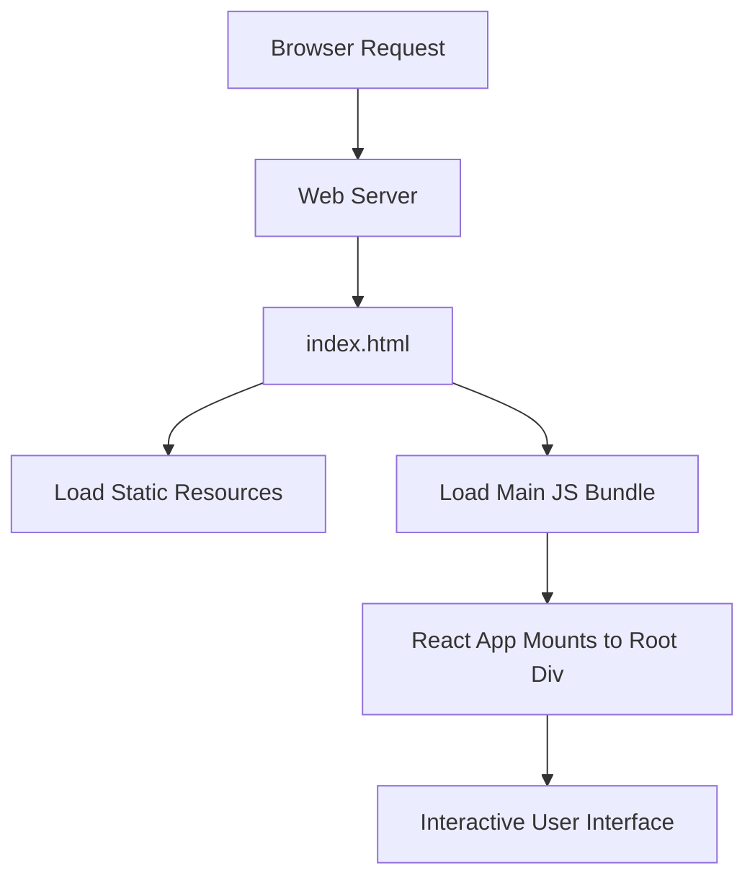

# tableau-frontend — Repository Overview

### High-Level Purpose
The `tableau-frontend` repository contains a client-side React single-page application (SPA) designed to provide an interactive user interface. Its primary objective is to integrate with external services, specifically to display and interact with Tableau dashboards, handle user authentication via Google OAuth, and fetch data through an API.

### Architectural Structure
The application follows a standard frontend SPA architecture:
*   **Client-Side React Application**: The core of the system, responsible for rendering the user interface and managing application state. It mounts into a designated `div` within the `index.html` file.
*   **Static Assets (`public/`)**: Contains the primary HTML entry point (`index.html`), web application manifest (`manifest.json`), icons, and directly linked external scripts like the Tableau embedding API. These assets are served directly by a web server.
*   **Source Code (`src/`)**: Houses the application's React components, global styles (`App.css`), and other client-side logic.
*   **Project Configuration (`package.json`)**: Serves as the manifest, defining dependencies, scripts for development and build processes, and metadata for the frontend project.

### Core Components
*   **React Application**: The foundational framework for building the user interface, managing components, and handling client-side rendering.
*   **User Interface Layer**: Utilizes Ant Design, Tailwind CSS, `slick-carousel`, and custom CSS for a consistent and interactive user experience.
*   **Routing Module**: Implemented with React Router DOM to manage client-side navigation between different application views.
*   **API Client**: Axios is used for making asynchronous HTTP requests to backend services for data retrieval and submission.
*   **Authentication Integration**: `@react-oauth/google` facilitates user authentication against Google accounts.
*   **Tableau Embedding**: The Tableau Embedding API is directly integrated to display and interact with Tableau dashboards within the application.
*   **Progressive Web App (PWA) Support**: `manifest.json` provides metadata for PWA features, enabling installability and an app-like experience.
*   **Build System**: Managed by Create React App scripts, streamlining development, testing, and production build processes.

### Interaction & Data Flow
Upon a browser request, a web server delivers the `index.html` file. This HTML document bootstraps the application by loading the main JavaScript bundle, which then initializes and mounts the React application into the `
`. The React application dynamically renders UI components, handles user interactions, manages client-side routing, and makes API calls via Axios to fetch necessary data. Authentication workflows leverage Google OAuth. Tableau dashboards are embedded and rendered client-side using the dedicated Tableau API. Loading states are indicated through CSS-driven visual indicators, controlled by the application's JavaScript logic.

### Technology Stack
*   **Core Framework**: React, React DOM
*   **UI Libraries**: Ant Design, Tailwind CSS, `slick-carousel`, `react-icons`
*   **HTTP Client**: Axios
*   **Routing**: React Router DOM
*   **Authentication**: `@react-oauth/google`
*   **Forms**: `react-hook-form`
*   **Notifications**: `react-toastify`
*   **Build & Development**: `react-scripts` (Create React App), ESLint, Jest, React Testing Library
*   **External Integration**: Tableau Embedding API
*   **Styling**: Global CSS (`App.css`), Google Fonts

### Design Observations
The project is architected as a private, feature-rich single-page application with a strong emphasis on integrating external data visualization (Tableau) and authentication (Google OAuth). The reliance on Create React App simplifies the build setup but implies a preference for a more opinionated development environment. Extensive customization of UI components, like `slick-carousel`, indicates a focus on specific branding and user experience requirements. The inclusion of a Web App Manifest points towards a design goal of providing a Progressive Web App experience, offering enhanced installability and native-app-like features.

### System Diagram (Optional)

