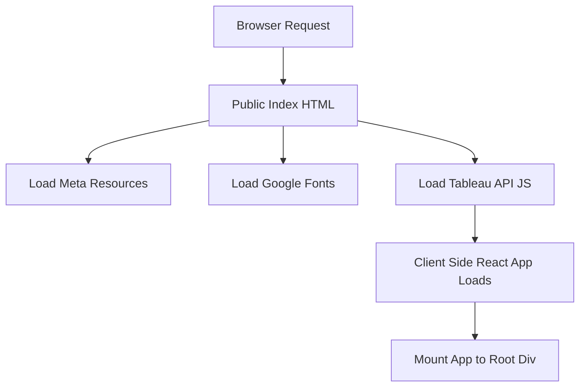

# tableau-frontend — Repository Overview

### High-Level Purpose
The `tableau-frontend` repository contains a client-side React application designed to integrate and display Tableau dashboards. Its primary objective is to provide a rich user interface for interacting with Tableau content, authenticate users, and manage application-specific views and data.

### Architectural Structure
The application is structured as a standard Create React App project. The `public/` directory hosts static assets, including the `index.html` entry point and the PWA manifest. The `src/` directory contains the core React application code, encompassing components, styles, and utilities. A `src/Mock` directory is present for providing static mock data, facilitating decoupled frontend development.

### Core Components
*   **Application Shell**: `public/index.html` serves as the initial HTML document, bootstrapping the application and loading external scripts like the Tableau Embedding API. `public/manifest.json` enables Progressive Web App (PWA) capabilities.
*   **React Application**: The core client-side logic is built with React, utilizing `react-router-dom` for navigation and `react-hook-form` for form management.
*   **User Interface**: Styling is managed via global CSS (`App.css`), `tailwindcss`, and the `antd` component library. `react-slick` provides carousel functionality.
*   **API Interaction**: `axios` is used for making HTTP requests to backend services, while `@react-oauth/google` handles third-party authentication.
*   **Tableau Integration**: The Tableau Embedding API is directly included to embed and interact with Tableau dashboards within the application.
*   **Mock Data**: `src/Mock/view.js` provides static data for development and testing, simulating API responses for various views.

### Interaction & Data Flow
A user's browser initiates a request, loading `public/index.html`. This document then loads essential resources, including the Tableau Embedding API script. Concurrently, the client-side JavaScript bundle (the React application) is loaded and mounts itself to the `
` element. From there, the React application manages its UI state, handles client-side routing, makes API calls to a backend using Axios (with mock data available in development), and authenticates users via Google OAuth. Embedded Tableau dashboards render and allow interaction directly within the application's interface.

### Technology Stack
*   **Frontend Framework**: React
*   **UI Library**: Ant Design (antd)
*   **Styling**: Tailwind CSS, CSS
*   **Routing**: React Router DOM
*   **HTTP Client**: Axios
*   **Form Management**: React Hook Form
*   **Authentication**: Google OAuth (`@react-oauth/google`)
*   **Tableau Integration**: Tableau Embedding API
*   **UI Components**: React Slick, React Icons
*   **Build Tooling**: Create React App (`react-scripts`)
*   **Testing**: React Testing Library

### Design Observations
The project leverages Create React App for streamlined development and build processes. The integration of `antd` and `tailwindcss` indicates a focus on a modern, customizable, and rich user experience. Direct inclusion of the Tableau Embedding API suggests a tightly coupled integration strategy for displaying data visualizations. The presence of `manifest.json` enables PWA features, enhancing user experience through installability. Mock data is employed to facilitate independent frontend development and robust testing.

### System Diagram (Optional)

