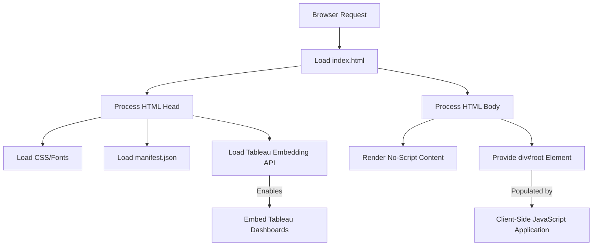

# tableau-frontend — Repository Overview

### High-Level Purpose
This repository hosts a React-based single-page application (SPA) designed to display interactive Tableau dashboards. Its primary objective is to provide a user interface for accessing and visualizing Tableau content, integrating with external authentication (Google OAuth) and offering an enhanced user experience through Progressive Web App (PWA) capabilities.

### Architectural Structure
The project is structured as a client-side Single Page Application. The `public/index.html` file serves as the initial entry point, acting as a static template processed by the browser. It includes external dependencies like the Tableau Embedding API and provides a mount point (`div#root`) for the dynamically rendered React application. The `public` directory also contains static assets and the `manifest.json` file, which configures PWA features. Development, build, and testing processes are orchestrated by `react-scripts` (Create React App), abstracting underlying tooling configurations.

### Core Components
*   **User Interface Layer**: Built with React and Ant Design, responsible for rendering interactive UI components and user interactions.
*   **Routing Module**: Manages client-side navigation within the application using `react-router-dom`.
*   **Data Access Module**: Handles asynchronous HTTP requests to backend APIs using `axios` for data retrieval and submission.
*   **Authentication Module**: Integrates with Google OAuth via `@react-oauth/google` to manage user authentication flows.
*   **Tableau Embedding Module**: Utilizes the Tableau Embedding API to embed and display live Tableau dashboards directly within the application.
*   **Development Toolchain**: `react-scripts` provides a standardized environment for application development, building, and testing.
*   **PWA Configuration**: `manifest.json` defines application metadata and behavior for installation as a Progressive Web App.

### Interaction & Data Flow
1.  A web browser loads `public/index.html`, which initiates the application by loading necessary static resources and external scripts, including the Tableau Embedding API.
2.  The React application's JavaScript bundle then executes, mounts its UI components into the `div#root` element, and takes over client-side rendering.
3.  User interactions trigger state changes, routing via `react-router-dom`, and potential API calls using `axios` for backend data.
4.  User authentication occurs through Google OAuth, redirecting users for login and handling token management.
5.  Embedded Tableau dashboards are rendered by the Tableau Embedding API, interacting with the Tableau server to display visualizations.
6.  The browser may offer to "install" the application based on the metadata in `public/manifest.json`, providing a native-like experience.

### Technology Stack
*   **Frontend Framework**: React
*   **UI Toolkit**: Ant Design, `react-icons`, `react-slick`
*   **Routing**: React Router DOM
*   **HTTP Client**: Axios
*   **Form Management**: React Hook Form
*   **Authentication**: Google OAuth (`@react-oauth/google`)
*   **Build & Development**: Create React App (`react-scripts`), Tailwind CSS (development), ESLint
*   **Testing**: React Testing Library (`@testing-library/react`, `jest-dom`, `user-event`)
*   **Third-party APIs**: Tableau Embedding API, Google Fonts

### Design Observations
The project leverages `react-scripts` to simplify its build system and development environment, reducing the overhead of manual configuration. The choice of Ant Design promotes rapid UI development and design consistency. Direct integration with the Tableau Embedding API and Google OAuth is central to the application's core functionality, enabling visualization and secure access. The inclusion of a Web App Manifest indicates an architectural consideration for PWA capabilities, aiming for an enhanced, installable user experience. The reliance on a broad set of third-party libraries points to a feature-rich application, potentially impacting bundle size and overall performance.

### System Diagram (Optional)
