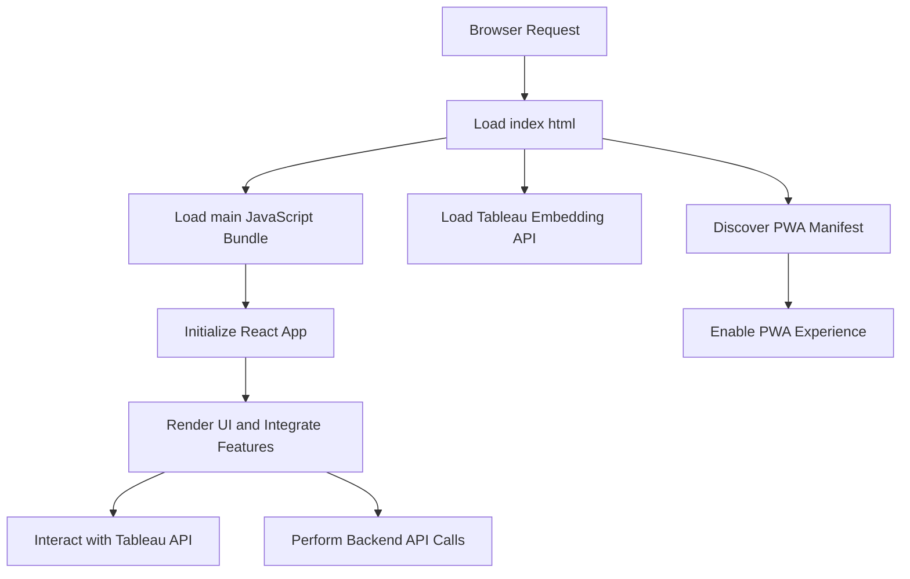

# tableau-frontend — Repository Overview

### High-Level Purpose
The `tableau-frontend` repository hosts a client-side web application primarily built with React. Its core objective is to provide an interactive user interface for consuming and displaying Tableau dashboards and data visualizations. The application integrates Google OAuth for user authentication and supports Progressive Web App (PWA) features for an enhanced, native-like user experience. It serves as the presentation layer for data reporting and interaction.

### Architectural Structure
The application adopts a standard single-page application (SPA) architecture, structured around the Create React App (CRA) boilerplate.
*   **Root Level**: Contains project configuration files such as `package.json`, defining dependencies, build scripts, and metadata.
*   **`public/` Directory**: Houses static assets and the `index.html` entry point. This HTML file serves as the initial document loaded by the browser, providing the mount point for the React application and linking to external resources like the Tableau Embedding API and the PWA `manifest.json`.
*   **`src/` Directory (Inferred)**: Contains the main application source code, including React components and application-specific styles (e.g., `App.css`).
*   **Client-Side Rendering**: The entire user interface is dynamically rendered and managed by JavaScript within the browser, initiated from the `

` in `index.html`.

### Core Components
*   **Build & Dependency Management (`package.json`)**: Manages project metadata, third-party libraries (e.g., React, Axios, Ant Design), development tools (e.g., Tailwind CSS), and standardized scripts for development, build, and testing.
*   **Application Host (`public/index.html`)**: The static entry point that bootstraps the client-side application. It loads the main JavaScript bundle, integrates the Tableau Embedding API, and sets up PWA metadata.
*   **PWA Manifest (`public/manifest.json`)**: Configures the application's Progressive Web App capabilities, including icons, display mode, and theme colors, enabling "Add to Home Screen" functionality.
*   **User Interface Framework (React)**: Provides the component-based architecture for building interactive UIs, heavily relying on `react` and `react-dom`.
*   **UI Components & Styling (Ant Design, Tailwind CSS, `App.css`)**: Utilizes a comprehensive UI library (Ant Design) for ready-made components, a utility-first CSS framework (Tailwind CSS) for efficient styling, and custom CSS for specific layout and component overrides.
*   **Data Fetching (Axios)**: An HTTP client used for making API requests to backend services.
*   **Client-side Routing (React Router DOM)**: Manages navigation within the single-page application without full page reloads.
*   **Authentication (@react-oauth/google)**: Integrates Google OAuth for user authentication and authorization flows.
*   **Tableau Integration (Tableau Embedding API)**: Enables embedding and interaction with Tableau dashboards directly within the application.

### Interaction & Data Flow
Upon a browser request, the `public/index.html` file is served, initiating the application bootstrap. This HTML file loads the `tableau.embedding.3.latest.js` script to make Tableau APIs available and references the `manifest.json` for PWA capabilities. Concurrently, the application's main JavaScript bundle (defined in `package.json` scripts) loads and mounts a React application into the `

`.

The React application then takes over, rendering the UI using Ant Design and custom styles. It leverages `react-router-dom` for navigation, `axios` for fetching data from backend APIs, and `@react-oauth/google` for handling user authentication. Crucially, the application interacts with the Tableau Embedding API to display and manage Tableau visualizations as a core part of its functionality.

### Technology Stack
*   **Frontend Framework**: React, React DOM
*   **Build Tooling**: Create React App (via `react-scripts`), Webpack, Babel (abstracted by CRA)
*   **UI Libraries**: Ant Design, `react-slick`, `react-icons`
*   **Styling**: Tailwind CSS, CSS modules
*   **HTTP Client**: Axios
*   **Routing**: React Router DOM
*   **Authentication**: Google OAuth (`@react-oauth/google`)
*   **Data Visualization Integration**: Tableau Embedding API
*   **Form Management**: React Hook Form
*   **Notifications**: React Toastify
*   **Testing**: Jest, React Testing Library
*   **Performance Monitoring**: Web Vitals

### Design Observations
The project leverages Create React App, simplifying initial setup and abstracting complex build configurations, which is beneficial for rapid development. The inclusion of `manifest.json` and a service worker (implied by PWA features, though service worker file not detailed) points to a commitment to modern web standards and an enhanced user experience through PWA capabilities. Direct integration of the Tableau Embedding API indicates a central role for data visualization. The use of `!important` in `src/App.css` might signify style specificity conflicts or a need for overriding framework defaults, which can introduce maintenance challenges. The `private: true` field in `package.json` correctly prevents unintended public publishing of this application.

### System Diagram (Optional)
