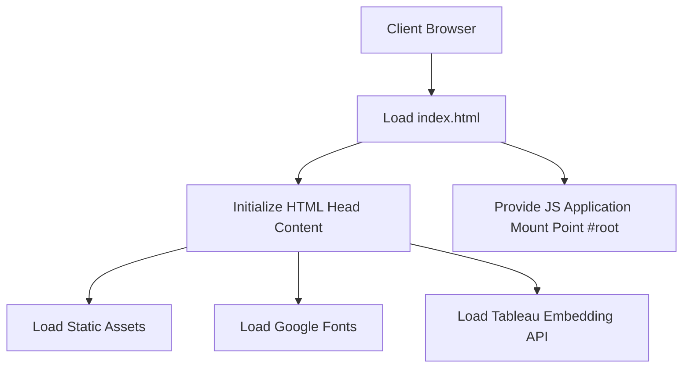

# tableau-frontend — Repository Overview

### High-Level Purpose
This repository hosts the `tableau_frontend` project, a private React application. Its primary objective is to provide a client-side user interface, integrate with external APIs, enable user authentication via Google OAuth, and embed Tableau visualizations. It is designed as a single-page application (SPA) with Progressive Web App (PWA) capabilities.

### Architectural Structure
The project follows a standard Create React App (CRA) structure for a client-side frontend. It is organized around:
*   **Root Level**: Contains `package.json` which acts as the project manifest, defining dependencies, scripts, and configuration for Node.js package management and build processes.
*   **`public` Directory**: Stores static assets like `index.html` (the primary HTML entry point), `manifest.json` (for PWA features), and various icons. These assets are served directly by a web server.
*   **Source Code (Implied)**: Not detailed in summaries, but `react` and `react-scripts` imply a JavaScript/TypeScript source directory where the main application logic, components, and routing reside, mounting onto the `div id="root"` in `index.html`.

### Core Components
*   **React Application**: The central user interface, responsible for dynamic content rendering, routing, and state management.
*   **Build Toolchain**: Managed by `react-scripts`, abstracting Webpack and Babel configurations for development, build, and test processes.
*   **UI Frameworks**: `antd` provides a set of enterprise-level UI components, complemented by `tailwindcss` for utility-first styling.
*   **Routing**: `react-router-dom` handles client-side navigation within the SPA.
*   **API Client**: `axios` facilitates HTTP requests to backend services.
*   **Authentication**: `@react-oauth/google` integrates Google OAuth for user authentication.
*   **Tableau Embedding API**: Enables the integration and display of Tableau dashboards and visualizations directly within the application.
*   **Web App Manifest**: `public/manifest.json` configures the application for PWA features, including installability and offline capabilities.

### Interaction & Data Flow
The application's execution begins when a client browser loads `public/index.html`. This HTML document initializes the viewport, loads external resources like Google Fonts and the Tableau Embedding API, and provides a mount point (`div id="root"`) for the React application.

Upon loading, the client-side JavaScript application (built by `react-scripts`) takes over:
1.  **Rendering**: React components render the user interface based on application state and routes.
2.  **API Communication**: `axios` sends HTTP requests to external APIs (not defined in summaries) to fetch and submit data.
3.  **Authentication**: Google OAuth handles user login, providing tokens for subsequent authenticated requests.
4.  **Tableau Integration**: The loaded Tableau Embedding API script allows the React application to dynamically embed and interact with Tableau dashboards.
5.  **PWA Features**: The `manifest.json` enables the browser to offer "add to home screen" functionality, allowing the app to run in a standalone, app-like experience.

### Technology Stack
*   **Frontend Framework**: React.js
*   **Build System**: Create React App (`react-scripts`)
*   **Package Manager**: npm/yarn (implied by `package.json`)
*   **HTTP Client**: Axios
*   **UI Libraries**: Ant Design (`antd`), Tailwind CSS
*   **Routing**: React Router DOM
*   **Form Management**: React Hook Form
*   **Authentication**: Google OAuth (`@react-oauth/google`)
*   **Notifications**: React Toastify
*   **Embedding**: Tableau Embedding API
*   **Testing**: React Testing Library, Jest (implied by `eslintConfig`)
*   **PWA Support**: Web App Manifest

### Design Observations
The project leverages `create-react-app` for its build toolchain, prioritizing rapid development and a standardized setup over granular control of Webpack configurations. A hybrid approach to UI styling is indicated by the concurrent use of Ant Design for component-rich interfaces and Tailwind CSS for utility-first custom styling. The direct inclusion of the Tableau Embedding API in `index.html` highlights its critical role and the need for early loading. Google OAuth provides a robust external authentication mechanism. The `manifest.json` indicates an intent to deliver a Progressive Web App experience, enhancing user engagement and installability.

### System Diagram (Optional)
