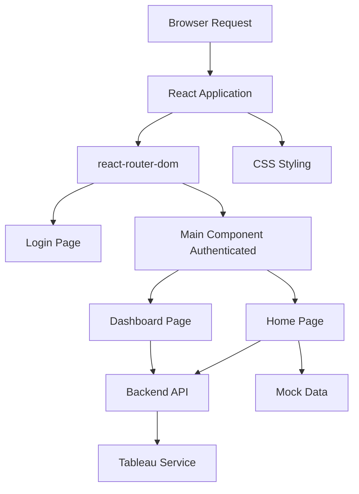

# tableau-frontend — Repository Overview

### High-Level Purpose
The `tableau-frontend` repository hosts a React-based single-page application designed to provide a user interface for displaying data and interactive dashboards, primarily integrating with Tableau visualizations. Its core objective is to render authenticated views, allowing users to browse and interact with Tableau workbooks and views.

### Architectural Structure
The application follows a client-side React single-page application (SPA) architecture. `src/App.jsx` serves as the root component, handling global client-side routing using `react-router-dom`. Routing is structured into a top-level `BrowserRouter` that directs traffic to a `Login` page for unauthenticated users and a `Main` component for authenticated users. The `Main` component then manages nested routes for core application pages like `Home` and `Dashboard`. UI components are organized within a `Components` directory (e.g., `Sidenav`), while primary page views reside in `Pages`. Styling is managed through `src/App.css` for global styles and overrides, alongside extensive use of Tailwind CSS classes for component-level styling. Mock data for development is located in the `Mock` directory.

### Core Components
*   **`App` Component**: The application's entry point, defining top-level routing and layout.
*   **`Main` Component**: Handles authentication state and renders protected routes (e.g., `/home`, `/dashboard`).
*   **`Login` Page**: Component for user authentication.
*   **`Home` Page**: Displays lists of workbooks and views, handles search, and navigates to dashboards.
*   **`Dashboard` Page**: Renders embedded Tableau visualizations, manages Tableau token acquisition and injection.
*   **`Sidenav` Component**: Intended for sidebar navigation, though currently commented out.
*   **`react-router-dom`**: Core library for client-side routing.
*   **`axios`**: HTTP client for backend API interactions.
*   **`react-slick` / `slick-carousel`**: UI component for displaying image carousels (e.g., for workbooks).
*   **`antd` (Ant Design)**: UI library providing components like `Input`, `Skeleton`, and `Spin` for enhanced UI/UX.
*   **`API` Constant**: Centralized base URL for backend API endpoints.
*   **Mock Data (`allViews`, `allWorkBooks`)**: Static data providers for decoupled frontend development.

### Interaction & Data Flow
User interaction begins with the `BrowserRouter` routing requests. Unauthenticated users are directed to the `Login` page. Upon (currently hardcoded) authentication, the `Main` component handles navigation to authenticated routes. The `Home` page fetches workbook and view data from the backend API, displays them, and allows users to search or navigate to specific dashboards. The `Dashboard` page then fetches a secure Tableau token from the backend, which is used to construct and inject a `<tableau-viz>` web component into the DOM, displaying the selected visualization. Logout functionality clears the session cookie and redirects to the login page.

### Technology Stack
*   **Frontend Framework:** React
*   **Routing Library:** `react-router-dom`
*   **State Management:** React `useState`, `useEffect`
*   **Styling:** CSS (`src/App.css`), Tailwind CSS
*   **UI Libraries:** `react-slick`, `antd` (Ant Design), `react-icons`
*   **HTTP Client:** `axios`
*   **Backend Interaction:** AWS API Gateway (implied by API endpoint structure), Tableau API (implied by token fetching and embed strategy).

### Design Observations
The application demonstrates a clear separation of concerns for routing (public vs. protected routes) and uses mock data to facilitate decoupled frontend development. The authentication flow appears to be in an iterative stage, with a hardcoded `isUserLoggedIn` state allowing frontend work to proceed without full backend integration. Client-side caching for Tableau authentication tokens improves performance on the `Dashboard` page. The direct manipulation of the DOM for embedding Tableau web components is a common pattern for integrating third-party visualization libraries. Extensive use of `!important` in `App.css` and a combination of `activeclassName` and custom regex-based `className` for navigation links may indicate potential CSS specificity challenges or areas for refactoring. The `Sidenav` component is currently unrendered and fully commented out, suggesting an incomplete or future feature integration.

### System Diagram

```mermaid
graph TD
BrowserRequest[Browser Request] --> ReactApp[React Application]
ReactApp --> Router[react-router-dom]
Router --> Login[Login Page]
Router --> MainComponent[Main Component Authenticated]
MainComponent --> Home[Home Page]
MainComponent --> Dashboard[Dashboard Page]
Home --> APIBackend[Backend API]
Dashboard --> APIBackend
APIBackend --> TableauService[Tableau Service]
Home --> MockData[Mock Data]
ReactApp --> Styling[CSS Styling]
```