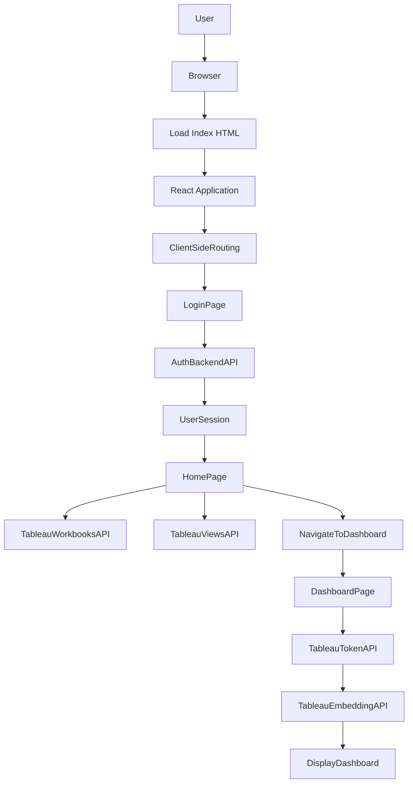

>>> GENERATED USING CUSTOM USER PROMPT <<<
# tableau-frontend — Repository Overview

### High-Level Purpose
The `tableau-frontend` repository hosts a React-based single-page application designed for user authentication, browsing Tableau workbooks and views, and embedding specific Tableau dashboards. Its primary objective is to provide a user interface for interacting with and displaying Tableau visualizations, integrating with a backend API for data and authentication. This documentation was generated using a custom user prompt override.

### Architectural Structure
The repository adopts a Create React App (CRA) structure with distinct layers:

*   **Build & Configuration**: `package.json` manages dependencies and scripts, while `tailwind.config.js` handles styling configuration.
*   **Public Assets & Entry Point**: The `public/` directory contains `index.html` (the SPA's root), `manifest.json` for PWA capabilities, and static assets.
*   **Application Source (`src/`)**:
    *   **Root Application (`App.jsx`)**: Configures client-side routing and global API endpoint.
    *   **Page-Level Components (`src/Pages/`)**: Contains feature-specific views like `Login.jsx`, `Home.jsx`, and `Dashboard.jsx`.
    *   **Shared Components (`src/Components/`)**: Intended for reusable UI elements, though `Sidenav.jsx` is currently commented out.
    *   **Styling (`App.css`)**: Global application styles and overrides.
    *   **Mock Data (`src/Mock/`)**: Provides static data for development and testing, though often unused in current runtime logic.
    *   **Services (`src/Services/`)**: Intended for API abstraction, but not consistently utilized in current implementations.

### Core Components
*   **`App.jsx`**: The root React component establishing client-side routing via `react-router-dom` and defining the global backend API base URL.
*   **`Login.jsx`**: Manages user authentication, supporting email/password and Google OAuth, by interacting with the backend `/auth` endpoint.
*   **`Home.jsx`**: Displays a browsable list of Tableau workbooks and views, allowing search and filtering. It fetches data from `/tableau/workbooks` and `/tableau/views`.
*   **`Dashboard.jsx`**: Embeds specific Tableau visualizations by fetching authentication tokens from `/tableau/token` and utilizing the Tableau Embedding API.
*   **`package.json`**: Defines project metadata, manages runtime dependencies (`react`, `axios`, `antd`), and specifies build and test scripts.
*   **`public/index.html`**: The single HTML entry point, bootstrapping the React application and pre-loading external scripts like the Tableau Embedding API.
*   **`public/manifest.json`**: Provides metadata for Progressive Web App (PWA) features, enabling application installation on user devices.
*   **`tailwind.config.js`**: Configures Tailwind CSS for utility-first styling, defining content paths and extending the default theme.

### Interaction & Data Flow
The application flow initiates with user authentication on the `Login` page, utilizing either email/password or Google OAuth to interact with the backend `/auth` endpoint. Successful authentication redirects the user to the `Home` page. Here, lists of Tableau workbooks and views are fetched from `/tableau/workbooks` and `/tableau/views` respectively, presented in a browseable interface. Users can search and filter these views. Selecting a specific view navigates to the `Dashboard` page. The `Dashboard` page then requests a temporary authentication token from `/tableau/token` and employs the globally available Tableau Embedding API to dynamically load and display the chosen visualization. Client-side navigation throughout the application is managed by `react-router-dom`.

### Technology Stack
*   **Frontend Framework**: React
*   **Routing**: React Router DOM (`react-router-dom`)
*   **UI Libraries**: Ant Design (`antd`), Tailwind CSS (`tailwindcss` as dev dependency)
*   **HTTP Client**: Axios (`axios`)
*   **Authentication**: Google OAuth for React (`@react-oauth/google`)
*   **Form Management**: React Hook Form (`react-hook-form`)
*   **UI Utilities**: React Icons (`react-icons`), React Toastify (`react-toastify`), React Slick (`react-slick`), Slick Carousel (`slick-carousel`), Web Vitals (`web-vitals`)
*   **Build Toolchain**: Create React App (via `react-scripts`)
*   **Linter**: ESLint
*   **Testing**: React Testing Library (`@testing-library/*`)
*   **External APIs**: Tableau Embedding API, Google OAuth

### Design Observations
The application employs standard React patterns within a Create React App-like setup, providing a functional foundation for its single-page application needs.

*   **Strengths**: Clear component separation into `Pages` and `Components`, robust client-side routing, centralized API endpoint definition (`App.API`), and flexible styling via both Ant Design components and Tailwind CSS utilities. PWA capabilities are enabled through `manifest.json`.
*   **Trade-offs/Improvement Areas**:
    *   **Authentication Logic**: `App.jsx` currently hardcodes `isUserLoggedIn` to `true`, bypassing actual authentication, and the `apiService` is imported but not consistently used for API calls, indicating an incomplete or mocked authentication flow requiring further implementation and abstraction.
    *   **Unused Code**: `src/Components/Sidenav.jsx` is entirely commented out. Mock data files in `src/Mock/` are imported but not actively used in `Home.jsx`, which directly fetches data via `axios`. These could be removed or fully integrated.
    *   **CSS Practices**: `App.css` contains `!important` declarations and some redundant property declarations, which may complicate style specificity and maintenance.
    *   **Configuration**: Tableau host and content URLs are hardcoded in `Dashboard.jsx`. These are candidates for externalization to environment variables for improved deployment flexibility.
    *   **Dependency Management**: `package.json` lists `i` and `npm` as `dependencies`, which is atypical for a production frontend application and suggests potential local development scripts or an oversight.
    *   **API Abstraction**: The `apiService` is not consistently used across components (e.g., `Login.jsx` uses `axios` directly), leading to decentralized API interaction logic.

### System Diagram

```mermaid
graph TD
User[User] --> Browser[Browser]
Browser --> LoadIndexHtml[Load Index HTML]
LoadIndexHtml --> ReactApp[React Application]
ReactApp --> ClientSideRouting[ClientSideRouting]
ClientSideRouting --> LoginPage[LoginPage]
LoginPage --> AuthBackendAPI[AuthBackendAPI]
AuthBackendAPI --> UserSession[UserSession]
UserSession --> HomePage[HomePage]
HomePage --> TableauWorkbooksAPI[TableauWorkbooksAPI]
HomePage --> TableauViewsAPI[TableauViewsAPI]
HomePage --> NavigateToDashboard[NavigateToDashboard]
NavigateToDashboard --> DashboardPage[DashboardPage]
DashboardPage --> TableauTokenAPI[TableauTokenAPI]
TableauTokenAPI --> TableauEmbeddingAPI[TableauEmbeddingAPI]
TableauEmbeddingAPI --> DisplayDashboard[DisplayDashboard]
```

### Custom Note
This documentation was generated using a USER-DEFINED PROMPT (NOT DEFAULT).