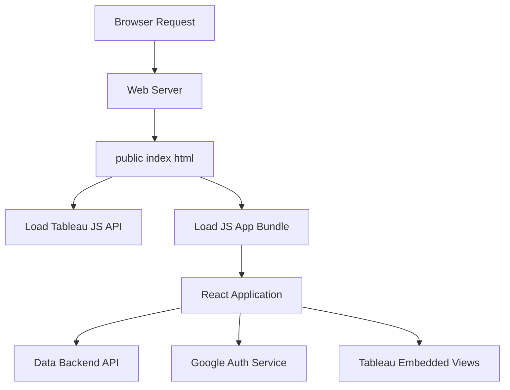

# tableau-frontend — Repository Overview

### High-Level Purpose
The `tableau-frontend` repository hosts a client-side React application named "Qadence by TQG". Its primary objective is to provide an interactive user interface for viewing and interacting with Tableau dashboards, likely involving user authentication, data fetching, and managing application-specific views.

### Architectural Structure
The repository follows a standard Create React App (CRA) structure.
*   **Root Level**: Contains project configuration files such as `package.json` for dependency management and build scripts, and `tailwind.config.js` for styling customization.
*   **`public/` Directory**: Houses static assets including `index.html` (the application's entry point), `manifest.json` for Progressive Web App (PWA) capabilities, and various icons.
*   **`src/` Directory**: Contains the primary application source code, including React components, global styles (`App.css`), and dedicated sub-directories like `Mock/` for development-specific data.

### Core Components
*   **React Application Core**: Built using React, responsible for rendering the user interface, managing component lifecycle, and handling application state.
*   **Build & Dependency System**: `package.json` orchestrates project dependencies, defines build and development scripts, and configures the development ecosystem.
*   **Application Entry Point**: `public/index.html` serves as the initial document loaded by the browser, providing the root DOM element (`#root`) for React to render into, and pre-loading critical external scripts like the Tableau Embedding API.
*   **Progressive Web App (PWA) Manifest**: `public/manifest.json` defines metadata enabling the application to be installed and provide an app-like experience.
*   **Global Styling**: `src/App.css` provides base styles and overrides for external UI libraries (e.g., `react-slick`).
*   **Mock Data Module**: `src/Mock/view.js` offers static data for development and testing environments, simulating backend API responses for view-related information.
*   **Tailwind CSS Configuration**: `tailwind.config.js` customizes the utility-first CSS framework's theme and specifies files for class scanning.

### Interaction & Data Flow
1.  **Client Initialization**: A user's browser requests `public/index.html` from a web server, initiating the application load.
2.  **Static Asset Loading**: `index.html` references and loads static assets, including `public/manifest.json` for PWA features, external stylesheets (e.g., Google Fonts), and the Tableau Embedding API script.
3.  **JavaScript Application Bootstrapping**: The main JavaScript bundle (generated from `src/` files) is loaded and executed, mounting the React application into the `
` element.
4.  **UI Rendering**: The React application renders its components, applying styles defined in `src/App.css` and those generated by Tailwind CSS (configured via `tailwind.config.js`).
5.  **Data Interaction**: The application uses `axios` for HTTP requests to fetch data from a backend service. During development, `src/Mock/view.js` can supply static view data.
6.  **Authentication**: User authentication is facilitated via `@react-oauth/google` for integration with Google's OAuth services.
7.  **Navigation**: `react-router-dom` manages client-side routing, enabling navigation between different views within the single-page application.
8.  **Tableau Integration**: The Tableau Embedding API allows the React application to embed and interact with Tableau visualizations directly within the web application.

### Technology Stack
*   **Frontend Framework**: React (`react`, `react-dom`).
*   **Build System**: `react-scripts` (Create React App), which abstracts Webpack and Babel configurations.
*   **Package Management**: npm.
*   **UI Components**: Ant Design (`antd`), `react-slick` for carousels, `react-toastify` for notifications, `react-icons`.
*   **Styling**: Tailwind CSS (`tailwindcss`) with a custom configuration, supplemented by direct CSS (`App.css`).
*   **API Interaction**: `axios` for HTTP client requests.
*   **Authentication**: `@react-oauth/google` for Google OAuth integration.
*   **Client-side Routing**: `react-router-dom`.
*   **Form Management**: `react-hook-form`.
*   **Testing**: React Testing Library (`@testing-library/react`, `@testing-library/jest-dom`).
*   **Tableau Integration**: Tableau Embedding API (external JavaScript library).
*   **Language**: JavaScript (with support for JSX, and implicitly TypeScript based on `tailwind.config.js` content paths).

### Design Observations
*   **Create React App Foundation**: The project is built upon `react-scripts`, providing a standardized and managed build setup, which simplifies initial configuration but might require ejecting for advanced customizations.
*   **Hybrid Styling Strategy**: The application integrates both Ant Design for structured UI components and Tailwind CSS for utility-first styling, allowing for a flexible and potentially efficient approach to UI development.
*   **Progressive Web App Readiness**: The inclusion of `manifest.json` indicates an intent to provide PWA features, enhancing user engagement through installability and an app-like experience.
*   **Direct Tableau Integration**: The explicit referencing of the Tableau Embedding API in `index.html` is central to the application's core functionality, enabling seamless display and interaction with Tableau dashboards.
*   **Dedicated Mock Data**: The presence of `src/Mock/view.js` demonstrates a clear practice for providing static data, facilitating independent frontend development and consistent testing.
*   **Atypical `npm`/`i` Dependencies**: The `package.json` file lists `npm` and `i` as production dependencies, which is unusual for a runtime application and may warrant further investigation for potential configuration cleanup or clarification.

### System Diagram

```mermaid
graph TD
A[Browser Request] --> B[Web Server]
B --> C[public index html]
C --> D[Load Tableau JS API]
C --> E[Load JS App Bundle]
E --> F[React Application]
F --> G[Data Backend API]
F --> H[Google Auth Service]
F --> I[Tableau Embedded Views]
```