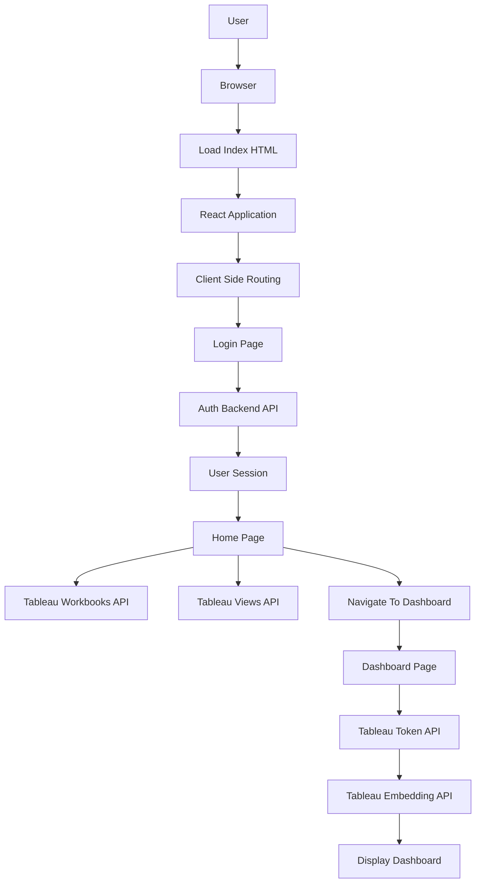

# tableau-frontend — Repository Overview

### High-Level Purpose
The `tableau-frontend` repository hosts a React-based single-page application designed to enable user authentication, browse available Tableau workbooks and views, and dynamically embed specific Tableau dashboards. Its primary objective is to provide a user interface for interacting with and displaying Tableau visualizations, integrating with a backend API for data and authentication.

### Architectural Structure
The repository follows a typical Create React App (CRA) structure, organized into distinct layers:

*   **Build & Configuration Layer**: Managed by `package.json` for dependencies and scripts, and `tailwind.config.js` for styling framework configuration.
*   **Public Assets & Entry Point Layer**: The `public/` directory contains `index.html` (the SPA entry point), `manifest.json` for Progressive Web App (PWA) capabilities, and static assets like icons.
*   **Application Source Layer (`src/`)**:
    *   **Root Application (`App.jsx`)**: Establishes the main client-side routing and global API endpoint.
    *   **Page-Level Components (`src/Pages/`)**: Contains top-level views like `Login.jsx`, `Home.jsx`, and `Dashboard.jsx`, each responsible for a distinct application feature.
    *   **Shared Components (`src/Components/`)**: Intended for reusable UI elements (e.g., `Sidenav.jsx`, though currently commented out).
    *   **Styling (`App.css`)**: Global application styles and overrides.
    *   **Mock Data (`src/Mock/`)**: Provides static data for development and testing (e.g., `view.js`).
    *   **Services (`src/Services/`)**: Intended for API abstraction (e.g., `api_service.js`, though largely unused in current summaries).

### Core Components
*   **`App.jsx`**: The root React component, configuring client-side routing via `react-router-dom` and defining the global backend API base URL.
*   **`Login.jsx`**: Handles user authentication, supporting both email/password login and Google OAuth, by interacting with the backend `/auth` endpoint.
*   **`Home.jsx`**: Displays a browsable list of Tableau workbooks and views, allowing search and filtering, and fetching data from `/tableau/workbooks` and `/tableau/views`.
*   **`Dashboard.jsx`**: Responsible for dynamically embedding specific Tableau visualizations by fetching authentication tokens from `/tableau/token` and utilizing the Tableau Embedding API.
*   **`package.json`**: Defines project metadata, manages runtime and development dependencies (e.g., `react`, `axios`, `antd`), and specifies build and test scripts.
*   **`public/index.html`**: The single HTML entry point for the application, bootstrapping the React application and pre-loading external scripts like the Tableau Embedding API.
*   **`public/manifest.json`**: Provides metadata for PWA features, enabling the application to be installed on user devices with custom display settings.

### Interaction & Data Flow
The application's primary interaction flow begins with user authentication on the `Login` page. Upon successful login (via email/password or Google OAuth), the user is redirected to the `Home` page. The `Home` page fetches lists of Tableau workbooks and views from the backend API, displaying them in a browseable interface. Users can search and filter these views. When a user selects a specific view, they are navigated to the `Dashboard` page. The `Dashboard` page then requests a temporary authentication token from the backend API and uses the Tableau Embedding API to dynamically load and display the selected Tableau visualization. Client-side routing throughout the application is managed by `react-router-dom`.

```mermaid
graph TD
User[User] --> Browser[Browser]
Browser --> LoadIndexHtml[Load Index HTML]
LoadIndexHtml --> ReactApp[React Application]
ReactApp --> ClientSideRouting[Client Side Routing]
ClientSideRouting --> LoginPage[Login Page]
LoginPage --> AuthBackendAPI[Auth Backend API]
AuthBackendAPI --> UserSession[User Session]
UserSession --> HomePage[Home Page]
HomePage --> TableauWorkbooksAPI[Tableau Workbooks API]
HomePage --> TableauViewsAPI[Tableau Views API]
HomePage --> NavigateToDashboard[Navigate To Dashboard]
NavigateToDashboard --> DashboardPage[Dashboard Page]
DashboardPage --> TableauTokenAPI[Tableau Token API]
TableauTokenAPI --> TableauEmbeddingAPI[Tableau Embedding API]
TableauEmbeddingAPI --> DisplayDashboard[Display Dashboard]
```

### Technology Stack
*   **Frontend Framework**: React
*   **Routing**: React Router DOM (`react-router-dom`)
*   **UI Libraries**: Ant Design (`antd`), Tailwind CSS (`tailwindcss` as dev dependency)
*   **HTTP Client**: Axios (`axios`)
*   **Authentication**: Google OAuth for React (`@react-oauth/google`)
*   **Form Management**: React Hook Form (`react-hook-form`)
*   **UI Utilities**: React Icons (`react-icons`), React Toastify (`react-toastify`), React Slick (`react-slick`), Slick Carousel (`slick-carousel`)
*   **Build Toolchain**: Create React App (implied by `react-scripts`)
*   **Linter**: ESLint
*   **Testing**: React Testing Library (`@testing-library/*`)
*   **External APIs**: Tableau Embedding API, Google OAuth.

### Design Observations
The application leverages standard React patterns and a Create React App-like setup, providing a solid foundation for a single-page application.
*   **Strengths**: Clear component separation (Pages, Components), robust client-side routing, centralized API endpoint (`App.API`), and integration with both Ant Design and Tailwind CSS for flexible styling. PWA capabilities are enabled via `manifest.json`.
*   **Trade-offs/Improvement Areas**:
    *   **Authentication Logic**: The `App.jsx` `Main` component currently hardcodes `isUserLoggedIn` to `true`, bypassing actual authentication, and the `apiService` is imported but not utilized for API calls in `Login.jsx`. This suggests an incomplete or mocked authentication flow that requires further implementation and abstraction.
    *   **Unused Components/Mocks**: `src/Components/Sidenav.jsx` is entirely commented out, and mock data files in `src/Mock/` are imported but not actively used in `Home.jsx`, which directly fetches data via `axios`. These could be removed for clarity or fully integrated.
    *   **CSS Practices**: `App.css` contains `!important` declarations, which can complicate style specificity and maintenance, and has some redundant property declarations.
    *   **Configuration**: Tableau host and content URLs are hardcoded within `Dashboard.jsx`, which could be externalized to environment variables for easier deployment and configuration management.
    *   **Dependency Management**: `package.json` lists `i` and `npm` as `dependencies`, which is atypical for a production frontend application and might indicate local development scripts or configurations that could be refined.

### System Diagram

```mermaid
graph TD
User[User] --> Browser[Browser]
Browser --> LoadIndexHtml[Load Index HTML]
LoadIndexHtml --> ReactApp[React Application]
ReactApp --> ClientSideRouting[Client Side Routing]
ClientSideRouting --> LoginPage[Login Page]
LoginPage --> AuthBackendAPI[Auth Backend API]
AuthBackendAPI --> UserSession[User Session]
UserSession --> HomePage[Home Page]
HomePage --> TableauWorkbooksAPI[Tableau Workbooks API]
HomePage --> TableauViewsAPI[Tableau Views API]
HomePage --> NavigateToDashboard[Navigate To Dashboard]
NavigateToDashboard --> DashboardPage[Dashboard Page]
DashboardPage --> TableauTokenAPI[Tableau Token API]
TableauTokenAPI --> TableauEmbeddingAPI[Tableau Embedding API]
TableauEmbeddingAPI --> DisplayDashboard[Display Dashboard]
```