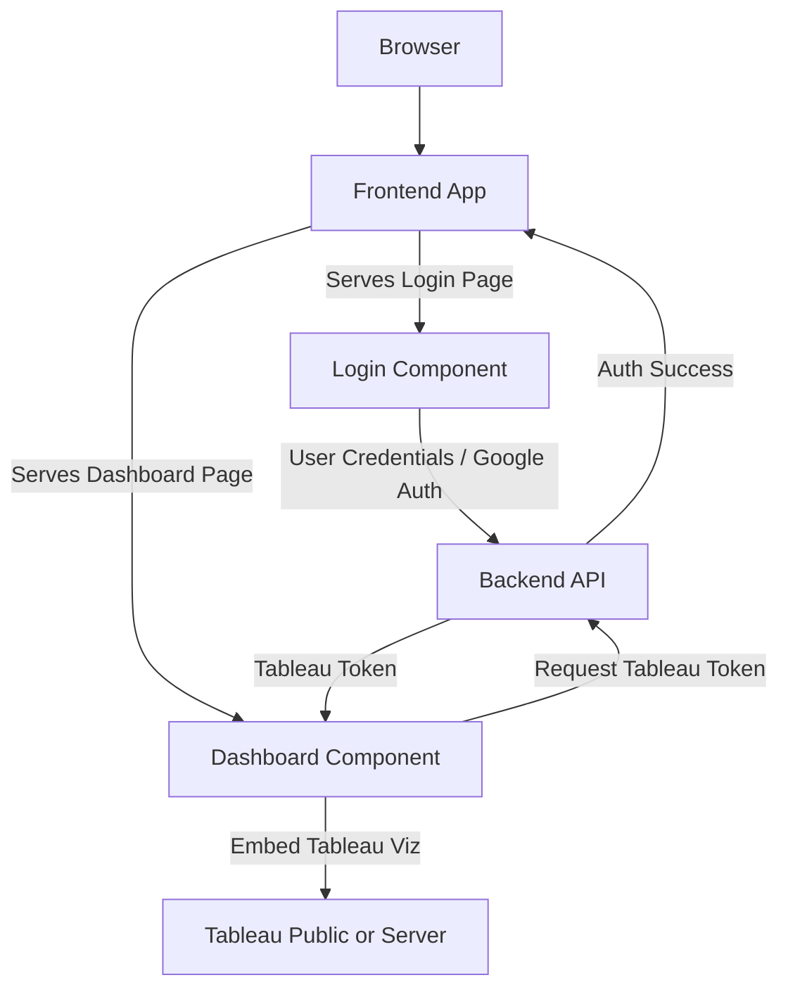

# tableau-frontend — Repository Overview

### High-Level Purpose
The `tableau-frontend` repository contains a React-based single-page application named "Qadence by TQG". Its primary objective is to provide a user interface for authenticating users and subsequently displaying embedded Tableau dashboards, leveraging the Tableau Embedding API for visualization.

### Architectural Structure
The repository follows a standard Create React App-like structure:
- **Root Configuration**: `package.json` manages project metadata, dependencies, and build scripts. `tailwind.config.js` configures the Tailwind CSS framework.
- **Public Assets**: The `public/` directory hosts static assets including `index.html` (the application's HTML entry point), `manifest.json` (for Progressive Web App capabilities), and various icons.
- **Source Code**: The `src/` directory contains the core application logic.
    - `src/Pages/`: Contains top-level React components representing distinct application views, such as `Login.jsx` and `Dashboard.jsx`.
    - `src/Mock/`: Houses mock data for development and testing, like `view.js`.
    - `src/App.css`: Defines global and component-specific cascading styles.

### Core Components
- **React Application**: The main client-side application built with React, managing UI rendering, state, and routing.
- **`Login` Component**: Handles user authentication, supporting both traditional email/password and Google OAuth flows, interacting with a backend API.
- **`Dashboard` Component**: Responsible for retrieving a Tableau authentication token from the backend and dynamically embedding Tableau visualizations using the Tableau Embedding API.
- **Tableau Embedding API**: An external JavaScript library integrated to render interactive Tableau dashboards within the application.
- **Backend API (implied)**: Provides endpoints for user authentication and provisioning of Tableau access tokens.
- **Styling Layer**: Consists of global CSS (`App.css`), Ant Design UI components, and Tailwind CSS utilities.
- **Dependency & Build Management**: `package.json` and `react-scripts` orchestrate the development and production build processes.

### Interaction & Data Flow
1.  **Initial Load**: The browser requests `public/index.html`, which serves as the SPA entry point and loads the main JavaScript application bundle along with the Tableau Embedding API script.
2.  **User Authentication**: The `Login` component, displayed on the initial route, facilitates user authentication. It sends user credentials (email/password or Google OAuth token) to a backend API (`/auth/`).
3.  **Navigation**: Upon successful authentication, the application navigates the user to the `/home` route, which renders the `Dashboard` component.
4.  **Tableau Dashboard Display**: The `Dashboard` component, upon mounting, extracts the target Tableau dashboard URL. It then initiates a request to the backend API (`/tableau/token`) to acquire a short-lived Tableau authentication token.
5.  **Visualization Embedding**: Using the obtained token, the `Dashboard` component dynamically creates and injects a `<tableau-viz>` custom element into the DOM, embedding the specified Tableau dashboard for interactive viewing.
6.  **Logout**: Users can log out, which clears the session cookie and redirects them to the login page.

### Technology Stack
-   **Frontend Framework**: React
-   **Build System**: Create React App (inferred from `react-scripts`)
-   **Language**: JavaScript (JSX)
-   **Styling**: Tailwind CSS (for utility-first styling), Ant Design (for UI components), Custom CSS
-   **HTTP Client**: Axios
-   **Routing**: React Router DOM
-   **Authentication**: Google OAuth (`@react-oauth/google`), Backend API for custom authentication
-   **Form Management**: React Hook Form
-   **UI Components/Libraries**: React Icons, React Slick (carousel), React Toastify (notifications)
-   **Embedded Analytics**: Tableau Embedding API
-   **Code Quality**: ESLint (configured via `eslintConfig` in `package.json`)
-   **Testing**: Jest, React Testing Library (development dependencies)

### Design Observations
The application leverages a standard Create React App setup for rapid development. It exhibits a clear separation of concerns, with specific pages handling distinct functionalities like login and dashboard display. The integration with Tableau is a core architectural decision, with explicit handling of token acquisition and dynamic embedding. The use of both Ant Design and Tailwind CSS for styling suggests a flexible UI development approach. Client-side caching of Tableau tokens optimizes performance by reducing redundant backend calls. The `public/manifest.json` indicates support for Progressive Web App features. Direct DOM manipulation in the `Dashboard` component for embedding Tableau, while functional, deviates from typical React declarative patterns.

### System Diagram

```mermaid
graph TD
A[Browser] --> B[Frontend App]
B -- Serves Login Page --> C[Login Component]
C -- User Credentials / Google Auth --> D[Backend API]
D -- Auth Success --> B
B -- Serves Dashboard Page --> E[Dashboard Component]
E -- Request Tableau Token --> D
D -- Tableau Token --> E
E -- Embed Tableau Viz --> F[Tableau Public or Server]
```