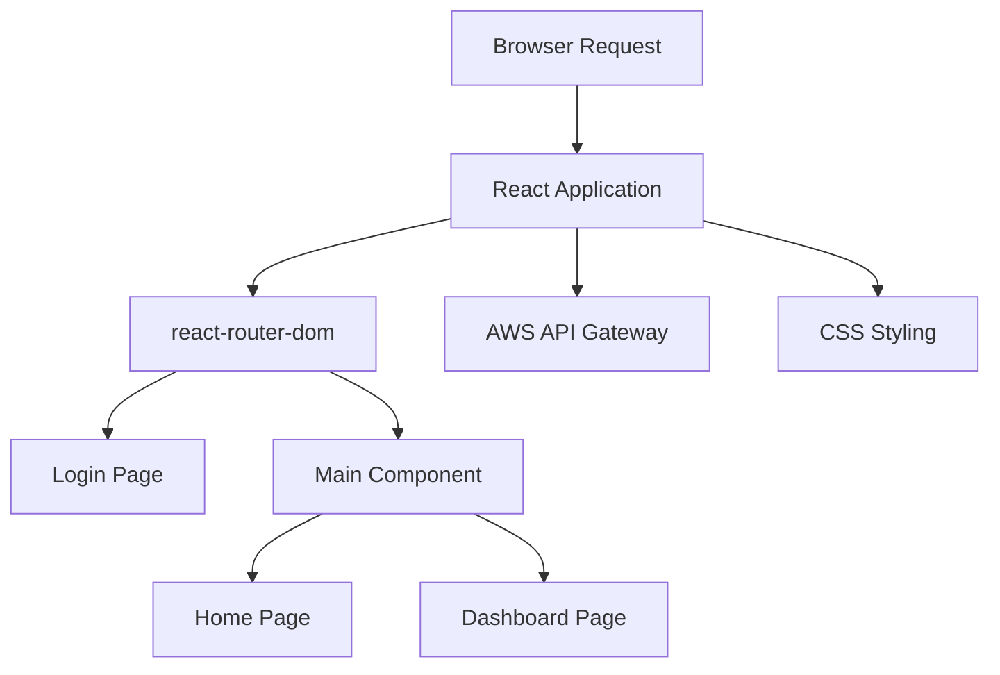

# tableau-frontend — Repository Overview

### High-Level Purpose
The `tableau-frontend` repository hosts a React-based single-page application designed to provide a user interface for displaying data and interactive dashboards. Its primary objective is to render authenticated views, likely involving data visualizations or reports, accessible via client-side routing.

### Architectural Structure
The architecture is structured as a client-side React application.
*   **Root (`src/App.jsx`):** Serves as the application's entry point, defining global routing and initializing the UI.
*   **Routing:** Utilizes `react-router-dom` to manage navigation, with a top-level router in `App.jsx` delegating to a nested router (`Main` component) for authenticated user flows.
*   **Pages:** Core application views (e.g., `Login`, `Home`, `Dashboard`) are organized into a `Pages` directory.
*   **Components:** Reusable UI elements are expected in a `Components` directory (e.g., `Sidenav`).
*   **Styling (`src/App.css`):** Global and component-specific styles are defined using standard CSS, including overrides for third-party libraries.

### Core Components
*   **`App` Component:** The root React component managing the overall application lifecycle and top-level routing.
*   **`Main` Component:** A nested component within `App` responsible for routes requiring authentication and rendering core application pages.
*   **`Login` Page:** Handles user authentication.
*   **`Home` and `Dashboard` Pages:** Primary content display areas for authenticated users.
*   **`Slick Carousel`:** A third-party UI component for displaying content in a carousel format, with customized styling.
*   **Loading Indicators:** UI elements for indicating ongoing background processes.
*   **API Service:** An intended module for interacting with backend services, although currently represented by a hardcoded API endpoint.

### Interaction & Data Flow
The application initiates with a `BrowserRouter` that directs traffic.
1.  Unauthenticated users are routed to the `Login` page.
2.  Upon conceptual authentication (currently hardcoded as true), users are directed to the `Main` component.
3.  Within `Main`, `react-router-dom` handles navigation to specific authenticated views like `/home` or `/dashboard`.
4.  UI elements and data presentation are styled by CSS rules.
5.  Backend interactions are anticipated through an API gateway, defined by a constant endpoint. The actual data retrieval and submission logic is abstracted to a `api_service` module, which is currently not actively used in the provided summaries.

### Technology Stack
*   **Frontend Framework:** React
*   **Routing Library:** `react-router-dom`
*   **Styling:** CSS
*   **UI Libraries:** `slick-carousel` (inferred from styling)
*   **Backend Interaction:** AWS API Gateway (implied by the API endpoint URL)

### Design Observations
The application uses a clear separation of routing concerns, with a root router for general access and a nested router for authenticated content. The inclusion of a hardcoded `isUserLoggedIn` state and commented-out authentication logic suggests an iterative development approach, allowing frontend development to proceed without a fully integrated backend authentication system. Custom styling for a `slick-carousel` indicates specific UI/UX requirements for content presentation. The architecture anticipates integration with an AWS-based backend through API Gateway.

### System Diagram

```mermaid
graph TD
BrowserRequest[Browser Request] --> ReactApp[React Application]
ReactApp --> Router[react-router-dom]
Router --> LoginPage[Login Page]
Router --> AuthenticatedRoutes[Main Component]
AuthenticatedRoutes --> HomePage[Home Page]
AuthenticatedRoutes --> DashboardPage[Dashboard Page]
ReactApp --> BackendAPI[AWS API Gateway]
ReactApp --> CSSStyling[CSS Styling]
```