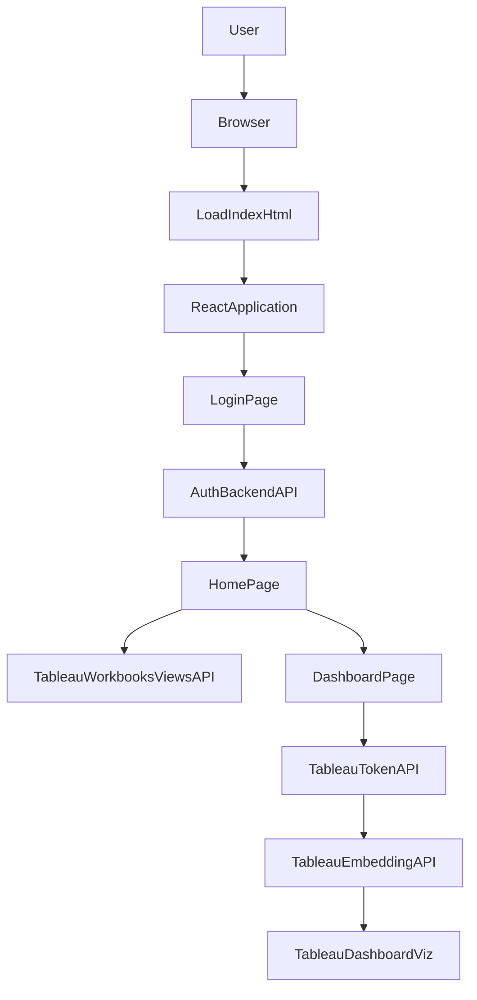

# tableau-frontend — Repository Overview

### High-Level Purpose
The `tableau-frontend` repository hosts a React-based single-page application. Its primary objective is to provide a user interface for authenticating users, browsing Tableau workbooks and views, and embedding specific Tableau dashboards. The application integrates with a backend API for authentication and data retrieval related to Tableau visualizations.

### Architectural Structure
The repository follows a Create React App (CRA)-like structure, organizing the application into distinct layers:

*   **Build & Configuration**: Root-level files like `package.json` manage dependencies and build scripts, while `tailwind.config.js` configures styling.
*   **Public Assets & Entry Point**: The `public/` directory contains the single HTML entry point (`index.html`), `manifest.json` for Progressive Web App (PWA) capabilities, and static assets.
*   **Application Source (`src/`)**:
    *   **Root Application (`App.jsx`)**: Establishes client-side routing and global API endpoint configuration.
    *   **Page-Level Components (`src/Pages/`)**: Houses feature-specific views such as `Login.jsx`, `Home.jsx`, and `Dashboard.jsx`.
    *   **Shared Components (`src/Components/`)**: Intended for reusable UI elements.
    *   **Styling (`App.css`)**: Contains global application styles and overrides.
    *   **Mock Data (`src/Mock/`)**: Provides static data for development purposes.
    *   **Services (`src/Services/`)**: Designated for API abstraction.

### Core Components
*   **`package.json`**: Defines project metadata, runtime/development dependencies, and npm scripts.
*   **`public/index.html`**: The single HTML entry point that bootstraps the React application and pre-loads the Tableau Embedding API.
*   **`public/manifest.json`**: Provides metadata for PWA features, enabling home screen installation and application-like display.
*   **`src/App.jsx`**: The root React component configuring client-side routing via `react-router-dom` and setting the global backend API base URL.
*   **`src/Pages/Login.jsx`**: Manages user authentication, interacting with the backend `/auth` endpoint.
*   **`src/Pages/Home.jsx`**: Displays a browsable, searchable list of Tableau workbooks and views, fetching data from `/tableau/workbooks` and `/tableau/views`.
*   **`src/Pages/Dashboard.jsx`**: Embeds specific Tableau visualizations by fetching authentication tokens from `/tableau/token` and utilizing the Tableau Embedding API.
*   **`tailwind.config.js`**: Configures Tailwind CSS for utility-first styling.
*   **Axios**: The primary HTTP client for backend API interactions.
*   **React Router DOM**: Manages client-side navigation.
*   **Tableau Embedding API**: An external JavaScript library pre-loaded in `index.html` for embedding Tableau visualizations.

### Interaction & Data Flow
The application flow typically begins with the browser loading `public/index.html`, which then bootstraps the React application. Client-side routing, managed by `react-router-dom`, initially directs users to the `Login` page. Users authenticate using email/password or Google OAuth, sending credentials to a backend `/auth` endpoint via `axios`. Upon successful authentication, the user is redirected to the `Home` page.

On the `Home` page, lists of Tableau workbooks and views are fetched from backend endpoints (`/tableau/workbooks`, `/tableau/views`) via `axios`. Users can search and filter these views client-side. Selecting a specific view navigates the user to the `Dashboard` page, passing the view's URL as state. On the `Dashboard` page, a temporary authentication token is requested from the backend's `/tableau/token` endpoint. This token, along with the view's URL, is then used by the client-side Tableau Embedding API (pre-loaded in `index.html`) to dynamically render the chosen Tableau visualization.

### Technology Stack
*   **Frontend Framework**: React (`react`, `react-dom`)
*   **Routing**: React Router DOM (`react-router-dom`)
*   **UI Components**: Ant Design (`antd`), React Icons (`react-icons`), React Toastify (`react-toastify`), React Slick (`react-slick`), Slick Carousel (`slick-carousel`)
*   **Styling**: Tailwind CSS (`tailwindcss`), global CSS (`App.css`)
*   **HTTP Client**: Axios (`axios`)
*   **Authentication**: Google OAuth for React (`@react-oauth/google`)
*   **Form Management**: React Hook Form (`react-hook-form`)
*   **Build Toolchain**: Create React App (`react-scripts`)
*   **External APIs**: Tableau Embedding API, Google OAuth

### Design Observations
The application uses standard React patterns within a Create React App-like setup.

*   **Strengths**:
    *   **Modular UI**: Clear separation of concerns with `Pages` for top-level views and `Components` for reusable elements.
    *   **Robust Routing**: Utilizes `react-router-dom` for effective client-side navigation.
    *   **Centralized Configuration**: The `API` constant in `App.jsx` centralizes the backend endpoint, improving maintainability.
    *   **Flexible Styling**: Combines Ant Design for structured UI elements with Tailwind CSS for utility-first styling.
    *   **PWA Readiness**: `manifest.json` enables Progressive Web Application features.
*   **Trade-offs & Improvement Areas**:
    *   **Authentication Logic Inconsistency**: `App.jsx` hardcodes `isUserLoggedIn` to `true`, bypassing actual authentication. The `apiService` is imported but not consistently used, leading to direct `axios` calls in components like `Login.jsx`, indicating an incomplete or inconsistent API abstraction layer.
    *   **Unused/Stale Code**: `src/Components/Sidenav.jsx` is entirely commented out. Mock data files in `src/Mock/` are imported but not actively used in `Home.jsx`, which relies on direct `axios` calls, suggesting these assets could be removed or properly integrated.
    *   **CSS Practices**: `App.css` contains `!important` declarations and some redundant property definitions, which may lead to specificity issues and harder maintenance.
    *   **Hardcoded Configuration**: Tableau host and content URLs are hardcoded in `Dashboard.jsx`. These are candidates for externalization into environment variables for improved deployment flexibility across environments.
    *   **Dependency Anomalies**: `package.json` lists `i` and `npm` as direct dependencies, which is unusual for a production frontend application and may indicate legacy scripts or an oversight.
    *   **Scalability for Client-Side Filtering**: The client-side filtering of views in `Home.jsx` might not scale efficiently for very large datasets, potentially requiring a shift to server-side search capabilities.

### System Diagram

```mermaid
graph TD
User[User] --> Browser[Browser]
Browser --> LoadIndexHtml[LoadIndexHtml]
LoadIndexHtml --> ReactApplication[ReactApplication]
ReactApplication --> LoginPage[LoginPage]
LoginPage --> AuthBackendAPI[AuthBackendAPI]
AuthBackendAPI --> HomePage[HomePage]
HomePage --> TableauWorkbooksViewsAPI[TableauWorkbooksViewsAPI]
HomePage --> DashboardPage[DashboardPage]
DashboardPage --> TableauTokenAPI[TableauTokenAPI]
TableauTokenAPI --> TableauEmbeddingAPI[TableauEmbeddingAPI]
TableauEmbeddingAPI --> TableauDashboardViz[TableauDashboardViz]
```