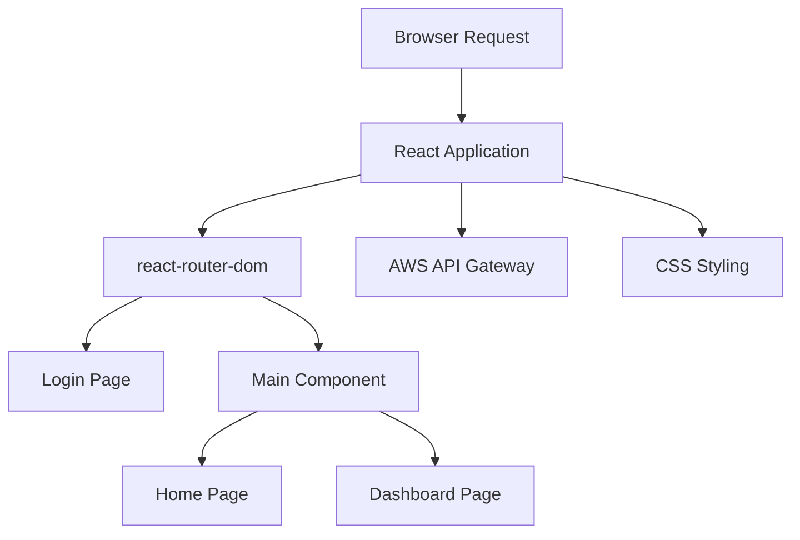

# tableau-frontend — Repository Overview

### High-Level Purpose
The `tableau-frontend` repository hosts a React-based single-page application designed to provide a user interface for displaying data and interactive dashboards. Its primary objective is to render authenticated views, likely involving data visualizations or reports, accessible via client-side routing.

### Architectural Structure
The architecture is structured as a client-side React application. The `App.jsx` file serves as the application's entry point, defining global routing and initializing the UI. Routing is managed by `react-router-dom`, with a top-level router delegating to a nested router (`Main` component) for authenticated user flows. Core application views (e.g., `Login`, `Home`, `Dashboard`) are organized into a `Pages` directory, and reusable UI elements are expected in a `Components` directory. Global and component-specific styles, including overrides for third-party libraries, are defined in `App.css`.

### Core Components
*   **`App` Component:** The root React component managing the overall application lifecycle and top-level routing.
*   **`Main` Component:** A nested component responsible for routes requiring authentication and rendering core application pages.
*   **`Login` Page:** Handles user authentication.
*   **`Home` and `Dashboard` Pages:** Primary content display areas for authenticated users.
*   **`Sidenav` Component:** Provides primary navigation links.
*   **`API` Constant:** Defines the base URL for backend API interactions.
*   **`slick-carousel`:** A third-party UI component for displaying content, with customized styling from `App.css`.
*   **Loading Indicators:** UI elements for indicating ongoing background processes, styled via `App.css`.
*   **`allViews` Mock Data:** Static data simulating dashboard view listings, used for development.

### Interaction & Data Flow
The application initiates with a `BrowserRouter` that directs traffic. Unauthenticated users are routed to the `Login` page. Upon conceptual authentication (currently hardcoded as true within `Main`), users are directed to the `Main` component, which then handles navigation to specific authenticated views like `/home` or `/dashboard` using nested `react-router-dom` routes. UI elements and data presentation are styled by CSS rules from `App.css`. Backend interactions are anticipated through an `api_service` module, interfacing with an AWS API Gateway endpoint defined by the `API` constant. Mock data from `src/Mock/view.js` can be used to simulate backend responses for view listings.

### Technology Stack
*   **Frontend Framework:** React
*   **Routing Library:** `react-router-dom`
*   **Styling:** CSS
*   **UI Libraries:** `slick-carousel`
*   **Backend Interaction:** AWS API Gateway (implied by the API endpoint URL)

### Design Observations
The application uses a clear separation of routing concerns, with a root router for general access and a nested router for authenticated content. The inclusion of a hardcoded `isUserLoggedIn` state and commented-out authentication logic suggests an iterative development approach, allowing frontend development to proceed without a fully integrated backend authentication system. Custom styling for a `slick-carousel` indicates specific UI/UX requirements for content presentation. The use of `!important` flags in `App.css` for certain styles may point to potential CSS specificity conflicts or a need for refactoring. The architecture anticipates integration with an AWS-based backend through API Gateway. The `Sidenav` component is developed and imported but not currently rendered within the primary application layout, indicating an incomplete integration or a planned future feature. The presence of mock data (`src/Mock/view.js`) facilitates decoupled frontend development by providing static data for UI components independently of a live backend.

### System Diagram

```mermaid
graph TD
BrowserRequest[Browser Request] --> ReactApp[React Application]
ReactApp --> Router[react-router-dom]
Router --> LoginPage[Login Page]
Router --> AuthenticatedRoutes[Main Component]
AuthenticatedRoutes --> HomePage[Home Page]
AuthenticatedRoutes --> DashboardPage[Dashboard Page]
ReactApp --> BackendAPI[AWS API Gateway]
ReactApp --> CSSStyling[CSS Styling]
```