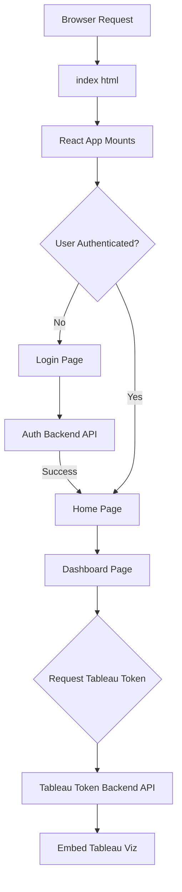

# tableau-frontend — Repository Overview

### High-Level Purpose
This repository contains the frontend application for "Qadence," a web interface primarily designed to display and interact with Tableau dashboards. It provides user authentication capabilities, including email/password and Google OAuth, and dynamically embeds Tableau visualizations sourced from a backend service. The application aims to offer a tailored user experience for accessing and viewing specific Tableau content.

### Architectural Structure
The repository follows a standard Single-Page Application (SPA) architecture, structured around a React framework.

-   **Root Directory**: Contains core configuration files such as `package.json` for dependency management and scripts, and `tailwind.config.js` for styling configuration.
-   **`public/`**: Stores static assets critical for the application's initial load and Progressive Web App (PWA) features. This includes `index.html` (the single entry point), `manifest.json`, and static images.
-   **`src/`**: Houses the application's source code, organized into functional directories:
    -   **`src/Pages/`**: Contains top-level React components representing distinct application views (e.g., `Login.jsx`, `Dashboard.jsx`).
    -   **`src/Mock/`**: Provides static mock data (`view.js`) used for development and testing, simulating backend API responses.
    -   **`src/App.css`**: Defines global application styles and overrides for third-party UI components.
-   **Backend Interaction**: The application communicates with a separate backend API for authentication and token retrieval using `axios`.

### Core Components
-   **`package.json`**: Manages project dependencies (React, Ant Design, Axios, React Router DOM, Google OAuth, etc.) and defines build, start, and test scripts.
-   **`public/index.html`**: The application's entry point, loading the main JavaScript bundle and the Tableau Embedding API, and defining the `#root` mount point for the React application.
-   **`public/manifest.json`**: Configures the application as a Progressive Web App (PWA), specifying icons, names, and display modes for installation on user devices.
-   **`src/App.css`**: Contains global CSS rules and styling specific to components like `react-slick` carousels and loading indicators.
-   **`src/Pages/Login.jsx`**: Handles user authentication, allowing login via email/password or Google OAuth, and manages client-side form validation and UI feedback.
-   **`src/Pages/Dashboard.jsx`**: Responsible for fetching Tableau authentication tokens from the backend, caching them, and dynamically embedding Tableau visualizations using the Tableau Embedding API's `<tableau-viz>` web component.
-   **`src/Mock/view.js`**: Provides static, predefined data structures to simulate view-related data from a backend, used for development and testing.

### Interaction & Data Flow
1.  **Application Bootstrapping**: A user's browser requests `public/index.html`. This file loads the Tableau Embedding API and serves as the mount point for the React application.
2.  **Authentication**:
    *   The `Login` page (`src/Pages/Login.jsx`) handles user input for email/password or initiates a Google OAuth flow.
    *   Credentials or Google access tokens are sent via `axios` to a backend API (`/auth`) for verification.
    *   Upon successful authentication, the backend typically establishes a session (e.g., via cookies), and the frontend navigates the user to the `/home` route.
3.  **Dashboard Display**:
    *   The `Dashboard` page (`src/Pages/Dashboard.jsx`) receives the Tableau dashboard path via `react-router-dom`'s `location.state`.
    *   It calls `getToken()` to acquire a Tableau authentication token. `getToken()` first checks a client-side cache, and if no valid token is present, it makes an `axios` request to the backend API (`/tableau/token`).
    *   With the token and dashboard path, the `Dashboard` component dynamically constructs and injects a `<tableau-viz>` web component into the DOM, embedding the Tableau visualization.
4.  **Styling**: Global styles from `src/App.css` and Tailwind CSS utilities (configured via `tailwind.config.js`) are applied throughout the rendering process.
5.  **Mock Data Usage**: During development or testing, components can import and use `src/Mock/view.js` to simulate data presence without needing a live backend connection.

### Technology Stack
-   **Frontend Framework**: React
-   **Build System**: Create React App (via `react-scripts`)
-   **UI Library**: Ant Design (`antd`)
-   **Styling**: Tailwind CSS (`tailwindcss`), custom CSS
-   **Routing**: React Router DOM (`react-router-dom`)
-   **HTTP Client**: Axios (`axios`)
-   **Authentication**: Google OAuth (`@react-oauth/google`), custom backend authentication
-   **Form Management**: React Hook Form (`react-hook-form`)
-   **Notifications**: React Toastify (`react-toastify`)
-   **Icons**: React Icons (`react-icons`)
-   **Carousel**: React Slick (`react-slick`), Slick Carousel (`slick-carousel`)
-   **Embedding**: Tableau Embedding API (external script)
-   **Linting**: ESLint (configured in `package.json`)
-   **Testing**: React Testing Library (`@testing-library/*`), Jest

### Design Observations
-   The project benefits from a managed build setup via `react-scripts`, abstracting complex Webpack/Babel configurations.
-   A hybrid styling approach combining Ant Design components with Tailwind CSS utilities is employed, offering both structured UI elements and flexible custom styling.
-   Client-side caching of Tableau authentication tokens in `Dashboard.jsx` optimizes API calls and enhances performance.
-   The application supports multiple authentication methods (email/password and Google OAuth), improving user accessibility.
-   The inclusion of `manifest.json` indicates an intent to support Progressive Web App features for enhanced user experience and installability.
-   The presence of `src/Mock/view.js` facilitates independent frontend development and testing.
-   Dynamic HTML injection using `innerHTML` for the Tableau web component in `Dashboard.jsx` requires careful consideration regarding potential Cross-Site Scripting (XSS) vulnerabilities if input data is not sufficiently trusted.
-   The `package.json` lists `npm` and `i` (an alias for `npm install`) as dependencies, which is atypical for production applications and may warrant review.

### System Diagram

```mermaid
graph TD
A[Browser Request] --> B[index html]
B --> C[React App Mounts]
C --> D{User Authenticated?}
D -- No --> E[Login Page]
E --> F[Auth Backend API]
F -- Success --> G[Home Page]
D -- Yes --> G
G --> H[Dashboard Page]
H --> I{Request Tableau Token}
I --> J[Tableau Token Backend API]
J --> K[Embed Tableau Viz]
```