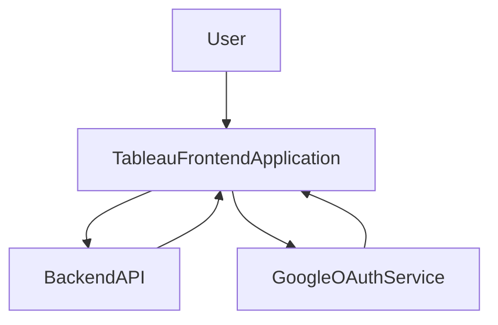

# REPOSITORY_OVERVIEW.md

> **Source File:** [REPOSITORY_OVERVIEW.md](https://github.com/test-company-prowiz/tableau-frontend/blob/main/REPOSITORY_OVERVIEW.md)
> **Repository:** `tableau-frontend`
> **Branch:** `main`

# tableau-frontend — Repository Overview

### High-Level Purpose
The `tableau-frontend` repository contains a client-side web application designed to provide a user interface for authenticating, browsing, and interacting with Tableau workbooks and views. Its primary objective is to serve as a portal for accessing and navigating Tableau content.

### Architectural Structure
This repository implements a Single-Page Application (SPA) using React. The architecture is client-server based, with the frontend consuming data and services from a backend API. The application's structure organizes top-level routes and their corresponding components within the `src/Pages` directory.

### Core Components
*   **Authentication Module**: Manages user login flows, supporting both traditional email/password authentication and Google OAuth.
*   **Content Browsing & Display**: Facilitates the fetching and presentation of Tableau workbooks in a carousel and a list of Tableau views, including filtering capabilities.
*   **Client-Side Routing**: Handles navigation between different application views (e.g., Login, Home, Dashboard) using `react-router-dom`.
*   **API Client**: Utilizes `axios` for making HTTP requests to the backend API, abstracting data fetching operations.
*   **User Interface Layer**: Built with React components, leveraging Ant Design for a consistent and robust UI experience.

### Interaction & Data Flow
1.  Users initiate interaction via the `Login` page, authenticating through either email/password credentials or Google OAuth.
2.  Upon successful authentication, the application navigates the user to the `Home` page.
3.  The `Home` page concurrently fetches lists of Tableau workbooks and views from the backend API.
4.  Workbooks are displayed in an interactive carousel, and views are listed, with options for filtering by workbook or search input.
5.  Selecting a specific view navigates the user to a `Dashboard` route, passing the view's `contentUrl` for display.
6.  Logout functionality clears the user session and redirects back to the `Login` page.
7.  All backend communication utilizes `axios` with `withCredentials: true`, indicating a reliance on cookie-based session management.

### Technology Stack
*   **Frontend Framework**: React
*   **Routing**: `react-router-dom`
*   **Form Management**: `react-hook-form`
*   **HTTP Client**: `axios`
*   **UI Library**: `antd` (Ant Design)
*   **Carousel Component**: `react-slick`
*   **Google OAuth Integration**: `@react-oauth/google`
*   **Notifications**: `react-toastify`

### Design Observations
The application employs standard React practices for state management and side effects using hooks. It provides a responsive user experience with loading indicators during data fetching. The direct handling of API calls within page components suggests a lean architecture for data fetching. The use of `withCredentials: true` across API requests indicates a clear design choice for cookie-based session management. Potential areas for enhancement include abstracting API calls into a dedicated service layer and implementing server-side filtering or pagination for views to improve scalability with large datasets.

### System Diagram

```mermaid
graph TD
User[User] --> TableauFrontendApplication[TableauFrontendApplication];
TableauFrontendApplication --> BackendAPI[BackendAPI];
TableauFrontendApplication --> GoogleOAuthService[GoogleOAuthService];
BackendAPI --> TableauFrontendApplication;
GoogleOAuthService --> TableauFrontendApplication;
```