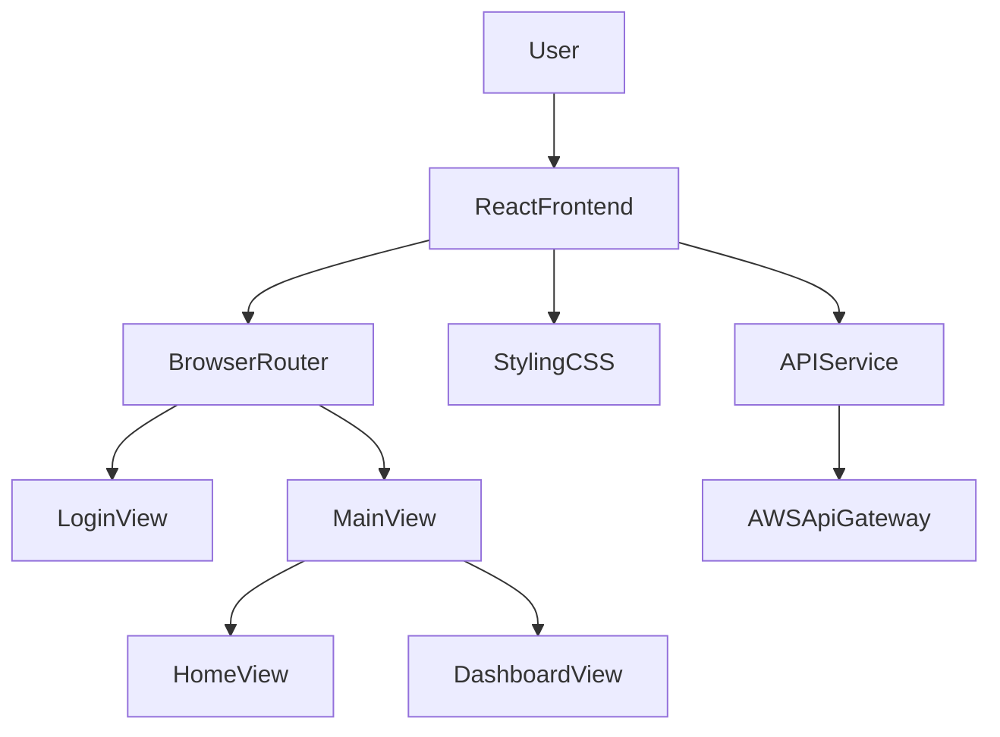

# REPOSITORY_OVERVIEW.md

> **Source File:** [REPOSITORY_OVERVIEW.md](https://github.com/test-company-prowiz/tableau-frontend/blob/main/REPOSITORY_OVERVIEW.md)
> **Repository:** `tableau-frontend`
> **Branch:** `main`

# tableau-frontend — Repository Overview

### High-Level Purpose
This repository hosts the frontend application, primarily a React-based single-page application responsible for user interface rendering, client-side routing, and interaction with a backend API. Its objective is to provide an interactive experience for users, including login, dashboard, and home views, potentially displaying data from Tableau or similar visualization services.

### Architectural Structure
The repository follows a typical React application structure:
*   **Root Component (`App.jsx`)**: Acts as the main entry point, orchestrating global routing and application layout.
*   **Styling (`App.css`)**: Contains global CSS rules and specific styles for UI components and third-party libraries.
*   **Pages**: Dedicate components for distinct application views (e.g., `Login`, `Home`, `Dashboard`).
*   **Services (inferred)**: A `Services` directory is inferred for API interaction logic (`api_service`).
*   **Components (inferred)**: A `Components` directory is inferred for reusable UI elements (`Sidenav`).

### Core Components
*   **`App` Component**: The top-level React component that sets up client-side routing using `react-router-dom` and defines the application's overall structure.
*   **`Main` Component**: A nested component within `App` that manages routes for authenticated users and includes a placeholder for authentication logic.
*   **Page Components**: Dedicated components like `Login`, `Home`, and `Dashboard` that represent distinct application views.
*   **Styling System**: Defined in `App.css`, providing global styles, layout rules, and custom theming for UI components, including a carousel library.
*   **API Service (inferred)**: An `api_service` is referenced, indicating a module for handling communication with external APIs.

### Interaction & Data Flow
The application initiates by rendering the `App` component, which configures `react-router-dom`.
1.  User navigation is managed by `BrowserRouter`, directing to either the `Login` page (for the root path) or the `Main` component (for authenticated sections).
2.  The `Main` component currently bypasses authentication checks and routes to `Home` or `Dashboard` based on the URL.
3.  Page components render UI elements, which are styled by `App.css`.
4.  Interaction with an external AWS API Gateway is anticipated via an `api_service` (though currently commented out in the main routing logic).

### Technology Stack
*   **React**: Core JavaScript library for building user interfaces.
*   **`react-router-dom`**: Library for declarative client-side routing.
*   **CSS**: For styling and layout management.
*   **`react-slick` (inferred)**: A carousel component library, based on explicit CSS styling for `slick-*` classes.
*   **AWS API Gateway (inferred)**: The configured `API` constant suggests interaction with an AWS API Gateway endpoint for backend communication.

### Design Observations
*   **Centralized Routing**: Routing logic is consolidated within `App.jsx`, providing a clear overview of navigation paths.
*   **Authentication Placeholder**: The current implementation of `Main` includes a hardcoded login state, indicating that a robust authentication flow is planned but not fully implemented. This requires further development for security and user management.
*   **API Configuration**: The API base URL is hardcoded in `App.jsx`; externalizing this into environment variables or a dedicated configuration file would improve maintainability and deployment flexibility.
*   **Third-Party Styling**: Direct styling of `react-slick` classes in `App.css` allows for custom theming but requires careful management to prevent conflicts with library updates.
*   **CSS Specificity**: The use of `!important` in `App.css` suggests potential challenges with CSS specificity, which could lead to maintainability issues.

### System Diagram

```mermaid
graph TD
A[User] --> B[ReactFrontend]
B --> C[BrowserRouter]
C --> D[LoginView]
C --> E[MainView]
E --> F[HomeView]
E --> G[DashboardView]
B --> H[StylingCSS]
B --> I[APIService]
I --> J[AWSApiGateway]
```