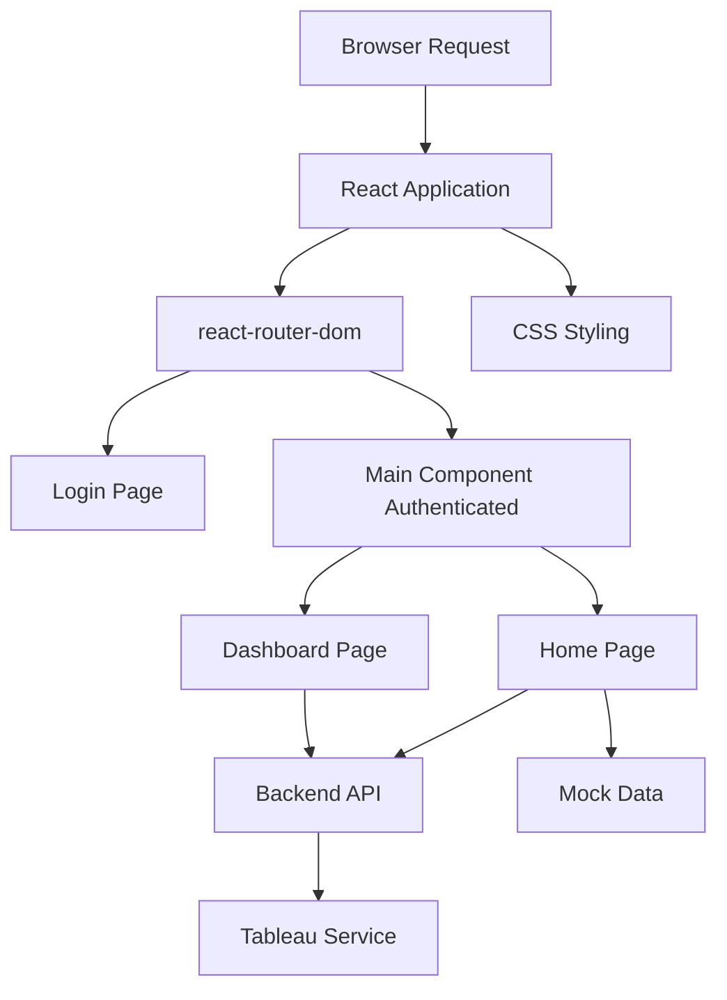

# tableau-frontend — Repository Overview

### High-Level Purpose
The `tableau-frontend` repository hosts a React-based single-page application designed to provide a user interface for displaying data and interactive dashboards, primarily integrating with Tableau visualizations. Its core objective is to render authenticated views, allowing users to browse and interact with Tableau workbooks and views.

### Architectural Structure
The application follows a client-side React single-page application (SPA) architecture. `src/App.jsx` serves as the root component, handling global client-side routing using `react-router-dom`. Routing is structured into a top-level `BrowserRouter` that directs traffic to a `Login` page for unauthenticated users and a `Main` component for authenticated users. The `Main` component then manages nested routes for core application pages like `Home` and `Dashboard`. UI components are organized within a `Components` directory (e.g., `Sidenav`), while primary page views reside in `Pages`. Styling is managed through `src/App.css` for global styles and overrides, alongside extensive use of Tailwind CSS classes for component-level styling. Mock data for development is located in the `Mock` directory.

### Core Components
*   **`App` Component**: The application's entry point, defining top-level routing and layout.
*   **`Main` Component**: Handles authentication state and renders protected routes (e.g., `/home`, `/dashboard`).
*   **`Login` Page**: Component for user authentication, supporting traditional and Google OAuth login.
*   **`Home` Page**: Displays lists of workbooks and views, handles search, and navigates to dashboards.
*   **`Dashboard` Page**: Renders embedded Tableau visualizations, manages Tableau token acquisition and injection.
*   **`Sidenav` Component**: Intended for sidebar navigation, though currently commented out and unrendered.
*   **`react-router-dom`**: Core library for client-side routing.
*   **`axios`**: HTTP client for backend API interactions.
*   **`react-slick` / `slick-carousel`**: UI component for displaying image carousels (e.g., for workbooks).
*   **`antd` (Ant Design)**: UI library providing components like `Input`, `Skeleton`, `Spin`, and `Toast` for enhanced UI/UX.
*   **`react-hook-form`**: For client-side form state management and validation.
*   **`@react-oauth/google`**: For Google OAuth integration.
*   **`API` Constant**: Centralized base URL for backend API endpoints.
*   **Mock Data (`allViews`, `allWorkBooks`)**: Static data providers for decoupled frontend development.

### Interaction & Data Flow
User interaction begins with the `BrowserRouter` routing requests. Unauthenticated users are directed to the `Login` page. Upon authentication (currently hardcoded for `Main` or via login forms), the `Main` component handles navigation to authenticated routes. The `Home` page fetches workbook and view data from the backend API, displays them in a carousel and list, and allows users to search or navigate to specific dashboards. The `Dashboard` page then fetches a secure Tableau token from the backend, which is used to construct and inject a `<tableau-viz>` web component into the DOM, displaying the selected visualization. Logout functionality clears the session cookie and redirects to the login page.

### Technology Stack
*   **Frontend Framework:** React
*   **Routing Library:** `react-router-dom`
*   **State Management:** React `useState`, `useEffect`, `react-hook-form`
*   **Styling:** CSS (`src/App.css`), Tailwind CSS
*   **UI Libraries:** `react-slick`, `antd` (Ant Design), `react-icons`, `react-toastify`
*   **HTTP Client:** `axios`
*   **Authentication:** `@react-oauth/google` for Google OAuth.
*   **Backend Interaction:** AWS API Gateway (implied by API endpoint structure), Tableau API (implied by token fetching and embed strategy).

### Design Observations
*   **Strengths**:
    *   Clear separation of concerns for routing (public vs. protected routes) and component responsibilities.
    *   Effective use of mock data (`src/Mock`) to facilitate decoupled frontend development.
    *   Client-side caching for Tableau authentication tokens on the `Dashboard` page improves performance.
    *   Multiple loading states (skeletons, spinners) provide good user feedback during data fetching.
    *   Client-side form validation using `react-hook-form` enhances user experience for login.
*   **Trade-offs & Improvement Areas**:
    *   Authentication flow is in an iterative stage, with a hardcoded `isUserLoggedIn` state and an unused `apiService` import in the `Login` component, potentially suggesting an incomplete backend integration.
    *   CSS specificity challenges are evident with the use of `!important` in `App.css` and a complex `activeClassName` logic within `Sidenav`.
    *   The `Sidenav` component is currently unrendered, has commented-out crucial imports, and employs hardcoded navigation items with potentially inverted active styling logic, indicating it's an incomplete or undergoing refactoring feature.
    *   Direct DOM manipulation for embedding Tableau web components, while functional, deviates from typical React declarative patterns.
    *   Client-side filtering on the `Home` page for views might not scale efficiently for very large datasets.
    *   Redundancy in view fetching functions (`fetchAllViews` and `fetchAllData` both fetch all views) on the `Home` page.
    *   Logout is handled by direct `document.cookie` manipulation, which could be abstracted into a dedicated service.
    *   Mock data is static and may require maintenance to stay aligned with evolving API schemas.

### System Diagram

```mermaid
graph TD
BrowserRequest[Browser Request] --> ReactApp[React Application]
ReactApp --> Router[react-router-dom]
Router --> Login[Login Page]
Router --> MainComponent[Main Component Authenticated]
MainComponent --> Home[Home Page]
MainComponent --> Dashboard[Dashboard Page]
Home --> APIBackend[Backend API]
Dashboard --> APIBackend
APIBackend --> TableauService[Tableau Service]
Home --> MockData[Mock Data]
ReactApp --> Styling[CSS Styling]
```