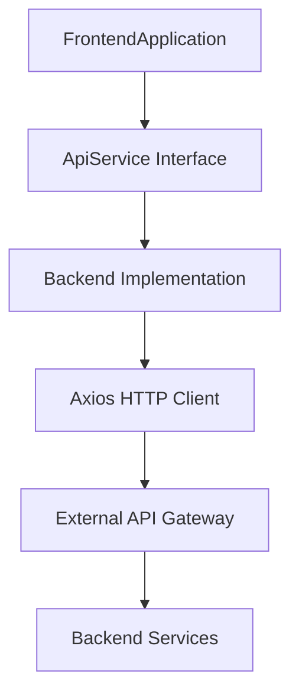

# REPOSITORY_OVERVIEW.md

> **Source File:** [REPOSITORY_OVERVIEW.md](https://github.com/test-company-prowiz/tableau-frontend/blob/main/REPOSITORY_OVERVIEW.md)
> **Repository:** `tableau-frontend`
> **Branch:** `main`

# tableau-frontend — Repository Overview

### High-Level Purpose
The `tableau-frontend` repository likely hosts a client-side application designed to interact with a backend system that manages or exposes data related to Tableau views and workbooks. Its primary objective is to provide a user interface for accessing, displaying, and potentially modifying this Tableau-related information, including user authentication.

### Architectural Structure
The repository follows a client-server architectural pattern. The provided file summary indicates a `Services` layer within the frontend application, responsible for abstracting API interactions. This suggests a modular structure where concerns like data fetching are separated from UI components.

### Core Components
*   **API Service Layer**: Provides an abstract interface (`ApiService`) for all backend interactions, with concrete implementations for `Backend` (real API calls) and `Mock` (simulated data). This layer handles authentication and data retrieval.
*   **HTTP Client**: Utilizes `axios` for making actual HTTP requests to the backend.
*   **Authentication Mechanism**: Relies on HTTP session cookies for managing user login and logout states.
*   **Data Models**: Implied models for "views" and "workbooks" which are fetched from the backend or mock data.

### Interaction & Data Flow
The frontend application initiates requests through the `apiService` instance. This instance, typically configured to use the `Backend` implementation, leverages `axios` to send HTTP requests to an external API gateway. These requests include user authentication (login/logout) and data retrieval (e.g., Tableau views, workbooks). The backend processes these requests and returns data or status codes, which are then handled by the frontend.

### Technology Stack
*   **Client-Side Language**: JavaScript.
*   **HTTP Client**: `axios`.
*   **Authentication**: Session-based (HTTP cookies).
*   **Backend Interaction**: Via an external API Gateway, potentially hosted on AWS.

### Design Observations
*   **Strategy Pattern**: The `ApiService` design allows for flexible switching between real backend integration and mock data, beneficial for development and testing.
*   **Session-based Authentication**: The reliance on `withCredentials:true` for `axios` calls indicates a dependency on HTTP cookies for maintaining user sessions.
*   **Inconsistent Error Handling**: While login errors are structured, generic `GET` request errors are primarily logged to the console, suggesting a potential area for improvement in comprehensive error propagation.
*   **Tableau Integration Focus**: The specific mock data endpoints for `/tableau/views/` and `/tableau/workbooks/` strongly suggest the application's core function revolves around interacting with or presenting data from a Tableau environment.

### System Diagram

```mermaid
graph TD
FrontendApplication --> ApiService[ApiService Interface]
ApiService --> BackendImpl[Backend Implementation]
BackendImpl --> AxiosHttpClient[Axios HTTP Client]
AxiosHttpClient --> ExternalApiGateway[External API Gateway]
ExternalApiGateway --> BackendServices[Backend Services]
```