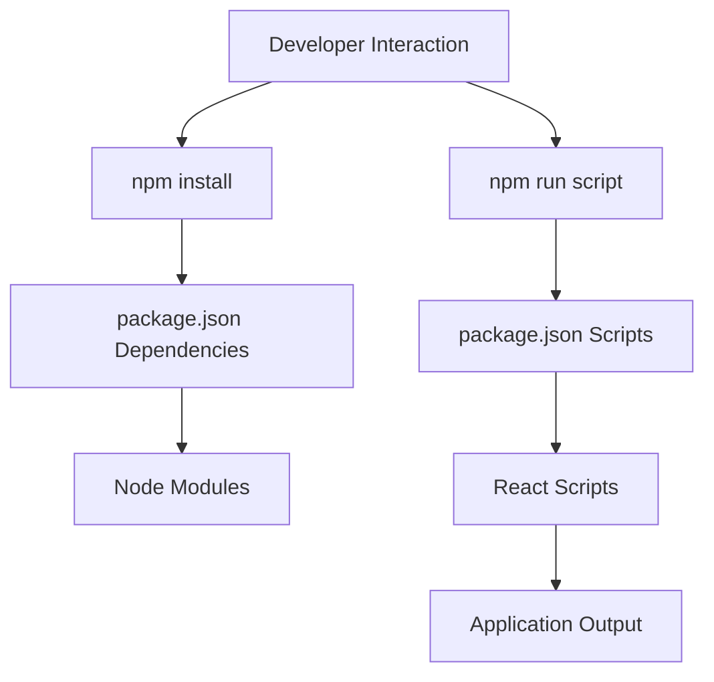

# package.json

> **Source File:** [package.json](https://github.com/test-company-prowiz/tableau-frontend/blob/main/package.json)  
> **Repository:** `tableau-frontend`  
> **Branch:** `main`

# package.json

### Overview
This file serves as the manifest for the `tableau_frontend` project. It defines metadata about the project, lists all runtime and development dependencies, and specifies scripts for common operations like starting the development server, building for production, and running tests. It is central to how the Node.js and React environment is configured and managed for this frontend application.

### Architecture & Role
Architecturally, `package.json` resides at the root of the frontend application's directory structure. It acts as a foundational configuration file, informing package managers (like npm) about the project's requirements and operational commands. It belongs to the build and dependency management layer, defining the ecosystem in which the application is developed and deployed.

### Key Components
- **`name`**: `tableau_frontend` - The identifier for the project.
- **`version`**: `0.1.0` - The current version of the project.
- **`private`**: `true` - Indicates that this package is not intended for publication to a public npm registry.
- **`dependencies`**: A list of packages required for the application to run in production. This includes core React libraries (`react`, `react-dom`, `react-scripts`), UI frameworks (`antd`), networking (`axios`), authentication (`@react-oauth/google`), routing (`react-router-dom`), form management (`react-hook-form`), and various UI utilities.
- **`scripts`**: Defines command-line aliases for common tasks:
    - `start`: Initiates the development server.
    - `build`: Compiles the application for production deployment.
    - `test`: Executes tests.
    - `eject`: Removes the abstraction of `react-scripts` to expose underlying configurations.
- **`eslintConfig`**: Configuration for ESLint, extending React application default rules for code quality.
- **`browserslist`**: Specifies the target browsers for the compiled application, optimizing output for broader compatibility.
- **`devDependencies`**: Packages required only during development, such as `tailwindcss` for styling.

### Execution Flow / Behavior
When a developer sets up the project, running `npm install` causes the package manager to read the `dependencies` and `devDependencies` sections, fetching and installing all specified packages into the `node_modules` directory. Subsequently, commands defined in the `scripts` section, such as `npm start`, `npm run build`, or `npm test`, invoke `react-scripts` to perform their respective actions, orchestrating the development or build processes.

### Dependencies
- **Core React & Build System**: `react`, `react-dom`, `react-scripts` form the fundamental React application stack, handling component rendering, DOM manipulation, and the underlying build toolchain.
- **UI & Styling**: `antd` provides a comprehensive set of UI components, while `tailwindcss` (a dev dependency) offers a utility-first CSS framework for efficient styling.
- **Data Fetching**: `axios` is used for making HTTP requests to backend APIs.
- **Authentication**: `@react-oauth/google` facilitates integration with Google OAuth for user authentication.
- **Routing**: `react-router-dom` enables client-side routing, managing different views and URLs within the single-page application.
- **Form Management**: `react-hook-form` simplifies form state management and validation.
- **UI Enhancements**: `react-icons` provides a collection of popular icons, `react-slick` and `slick-carousel` are for carousel functionalities, and `react-toastify` manages notifications.
- **Testing**: `@testing-library/jest-dom`, `@testing-library/react`, and `@testing-library/user-event` are crucial for writing and running unit and integration tests for React components.
- **Performance Monitoring**: `web-vitals` helps measure and report essential performance metrics.
- **Package Management Tools**: `i` (alias for `npm install`) and `npm` itself are listed as dependencies; while unusual for production applications, their presence suggests potential local scripting or specific environment setups.

### Design Notes
The `private: true` setting indicates that this project is an application rather than a reusable library, preventing accidental publication. The reliance on `react-scripts` suggests the project was likely bootstrapped with Create React App (CRA), providing a managed and opinionated build configuration that abstracts away complex webpack and Babel setups. The inclusion of both `antd` and `tailwindcss` implies a mixed approach to UI development, potentially leveraging Ant Design components for structured UI elements and Tailwind CSS for custom styling or utilities. The presence of `i` and `npm` in `dependencies` is atypical for a runtime application, as these are generally development tools; this might warrant investigation for cleanup or clarification of their intended role.

### Diagram (Optional)
