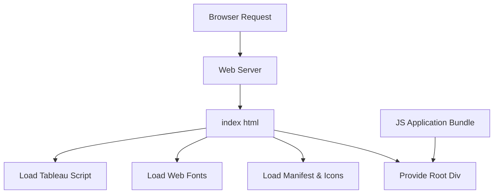

# public/index.html

> **Source File:** [public/index.html](https://github.com/tableau-frontend/blob/main/public/index.html)  
> **Repository:** `tableau-frontend`  
> **Branch:** `main`

### Overview
This file serves as the primary entry point for the client-side web application. It is the root HTML document loaded by the browser, providing the basic structure, metadata, external resource links, and the mount point for a JavaScript-driven application.

### Architecture & Role
Architecturally, this file resides at the client-side presentation layer. It is a static asset served by a web server, acting as the foundation upon which a single-page application (SPA) is built. Its role is to initialize the browser environment and load critical external dependencies before the main application JavaScript bundle takes over.

### Key Components
*   **`DOCTYPE html`**: Standard HTML5 document type declaration.
*   **`<head>`**: Contains metadata, links to favicons, the web app manifest, external fonts from Google Fonts, and the Tableau Embedding API script.
*   **`<meta name="description" content="Tableau dashboards powered by Qadence">`**: Specifies the application's description for search engines and social media.
*   **`<link rel="manifest" href="%PUBLIC_URL%/manifest.json" />`**: Links to the Web Application Manifest, enabling Progressive Web App (PWA) features.
*   **``**: Directly loads the Tableau Embedding API, making its functionalities available globally.
*   **`<body onload="">`**: The main content area of the page.
*   **`<noscript>`**: Provides a message to users if JavaScript is disabled in their browser.
*   **`

`**: A crucial element that serves as the primary mount point for a client-side JavaScript application (e.g., a React application), where dynamic content will be rendered.

### Execution Flow / Behavior
Upon a user navigating to the application's URL, the web server delivers this `index.html` file to the browser. The browser parses the HTML, processes meta tags, and initiates requests for linked resources such as favicons, the web app manifest, and Google Fonts. Crucially, the Tableau Embedding API script is loaded and executed. The `
` element is made available, expecting a client-side JavaScript bundle (injected during a build process, not present in this file) to dynamically render the application's user interface within it.

### Dependencies
*   **Internal**:
    *   `%PUBLIC_URL%/favicon.ico`: Application favicon.
    *   `%PUBLIC_URL%/logo192.png`: Apple touch icon.
    *   `%PUBLIC_URL%/manifest.json`: Web application manifest.
    (Note: `%PUBLIC_URL%` is a placeholder typically resolved by a build tool.)
*   **External**:
    *   `https://fonts.googleapis.com/css2?...`: Google Fonts for "Exo", "Inter", and "Outfit" typefaces.
    *   `https://public.tableau.com/javascripts/api/tableau.embedding.3.latest.js`: Tableau Embedding API script, essential for integrating Tableau dashboards.

### Design Notes
This file is designed as a template for a client-side rendered application, leveraging a build system (e.g., Create React App) to inject bundled JavaScript and CSS. The use of `%PUBLIC_URL%` placeholders confirms this templating approach. The direct inclusion of the Tableau Embedding API script in the `<head>` indicates a fundamental architectural decision to integrate Tableau functionalities from the outset, rather than lazy-loading it. The `
` pattern is standard for modern JavaScript frameworks that take control of a specific DOM element for rendering.

### Diagram (Optional)
