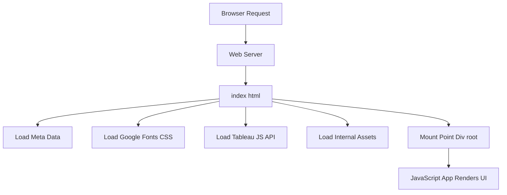

# public/index.html

> **Source File:** [public/index.html](https://github.com/test-company-prowiz/tableau-frontend/blob/main/public/index.html)  
> **Repository:** `tableau-frontend`  
> **Branch:** `main`

# public/index.html

### Overview
This file serves as the single entry point for the client-side web application. It provides the foundational HTML structure, metadata for the page, links to necessary stylesheets and external resources, and defines the mount point for the main JavaScript application.

### Architecture & Role
This file resides at the client layer and acts as the root document served by the web server. It bootstraps the application by providing the initial DOM structure into which a client-side JavaScript framework (e.g., React) injects its content. It is a fundamental component of a Single-Page Application (SPA) architecture, where all application logic and rendering typically occur within the browser after this initial HTML document is loaded.

### Key Components
*   **`<!DOCTYPE html>` and `<html lang="en">`**: Standard HTML5 document declaration and root element.
*   **`<head>` section**: Contains critical metadata such as character set, viewport settings, theme color, and a description. It also links to the favicon, Apple touch icon, application manifest (`manifest.json`), Google Fonts stylesheet, and the Tableau Embedding API script.
*   **`<title>`**: Sets the browser tab title to "Qadence by TQG".
*   **``**: Imports the Tableau Embedding API script, making its functionalities available globally.
*   **`<body>` section**: Contains the user-visible content.
*   **`<noscript>`**: Provides a fallback message if JavaScript is disabled in the user's browser.
*   **`
`**: This element serves as the primary mount point where the client-side JavaScript application will render its entire user interface.

### Execution Flow / Behavior
When a user navigates to the application's URL:
1.  The browser requests and receives `index.html` from the web server.
2.  The browser parses the HTML, setting up the basic page structure and metadata.
3.  Resources specified in the `<head>` (e.g., favicons, manifest, Google Fonts CSS, Tableau Embedding API script) are fetched and processed.
4.  The Tableau Embedding API is loaded and initialized, making its global `tableau` object available.
5.  The browser renders the empty `
`.
6.  A subsequent build step for the JavaScript application will inject bundled JavaScript files, typically into the `<body>`. These scripts then execute, target the `
`, and render the application's interactive components.

### Dependencies
*   **Internal Assets**: `favicon.ico`, `logo192.png`, `manifest.json`. These are referenced using the `%PUBLIC_URL%` placeholder, indicating a build-time replacement to the public directory URL.
*   **External Stylesheets**: Google Fonts (`https://fonts.googleapis.com/css2?family=Exo...`).
*   **External JavaScript**: Tableau Embedding API (`https://public.tableau.com/javascripts/api/tableau.embedding.3.latest.js`).
*   **Implicit JavaScript Application**: This file implicitly depends on a JavaScript application (likely a React application given the `#root` div pattern) that will be bundled and loaded into the `<body>` at runtime to hydrate the UI.

### Design Notes
*   The use of `%PUBLIC_URL%` is a common pattern in build tools (like Create React App) to ensure correct asset paths regardless of the deployment root.
*   The `#root` div is a standard convention for single-page applications to define where the JavaScript framework should mount its components.
*   Placing the Tableau Embedding API script directly in the `<head>` ensures it is loaded and available early in the page lifecycle, which might be crucial for early Tableau visualization interactions or setup.
*   The `description` meta tag and `title` indicate the application's focus on "Qadence" and "Tableau dashboards", aligning with the direct inclusion of the Tableau API.

### Diagram (Optional)
