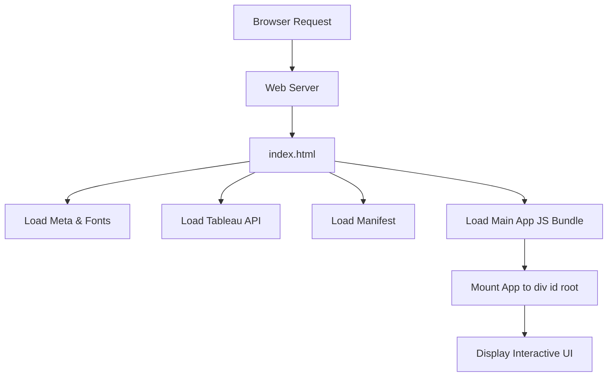

# public/index.html

### Overview
This file serves as the main entry point for the web application, providing the foundational HTML structure. It defines metadata, links to external resources like stylesheets and a web app manifest, and includes an external JavaScript library for Tableau integration. It also specifies the root element where the client-side application will mount.

### Architecture & Role
Architecturally, `index.html` functions as the client-side root document, part of the presentation layer. It is a static asset delivered by a web server upon an initial browser request. Its role is to bootstrap the single-page application (SPA) by defining the viewport, loading essential resources, and providing the mount point for the JavaScript application bundle.

### Key Components
- `<!DOCTYPE html>`: Declares the document as an HTML5 standard.
- `<html lang="en">`: The root element, specifying the document language.
- `<head>`: Contains metadata and resource links:
    - `<meta charset="utf-8" />`: Specifies character encoding.
    - `<meta name="viewport" ... />`: Configures the viewport for responsive behavior.
    - `<meta name="description" ... />`: Provides a brief description for the page.
    - `<link rel="icon" ... />`, `<link rel="apple-touch-icon" ... />`: Defines various favicons.
    - `<link href="https://fonts.googleapis.com/css2?..." rel="stylesheet">`: Imports custom fonts from Google Fonts.
    - `<link rel="manifest" href="%PUBLIC_URL%/manifest.json" />`: Links to the web application manifest.
    - ``: Integrates the Tableau embedding API.
    - `<title>Qadence by TQG</title>`: Sets the browser tab title.
- `<body>`: Contains the visible content of the page:
    - `<noscript>`: Provides fallback content if JavaScript is disabled.
    - `

`: The designated mount point where the main JavaScript application will inject its UI components.
- `%PUBLIC_URL%`: A placeholder, replaced during the build process with the correct public URL path.

### Execution Flow / Behavior
1. A browser initiates a request for the application's root URL.
2. The web server responds by serving the `public/index.html` file.
3. The browser parses the HTML, loading specified resources from the `<head>` section, including: favicons, Google Fonts stylesheets, the `manifest.json` file, and the Tableau embedding API script.
4. If JavaScript is disabled, the `<noscript>` content is displayed. Otherwise, the empty `

` is rendered.
5. During the application's build process (e.g., using a tool like Webpack), the compiled JavaScript application bundle is injected into the `<body>` element.
6. This injected JavaScript then executes, initializing the client-side framework (e.g., React) and rendering the application's components into the `

`, populating the page dynamically.

### Dependencies
- **External CSS/Fonts:**
    - `https://fonts.googleapis.com/css2?...`: Google Fonts for typography.
- **External JavaScript:**
    - `https://public.tableau.com/javascripts/api/tableau.embedding.3.latest.js`: Tableau Embedding API, enabling the integration of Tableau dashboards within the application.
- **Internal Resources (referenced via `%PUBLIC_URL%`):**
    - `favicon.ico`, `logo192.png`: Icons for the web application.
    - `manifest.json`: Web App Manifest, crucial for Progressive Web App (PWA) features.
- **Build System:** The file implicitly depends on a build process (e.g., Create React App's Webpack configuration) to replace `%PUBLIC_URL%` placeholders and inject the application's main JavaScript bundle into the `<body>`.

### Design Notes
- **Single-Page Application (SPA) Foundation:** This file is configured as a template for an SPA, where the primary content is rendered client-side by JavaScript into the designated `#root` element.
- **Tableau Integration:** The direct import of the Tableau embedding API indicates a core feature requirement to display or interact with Tableau dashboards as part of the application.
- **PWA Support:** The inclusion of `manifest.json` and theme-color meta tags suggests an intention to support Progressive Web App functionality, allowing the application to be installed and behave more like a native app.
- **Build-Time Transformation:** The use of `%PUBLIC_URL%` and the comments regarding script injection highlight that this file undergoes transformation during the build process, rather than being used exactly as-is in production.

### Diagram (Optional)
