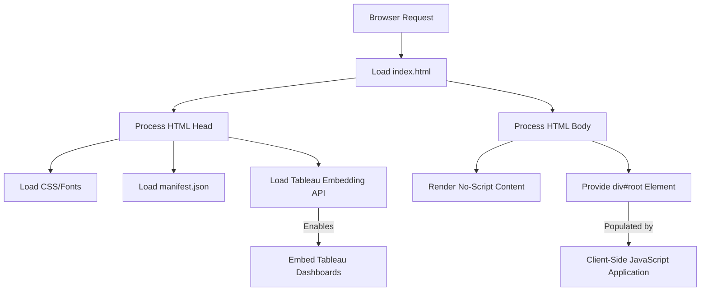

# public/index.html

### Overview
This file serves as the main entry point and HTML template for a web application. It defines the basic page structure, metadata, external resource links, and a designated root element for a client-side JavaScript application to mount.

### Architecture & Role
Architecturally, this file represents the client-side presentation layer and is the root document loaded by a web browser. It acts as a static template that is typically processed during a build step, where placeholders like `%PUBLIC_URL%` are replaced, and client-side JavaScript bundles are injected.

### Key Components
*   `<!DOCTYPE html>`: Specifies the HTML5 document type.
*   `<html lang="en">`: The root element, defining the document's language.
*   `<head>`: Contains metadata, character set, viewport settings, theme color, description, favicon, Apple touch icon, web app manifest link, Google Fonts, and the Tableau Embedding API script.
*   `<meta name="description" content="Tableau dashboards powered by Qadence" />`: Provides a brief description of the application.
*   `<link rel="manifest" href="%PUBLIC_URL%/manifest.json" />`: Links to the Web App Manifest, enabling Progressive Web App (PWA) features.
*   `<title>Qadence by TQG</title>`: Sets the title displayed in the browser tab.
*   ``: Integrates the Tableau Embedding API for embedding Tableau content.
*   `<body>`: Contains the main content of the HTML document.
*   `<noscript>`: Displays a message if JavaScript is disabled in the browser.
*   `
`: A designated mount point for a client-side JavaScript application to render its user interface.
*   `%PUBLIC_URL%`: A placeholder typically replaced during the build process with the base URL of the `public` folder.

### Execution Flow / Behavior
When a browser requests the application, it first loads `index.html`. The browser then processes the `<head>` section, loading linked resources such as stylesheets (Google Fonts), the web app manifest, and the Tableau Embedding API script. The `<body>` content is rendered, providing a `<noscript>` message if JavaScript is disabled and establishing the `
` element. A separate, bundled JavaScript application (not defined in this file) is expected to then execute, detect the `root` element, and dynamically inject its user interface into it.

### Dependencies
*   **Internal (referenced via `%PUBLIC_URL%` placeholders)**:
    *   `%PUBLIC_URL%/favicon.ico`: Application favicon.
    *   `%PUBLIC_URL%/logo192.png`: Icon for Apple touch devices.
    *   `%PUBLIC_URL%/manifest.json`: Web App Manifest for PWA functionality.
*   **External**:
    *   `https://fonts.googleapis.com/css2?family=Exo:wght@300;400;600&family=Inter:wght@600;400&family=Outfit&display=swap`: Google Fonts for typography.
    *   `https://public.tableau.com/javascripts/api/tableau.embedding.3.latest.js`: Tableau Embedding API for integrating Tableau dashboards.

### Design Notes
The file is designed as a template, common in single-page application (SPA) frameworks, providing a minimal HTML structure for a JavaScript application to enhance. The use of `%PUBLIC_URL%` indicates a build-time asset management strategy. Integration with Tableau is a primary design consideration, evident from the direct inclusion of the embedding API script. The inclusion of `manifest.json` suggests an intent to support Progressive Web App features.

### Diagram (Optional)
