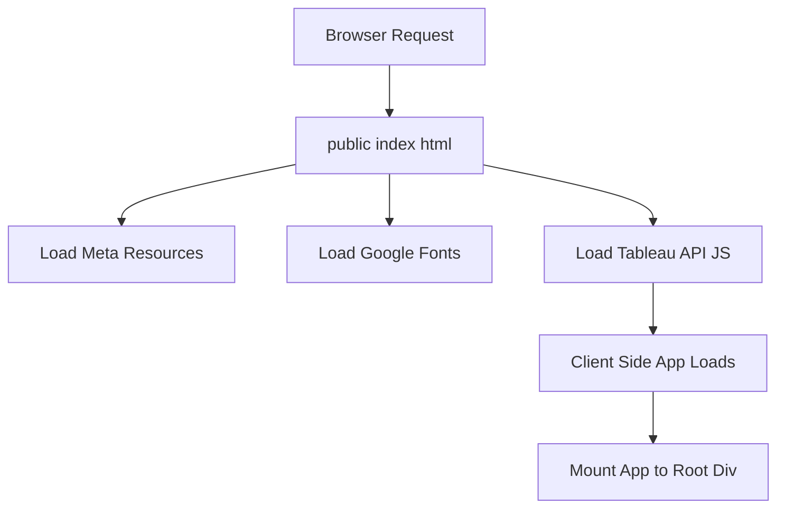

# public/index.html

### Overview
This file serves as the primary entry point and the foundational HTML document for the client-side web application. It defines the initial page structure, metadata, and links to essential resources required for the application to load and function in a web browser.

### Architecture & Role
Architecturally, `index.html` sits at the client-side front-end layer. It is a static asset served by a web server, acting as the initial shell into which a dynamic JavaScript application (likely a Single Page Application or SPA) will mount and render its content. It bootstraps the application by loading critical external scripts and stylesheets.

### Key Components
*   **`<!DOCTYPE html>` and `<html>`**: Standard declaration for an HTML5 document.
*   **`<head>`**: Contains metadata, links to external resources, and preloads for fonts and icons.
    *   `<meta>` tags: Define character set, viewport, theme color, and a description.
    *   `<link rel="icon">`, `<link rel="apple-touch-icon">`: Specify favicon and Apple touch icon.
    *   `<link rel="manifest">`: Links to `manifest.json` for Progressive Web App (PWA) capabilities.
    *   `<link href="https://fonts.googleapis.com/css2?...">`: Imports Google Fonts.
    *   `<title>Qadence by TQG</title>`: Sets the browser tab title.
    *   ``: Integrates the Tableau Embedding API.
*   **`<body>`**: Contains the visible content structure.
    *   `<noscript>`: Provides a message for users with JavaScript disabled.
    *   `

`: A common placeholder element where client-side JavaScript frameworks (e.g., React) typically mount and render their application components.

### Execution Flow / Behavior
When a browser requests the application, this `index.html` file is loaded first. The browser parses the HTML, fetches and applies stylesheets, preloads fonts, and then loads the Tableau Embedding API script. Concurrently, or shortly after, a client-side JavaScript bundle (implied by the `
` and accompanying comments) is expected to be loaded (likely injected into the `<body>` during a build process). This JavaScript bundle will then initialize, target the `
`, and dynamically render the application's user interface within it. The `noscript` tag ensures a fallback message is displayed if JavaScript is not enabled.

### Dependencies
*   **Internal Static Assets**:
    *   `%PUBLIC_URL%/favicon.ico`: Application favicon.
    *   `%PUBLIC_URL%/logo192.png`: Logo for PWA and Apple touch icon.
    *   `%PUBLIC_URL%/manifest.json`: Web App Manifest for PWA features.
    *   **Implicit**: The main application JavaScript bundle, which is expected to be injected into the `<body>` by a build process and depend on the `
`.
*   **External Assets**:
    *   `https://fonts.googleapis.com/css2?...`: Google Fonts (`Exo`, `Inter`, `Outfit`).
    *   `https://public.tableau.com/javascripts/api/tableau.embedding.3.latest.js`: Tableau Embedding API for integrating Tableau dashboards.
*   **Build-time Variable**: `%PUBLIC_URL%` is a placeholder that will be replaced during the build process with the base URL of the `public` directory, ensuring correct asset paths in various deployment scenarios.

### Design Notes
This `index.html` file is designed as a template. It leverages `%PUBLIC_URL%` for robust asset referencing across different deployment environments. The inclusion of `
` is a strong indicator that the application uses a client-side JavaScript framework (e.g., React, Vue) to render its user interface. The direct inclusion of the Tableau Embedding API script suggests a direct integration strategy, allowing the web application to display and interact with Tableau dashboards. Comments within the file provide guidance for developers regarding build processes and asset handling.

### Diagram (Optional)
