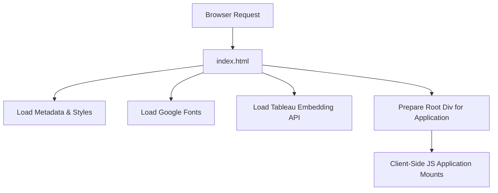

# public/index.html

### Overview
This file serves as the main entry point for the client-side web application. It is the root HTML document that the browser loads, providing the basic structure, metadata, and initial script and stylesheet links required to render the application, including integration with the Tableau embedding API.

### Architecture & Role
Architecturally, this file acts as the foundation of the client-side front-end, typically a Single-Page Application (SPA). It is the base HTML document served by the web server, into which a JavaScript framework (e.g., React, as indicated by `div id="root"`) will mount and render the application's user interface. It defines the initial viewport, character set, and references global assets and libraries.

### Key Components
*   **`<!DOCTYPE html>`**: Standard HTML5 document type declaration.
*   **`<meta>` tags**: Define document metadata such as character encoding (`charset`), viewport settings (`viewport`), theme color (`theme-color`), and a description of the application.
*   **`<link rel="icon" ...>`**: References the favicon.
*   **`<link rel="apple-touch-icon" ...>`**: References an icon for Apple devices.
*   **`<link href="https://fonts.googleapis.com/css2?..." rel="stylesheet">`**: Imports Google Fonts for typography.
*   **`<link rel="manifest" href="%PUBLIC_URL%/manifest.json" />`**: Links to the web app manifest, providing metadata for installation on mobile devices.
*   **`<title>Qadence by TQG</title>`**: Sets the title displayed in the browser tab.
*   **``**: Imports the Tableau Embedding API as a JavaScript module, enabling interaction with Tableau dashboards.
*   **`<noscript>`**: Provides fallback content for users with JavaScript disabled.
*   **`

`**: A designated empty `div` element that serves as the mount point for the client-side JavaScript application.
*   **`%PUBLIC_URL%`**: A placeholder variable that will be replaced by the application's public URL during the build process.

### Execution Flow / Behavior
1.  A web browser requests and receives `index.html`.
2.  The browser parses the HTML, setting up the document's basic structure and metadata.
3.  Static assets like the favicon, Apple touch icon, and web app manifest are referenced for loading.
4.  External stylesheets for Google Fonts are loaded, applying specified typography.
5.  The `tableau.embedding.3.latest.js` script is fetched and executed as a JavaScript module, making Tableau embedding functionalities available.
6.  The `div id="root"` element is prepared. In a typical build process for an SPA, the main JavaScript bundle of the application will be injected into the `<body>` (as suggested by comments) and will then initialize and render the application within this `div`.
7.  If JavaScript is disabled in the browser, the content within the `<noscript>` tag becomes visible.

### Dependencies
*   **Internal Static Assets**:
    *   `%PUBLIC_URL%/favicon.ico`
    *   `%PUBLIC_URL%/logo192.png`
    *   `%PUBLIC_URL%/manifest.json`
*   **External Libraries/Services**:
    *   Google Fonts API: `https://fonts.googleapis.com/css2?family=Exo:wght@300;400;600&family=Inter:wght@600;400&family=Outfit&display=swap` (for typography).
    *   Tableau Embedding API: `https://public.tableau.com/javascripts/api/tableau.embedding.3.latest.js` (for embedding Tableau content).
*   **Client-side Application (Implicit)**: A JavaScript application (e.g., built with React) that will hydrate the `
`.

### Design Notes
*   **Build System Integration**: The presence of `%PUBLIC_URL%` placeholders and comments about `npm run build` or `yarn start` strongly suggests this file is a template processed by a build tool (e.g., Create React App). This tool substitutes variables and injects bundled JavaScript and CSS files.
*   **Single-Page Application (SPA) Pattern**: The `
` is a common pattern for SPAs, indicating that the bulk of the application's UI is dynamically rendered by client-side JavaScript.
*   **Tableau Integration**: The direct inclusion of the Tableau Embedding API highlights a core functional requirement to display and interact with Tableau dashboards within the application.
*   **Performance**: Loading external resources like Google Fonts and the Tableau API directly can impact initial page load performance, depending on network conditions.

### Diagram (Optional)
