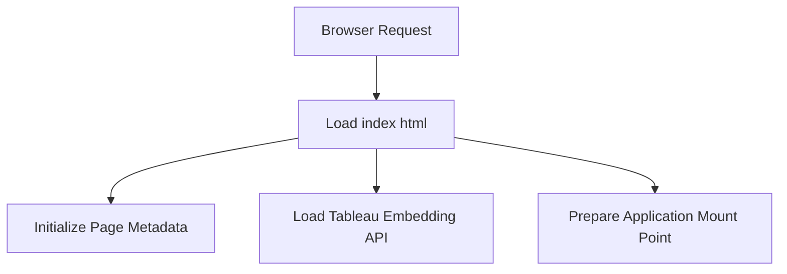

# public/index.html

### Overview
This file serves as the main entry point for the client-side web application. It defines the foundational HTML structure, metadata, external resource links, and a designated mount point for a JavaScript-driven application. Its primary role is to bootstrap the user interface.

### Architecture & Role
Architecturally, this file represents the initial presentation layer of the application. It is served by a web server and loaded directly by the client's browser. It acts as the host document for a single-page application (SPA), providing the basic scaffolding before client-side JavaScript takes over to render dynamic content.

### Key Components
*   **HTML Structure**: Defines the `<!DOCTYPE html>`, `<html>`, `<head>`, and `<body>` elements, forming the standard web page structure.
*   **Metadata**: Includes `<meta>` tags for character set, viewport configuration, theme color, and a description.
*   **Favicon and Touch Icons**: Links to `favicon.ico` and `logo192.png` for browser tab icons and home screen icons on mobile devices.
*   **Web Manifest**: Links to `manifest.json`, supporting Progressive Web Application (PWA) features.
*   **Google Fonts**: Imports custom fonts (`Exo`, `Inter`, `Outfit`) from Google Fonts for application styling.
*   **Tableau Embedding API**: Includes a `<script>` tag to load the Tableau embedding JavaScript API (`tableau.embedding.3.latest.js`), indicating the application's intent to display or interact with Tableau dashboards.
*   **Application Mount Point**: Contains an empty `

` element within the `<body>`, which is a common convention for client-side frameworks (e.g., React) to inject and manage the application's user interface.
*   **Noscript Warning**: A `<noscript>` tag informs users to enable JavaScript if it is disabled, as the application relies on client-side scripting.

### Execution Flow / Behavior
When a browser requests the application's URL, the web server delivers this `index.html` file. The browser then:
1.  Parses the HTML, setting up the basic document structure.
2.  Interprets `<meta>` tags to configure viewport, character set, and other page-level settings.
3.  Initiates loading of linked resources like `favicon.ico`, `manifest.json`, and Google Fonts CSS.
4.  Fetches and executes the `tableau.embedding.3.latest.js` script, making the Tableau embedding API available.
5.  Prepares the `

` element as a placeholder.
6.  Subsequently, the application's main JavaScript bundle (not defined in this file but expected through a build process) will load and dynamically render the user interface into this `#root` div.

### Dependencies
*   **External Script**: `https://public.tableau.com/javascripts/api/tableau.embedding.3.latest.js` for Tableau integration.
*   **External Stylesheet**: Google Fonts (`https://fonts.googleapis.com/css2?family=Exo:wght@300;400;600&family=Inter:wght@600;400&family=Outfit&display=swap`).
*   **Local Resources**: `favicon.ico`, `logo192.png`, and `manifest.json`, located in the `public` directory (paths resolved by a build process using `%PUBLIC_URL%`).
*   **Client-side JavaScript Application**: The file implicitly depends on a JavaScript application bundle that will target and render content into the `

`.

### Design Notes
*   The use of `%PUBLIC_URL%` placeholders indicates that this file is a template processed by a build system (e.g., Create React App, Webpack) to inject correct asset paths during compilation for different deployment environments.
*   The `

` pattern is a standard design for modern client-side frameworks, enabling a single-page application architecture where JavaScript controls the entire DOM within this element.
*   Direct inclusion of the Tableau embedding API suggests a tight integration with Tableau for data visualization or reporting as a core feature.
*   The file is designed to be a static template, with dynamic content primarily injected via JavaScript, rather than server-side rendering.

### Diagram (Optional)
