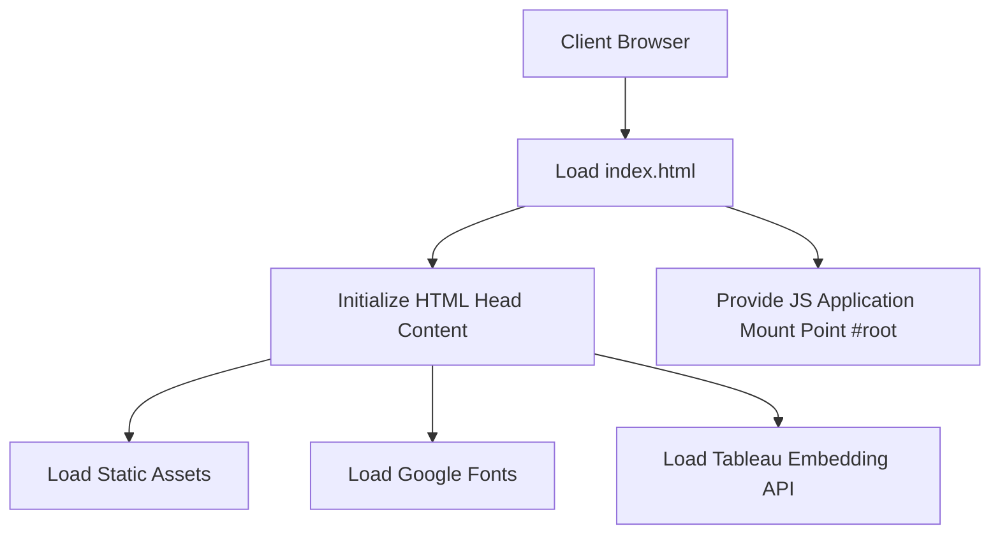

# public/index.html

### Overview
This file serves as the primary HTML entry point for a web application. It defines the basic document structure, loads essential meta-information, configures the viewport, and includes links to static assets, external stylesheets, and third-party JavaScript libraries, notably the Tableau Embedding API. It also provides a root element for a client-side JavaScript application to mount.

### Architecture & Role
This file resides at the client-side presentation layer and functions as the main template for a single-page application (SPA). It is typically served by a web server and provides the initial markup that the browser renders before any client-side JavaScript framework takes over to build out the dynamic content.

### Key Components
*   **`<!DOCTYPE html>`**: Declares the document as an HTML5 file.
*   **`<meta>` tags**: Define character encoding, viewport settings, theme color, and a description for search engines.
*   **`<link>` tags**: Reference favicons, the web app manifest (`manifest.json`), Apple touch icons, Google Fonts, and external stylesheets (implied by font links).
*   **`<script>` tags**: Load the Tableau Embedding API as a module.
*   **`%PUBLIC_URL%` placeholders**: Indicate references to static assets within a build system's public directory.
*   **`<noscript>` tag**: Provides a fallback message if JavaScript is disabled in the browser.
*   **`

`**: Serves as the designated mount point for a client-side JavaScript framework (e.g., React) to render its application content.

### Execution Flow / Behavior
When a browser loads this file, it parses the HTML document. It immediately begins loading external resources referenced in the `<head>` section, such as favicons, manifest, fonts, and the Tableau Embedding API script. Following the initial HTML render, an external JavaScript application (not defined within this file) is expected to execute, target the `
`, and dynamically inject the application's user interface. If JavaScript is disabled, the browser will display the content of the `<noscript>` tag.

### Dependencies
*   **Internal (via `%PUBLIC_URL%` placeholders)**:
    *   `favicon.ico`: Standard website icon.
    *   `manifest.json`: Web application manifest for progressive web app features.
    *   `logo192.png`: Icon for Apple touch devices.
*   **External**:
    *   `https://fonts.googleapis.com/css2?family=Exo:wght@300;400;600&family=Inter:wght@600;400&family=Outfit&display=swap`: Google Fonts for specific typography.
    *   `https://public.tableau.com/javascripts/api/tableau.embedding.3.latest.js`: Tableau Embedding API, enabling integration of Tableau dashboards.

### Design Notes
The presence of `%PUBLIC_URL%` indicates that this file functions as a template processed by a build tool (e.g., Create React App). The `div id="root"` is a standard convention for modern JavaScript frameworks to bootstrap their applications. The inclusion of the Tableau Embedding API directly in the head suggests that Tableau dashboard integration is a core feature requiring early loading.

### Diagram (Optional)
