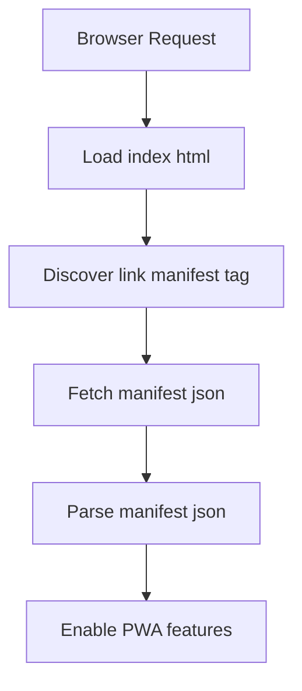

# public/manifest.json

### Overview
This file serves as the web application manifest, a JSON document that provides metadata about the web application. Browsers use this information to present the web application to users as a Progressive Web App (PWA) on their devices, enabling features like "Add to Home Screen," offline capabilities, and a native application-like experience.

### Architecture & Role
Architecturally, `manifest.json` is a client-side configuration file. It is typically served from the application's public root directory and referenced by a `<link rel="manifest" href="/manifest.json">` tag within the `public/index.html` file. Its primary role is to inform the browser about the application's identity, preferred display mode, icons, and theme colors, thereby facilitating PWA installation and management by the operating system.

### Key Components
*   **`short_name`**: A concise, human-readable name for the application, used when space is limited (e.g., on a home screen icon label).
*   **`name`**: The full, human-readable name of the application, typically displayed in installation prompts or app listings.
*   **`icons`**: An array of objects defining various icon assets for the application. Each object specifies the icon's `src` (path), `sizes` (dimensions), and `type` (MIME type). These icons are used across different platform contexts and resolutions.
*   **`start_url`**: The URL that the user is directed to when they launch the web application from an installed shortcut (e.g., home screen icon). A value of `.` indicates the current directory.
*   **`display`**: Specifies the preferred display mode for the web application. `standalone` typically hides standard browser UI elements, providing an app-like appearance.
*   **`theme_color`**: Defines the default theme color for the application, which may influence the browser's UI elements (e.g., address bar color) or the operating system's task switcher.
*   **`background_color`**: Specifies the background color that is displayed on the splash screen when the application is launched, before its stylesheets have loaded.

### Execution Flow / Behavior
When a browser loads `public/index.html`, it discovers the `<link rel="manifest" ...>` tag and fetches this `manifest.json` file. The browser then parses the JSON content to understand the application's PWA capabilities. If the conditions for PWA installation are met (e.g., served over HTTPS, has a service worker, minimum manifest fields), the browser may present an "Add to Home Screen" prompt to the user. Upon installation, the operating system uses the manifest's data (icons, name, start URL, display mode, colors) to integrate the web application as a first-class citizen, allowing it to be launched like a native application.

### Dependencies
*   **`public/index.html`**: This HTML file contains the `<link rel="manifest">` tag that references `public/manifest.json`, making it discoverable by browsers.
*   **Image assets**: The `icons` array references specific image files (`favicon.ico`, `logo192.png`, `logo512.png`) located within the `public` directory. These assets are crucial for the application's branding and visual representation across different device interfaces.

### Design Notes
This manifest adheres to the Web App Manifest specification, which is fundamental for Progressive Web App functionality. The use of `display: "standalone"` is a deliberate choice to provide an immersive, app-like experience by removing browser chrome. The inclusion of multiple icon sizes ensures optimal visual fidelity across a range of devices and operating system display contexts. Defining `theme_color` and `background_color` contributes to a seamless user experience, minimizing visual jarring during application load and ensuring brand consistency.

### Diagram (Optional)
