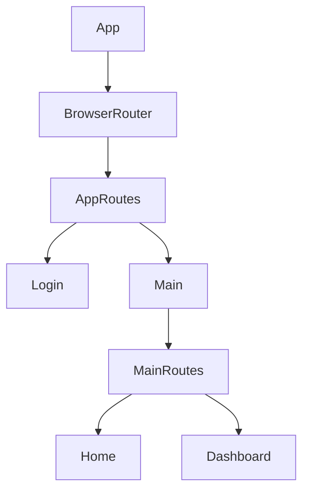

# src/App.jsx

> **Source File:** [src/App.jsx](https://github.com/test-company-prowiz/tableau-frontend/blob/main/src/App.jsx)
> **Repository:** `tableau-frontend`
> **Branch:** `main`

# src/App.jsx

### Overview
This file serves as the root component for the React application, responsible for setting up the main client-side routing structure and defining the base URL for API interactions. It orchestrates the rendering of different pages based on the URL path.

### Architecture & Role
This file resides at the client-side application layer, specifically functioning as the entry point for the user interface. It acts as the primary router and container for the application's page components, sitting atop the presentation layer and managing the top-level navigation flow.

### Key Components
-   **`App` function component**: The main functional component that initializes the `BrowserRouter` and defines the application's top-level routes.
-   **`Main` function component**: A nested component responsible for rendering routes that typically require a user to be logged in. It includes logic (currently partially commented out) for checking authentication status.
-   **`API` constant**: A string constant defining the base URL for the backend API endpoint.
-   **`BrowserRouter`, `Routes`, `Route`**: Components from `react-router-dom` used for declarative client-side routing.
-   **`Login`, `Home`, `Dashboard`**: Imported page components rendered based on the active route.
-   **`useState`**: React hook used within `Main` to manage the `isUserLoggedIn` state.

### Execution Flow / Behavior
1.  The `App` component renders first, wrapping the entire application in `BrowserRouter` to enable client-side navigation.
2.  The top-level `Routes` within `App` define two primary paths:
    *   The root path (`/`) renders the `Login` component.
    *   Any other path (`/*`) renders the `Main` component, which handles subsequent, typically authenticated, routes.
3.  Upon rendering, the `Main` component initializes a `isUserLoggedIn` state variable, currently hardcoded to `true`.
4.  If `isUserLoggedIn` is true, `Main` renders a nested `Routes` block. This block defines routes for:
    *   `/home`, which renders the `Home` component.
    *   `/dashboard`, which renders the `Dashboard` component.
5.  Commented-out code within `Main` indicates an intention to dynamically check user login status using `apiService.isLoggedIn()` and redirect to the login page (`/`) if not authenticated. This functionality is currently disabled, leading to `isUserLoggedIn` being always true.

### Dependencies
-   **`react-router-dom`**: Essential for handling client-side routing and navigation throughout the application.
-   **`react`**: The core library for building UI components and managing state with hooks.
-   **`./App.css`**: Provides styling rules for the root `App` component.
-   **`./Pages/Login`**: A page component for user authentication.
-   **`./Pages/Home`**: A primary page component for authenticated users.
-   **`./Pages/Dashboard`**: A page component providing a dashboard view for authenticated users.
-   **`./Components/Sidenav`**: Imported but not currently used in the rendered JSX, suggesting a planned or unused UI component.
-   **`./Services/api_service`**: Commented out, but its presence indicates a dependency on a service layer for interacting with the backend API, particularly for authentication.

### Design Notes
-   The application employs a nested routing strategy, where the `Main` component serves as a protective layer for routes requiring authentication.
-   Authentication logic is partially implemented but currently bypassed by hardcoding `isUserLoggedIn` to `true`, indicating an incomplete or temporarily disabled feature.
-   The `API` constant is defined globally within the module, promoting easy configuration of the backend endpoint.
-   The presence of `Sidenav` as an unused import might point to future UI integration or a previously removed component.

### Diagram 
