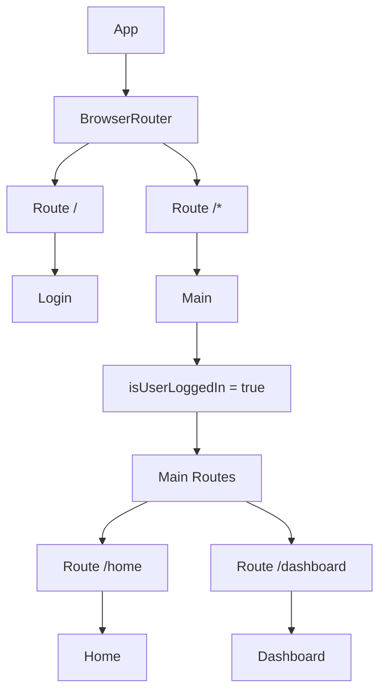

# src/App.jsx

> **Source File:** [src/App.jsx](https://github.com/test-company-prowiz/tableau-frontend/blob/main/src/App.jsx)
> **Repository:** `tableau-frontend`
> **Branch:** `main`

# src/App.jsx

### Overview
This file serves as the root component for the client-side React application, responsible for establishing global routing and defining the main entry points for different user experiences, such as login and authenticated sections.

### Architecture & Role
This file resides at the presentation layer of the frontend architecture. It acts as the primary router and container for the application's top-level views, orchestrating which page components are rendered based on the current URL path.

### Key Components
*   **`App` Component:** The main functional component that initializes `BrowserRouter` and defines the top-level routes for the application.
*   **`Main` Component:** A nested functional component responsible for rendering routes accessible post-authentication (or intended post-authentication). It contains internal routing for the `/home` and `/dashboard` paths.
*   **`API` Constant:** Defines the base URL for an AWS API Gateway endpoint, intended for backend communication.

### Execution Flow / Behavior
When the application loads, the `App` component renders the `BrowserRouter`.
1.  If the path is `/`, the `Login` component is rendered.
2.  For any other path, the `Main` component is rendered via a `/*` catch-all route.
3.  Inside `Main`, a `isUserLoggedIn` state is managed, though currently hardcoded to `true`.
4.  Nested `Routes` within `Main` then render `Home` for `/home` or `Dashboard` for `/dashboard`.
5.  Commented-out code suggests an `useEffect` hook was intended to perform an authentication check using `apiService.isLoggedIn()` and redirect to `/` if the user was not logged in. This functionality is currently disabled.

### Dependencies
*   **Internal:**
    *   `./App.css`: Provides styling for the application.
    *   `./Pages/Login`: The login page component.
    *   `./Pages/Home`: The main authenticated home page component.
    *   `./Pages/Dashboard`: The dashboard page component.
    *   `./Components/Sidenav`: Imported but not actively used within the rendered JSX.
*   **External:**
    *   `react`: Core React library for UI component development, including `useState`.
    *   `react-router-dom`: Provides client-side routing capabilities, including `BrowserRouter`, `Route`, `Routes`, and `useNavigate`.

### Design Notes
The current implementation hardcodes `isUserLoggedIn` to `true`, effectively bypassing the intended authentication gate for `/home` and `/dashboard` routes. The commented-out `useEffect` and `checkUser` functions, along with the `apiService` import, indicate that a client-side authentication flow was planned but is presently disabled. The `Sidenav` component is imported but not integrated into the UI, suggesting an incomplete or future UI element.

### Diagram
