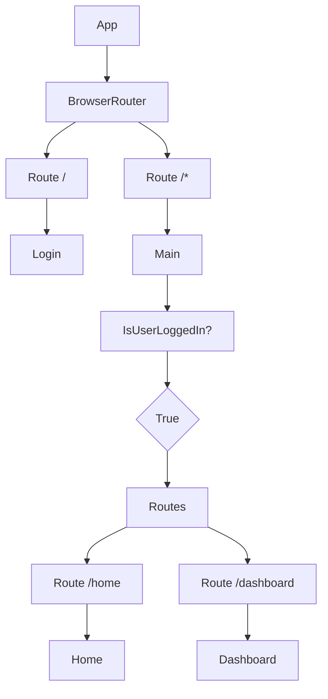

# src/App.jsx

> **Source File:** [src/App.jsx](https://github.com/test-company-prowiz/tableau-frontend/blob/main/src/App.jsx)
> **Repository:** `tableau-frontend`
> **Branch:** `main`

# src/App.jsx

### Overview
This file serves as the root component of the React application, responsible for establishing the primary client-side routing structure and rendering the initial application layout. It defines the main entry points for authenticated and unauthenticated user flows.

### Architecture & Role
Architecturally, this file resides at the application's root in the UI layer. It acts as the central router, using `react-router-dom` to manage navigation between different pages. It orchestrates the rendering of core components like the login page and the main application views based on the URL path.

### Key Components
*   **`App` Component:** The top-level functional component that initializes the `BrowserRouter` and defines the primary route structure.
*   **`Main` Component:** A nested functional component that handles routes intended for authenticated users. It manages its own routing for specific application pages like Home and Dashboard.
*   **`API` Constant:** An exported string constant defining the base URL for the backend API, `https://m3njvkrhfl.execute-api.us-east-1.amazonaws.com`.
*   **`Login` (from `./Pages/Login`):** The component rendered for the default unauthenticated route.
*   **`Home` (from `./Pages/Home`):** A component rendered within the `Main` component for the `/home` route.
*   **`Dashboard` (from `./Pages/Dashboard`):** A component rendered within the `Main` component for the `/dashboard` route.
*   **`react-router-dom` primitives:** `BrowserRouter`, `Routes`, `Route`, `useNavigate` are used for declarative routing.

### Execution Flow / Behavior
When the application loads, the `App` component is rendered. It initializes `BrowserRouter`, enabling client-side routing.
1.  If the URL path is `/`, the `Login` component is rendered.
2.  For any other path (`/*`), the `Main` component is rendered.
3.  Inside the `Main` component, a local state `isUserLoggedIn` is initialized to `true`.
4.  Conditional rendering within `Main` ensures that the `Home` and `Dashboard` routes are available if `isUserLoggedIn` is true.
5.  If the path matches `/home` or `/dashboard`, the respective component (`Home` or `Dashboard`) is displayed.
6.  Note: The commented-out `useEffect` and `checkUser` functions within `Main` indicate a planned authentication check, but this logic is currently inactive and `isUserLoggedIn` is hardcoded to `true`.

### Dependencies
*   **`react-router-dom`:** Essential for handling all routing concerns within the application.
*   **`react`:** The core library, specifically `useState` for managing component state.
*   **`./App.css`:** Provides global styling for the application.
*   **`./Pages/Login`:** The component for user login.
*   **`./Pages/Home`:** The main landing page after login.
*   **`./Pages/Dashboard`:** A page displaying dashboard content.
*   **`./Components/Sidenav`:** Imported but not currently utilized in the rendered component tree.
*   **`./Services/api_service`:** Commented out, but suggests an intended dependency for interacting with the backend API, particularly for authentication.

### Design Notes
The routing is split between the root `App` component and a nested `Main` component, segregating routes based on a conceptual authentication state. While an authentication check mechanism is present in comments within the `Main` component, it is currently bypassed, defaulting `isUserLoggedIn` to true. This allows development of protected routes without a fully implemented authentication flow. The `Sidenav` component is imported but not integrated, indicating a potential future UI enhancement for global navigation. The hardcoded API endpoint simplifies development and deployment.

### Diagram
