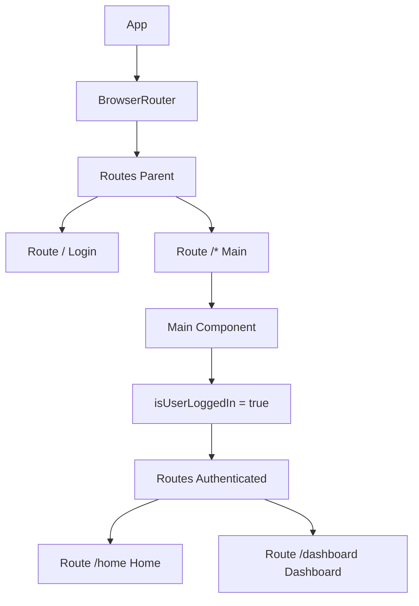

# src/App.jsx

> **Source File:** [src/App.jsx](https://github.com/test-company-prowiz/tableau-frontend/blob/main/src/App.jsx)
> **Repository:** `tableau-frontend`
> **Branch:** `main`

# src/App.jsx

### Overview
This file serves as the main entry point for the React application, responsible for setting up global client-side routing using `react-router-dom` and defining the core application layout. It manages top-level navigation and conditional rendering based on user authentication status.

### Architecture & Role
Architecturally, `src/App.jsx` functions as the application's root component within the presentation layer. It defines the shell for the single-page application, handling URL path resolution to specific page components.

### Key Components
*   **`App` Function Component**: The primary component that renders the `BrowserRouter` and initial `Routes`. It defines the entry point for unauthenticated (`Login`) and authenticated (`Main`) paths.
*   **`Main` Function Component**: A sub-component responsible for rendering routes accessible only to logged-in users (e.g., `/home`, `/dashboard`). It includes state management for user login status, though the actual authentication check is currently commented out.
*   **`API` Constant**: Exports a string constant defining the base URL for the backend API, indicating interaction with an AWS API Gateway endpoint.

### Execution Flow / Behavior
1.  The `App` component mounts and initializes `BrowserRouter`, enabling client-side routing.
2.  It defines two primary routes:
    *   The root path (`/`) renders the `Login` component.
    *   Any other path (`/*`) renders the `Main` component, which acts as a protected route container.
3.  Inside `Main`, the `isUserLoggedIn` state is managed. Currently, it defaults to `true`.
4.  If `isUserLoggedIn` is `true`, the `Main` component renders additional `Routes` for `/home` and `/dashboard`.
5.  Commented-out code within `Main` suggests an intended flow to check user login status via `apiService.isLoggedIn()` and redirect to the login page if not authenticated.

### Dependencies
*   **`react-router-dom`**: Provides core routing functionalities (`BrowserRouter`, `Route`, `Routes`, `useNavigate`) for navigation within the single-page application.
*   **`./App.css`**: Imports global styles for the application.
*   **`react`**: Utilized for `useState` to manage component-level state.
*   **`./Pages/Login`**: The component rendered for the initial login route.
*   **`./Pages/Home`**: A component rendered under the authenticated `Main` route.
*   **`./Pages/Dashboard`**: Another component rendered under the authenticated `Main` route.
*   **`./Components/Sidenav`**: Imported but not currently rendered within the `App` or `Main` components.
*   **`./Services/api_service`**: Commented out, but indicates an intended dependency for API interaction and authentication checks.

### Design Notes
*   The use of `react-router-dom` separates public (`Login`) and potentially protected (`Main`) routes, offering a clear structure for access control.
*   The `Main` component's `isUserLoggedIn` state and commented-out `checkUser` function suggest an in-progress or planned authentication flow. Currently, access to `/home` and `/dashboard` is effectively open due to `isUserLoggedIn` being hardcoded to `true`.
*   The `API` constant provides a centralized location for the backend endpoint, enhancing maintainability.
*   The `Sidenav` component is imported but not rendered, indicating either future integration or a refactoring decision to omit it from this file's responsibility.

### Diagram
