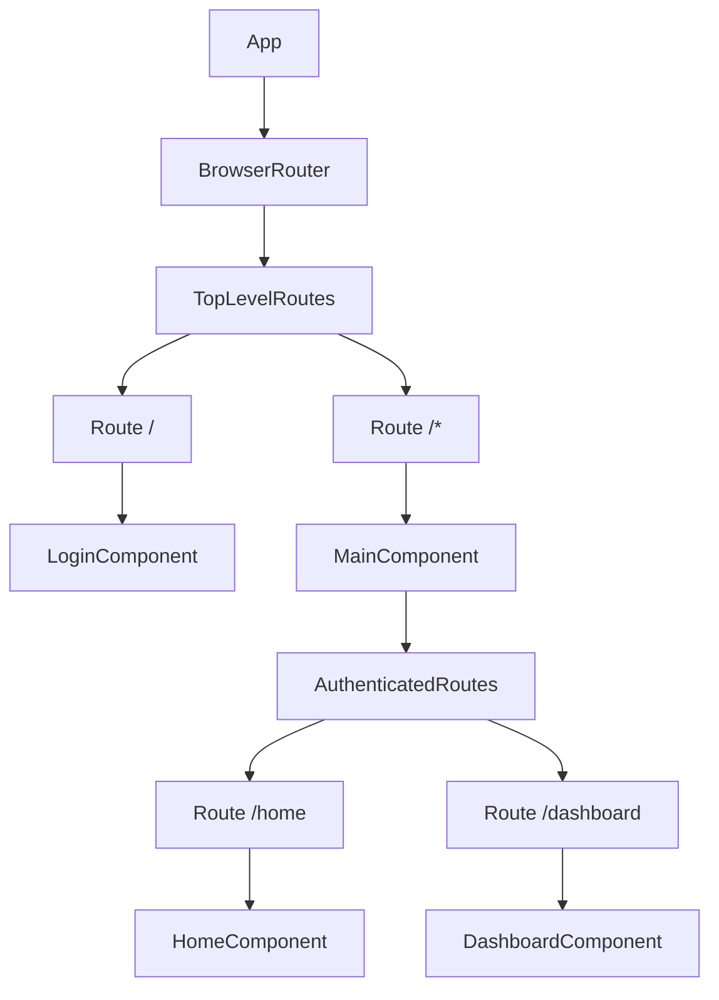

# src/App.jsx

> **Source File:** [src/App.jsx](https://github.com/test-company-prowiz/tableau-frontend/blob/main/src/App.jsx)
> **Repository:** `tableau-frontend`
> **Branch:** `main`

# src/App.jsx

### Overview
This file serves as the main entry point for the React application, responsible for setting up the global routing structure using `react-router-dom`. It defines the primary layout and navigation paths for both public (login) and authenticated sections of the application.

### Architecture & Role
Architecturally, `App.jsx` functions as the root component of the client-side application. It resides in the presentation layer, orchestrating the rendering of different page components based on the URL path. It establishes the foundational routing context for the entire application.

### Key Components
*   **`App` Function**: The default export and primary React component. It initializes the `BrowserRouter` and defines the top-level `Routes` for the application.
*   **`Main` Component**: A functional component nested within `App`'s routes. It is responsible for rendering routes that require a user to be logged in (though this logic is currently stubbed). It manages its own state for `isUserLoggedIn`.
*   **`API` Constant**: Exports a string constant representing the base URL for the backend API, likely an AWS API Gateway endpoint.

### Execution Flow / Behavior
1.  The `App` component renders, establishing a `BrowserRouter` context.
2.  The application's top-level `Routes` are defined:
    *   The root path (`/`) renders the `Login` component.
    *   Any other path (`/*`) renders the `Main` component, effectively creating a catch-all for authenticated sections.
3.  When the `Main` component renders:
    *   It initializes `isUserLoggedIn` state to `true`.
    *   It then renders another set of `Routes` *conditionally* based on `isUserLoggedIn`.
    *   These internal routes define `/home` (rendering `Home`) and `/dashboard` (rendering `Dashboard`).
    *   Crucially, the logic for checking user login status (`useEffect` and `checkUser` using `apiService`) and redirecting (`useNavigate`) is currently commented out, meaning the application will always render authenticated routes if the `/*` path is hit.

### Dependencies
*   **`react-router-dom`**: Provides core routing functionalities like `BrowserRouter`, `Route`, `Routes`, and `useNavigate`, which are essential for client-side navigation.
*   **`react`**: Specifically `useState` for managing component-level state within `Main`.
*   **`./App.css`**: Imports global styling for the application.
*   **`./Pages/Login`**: The component rendered for the initial login route.
*   **`./Pages/Home`**: A component rendered within the authenticated section.
*   **`./Pages/Dashboard`**: Another component rendered within the authenticated section.
*   **`./Components/Sidenav`**: Imported but not actively used in the provided code snippet, suggesting it might be intended for future integration.
*   **`./Services/api_service`**: Commented out, but the presence of `apiService.isLoggedIn()` in the commented code indicates an intended dependency for authentication logic.

### Design Notes
*   The application uses a nested routing structure where the `Main` component acts as a protected route wrapper, although the protection logic (`checkUser` and `apiService` integration) is currently disabled.
*   The `API` endpoint is hardcoded directly within the file, which is simple for small applications but typically moved to environment variables for better configurability and security in production.
*   The `Sidenav` component is imported but not utilized, implying either an incomplete feature or a placeholder for future UI integration.
*   The current implementation of `isUserLoggedIn` being hardcoded to `true` in `Main` means that any path matching `/*` (other than `/`) will display `Home` or `Dashboard` without actual authentication enforcement. This is likely a development shortcut.

### Diagram
