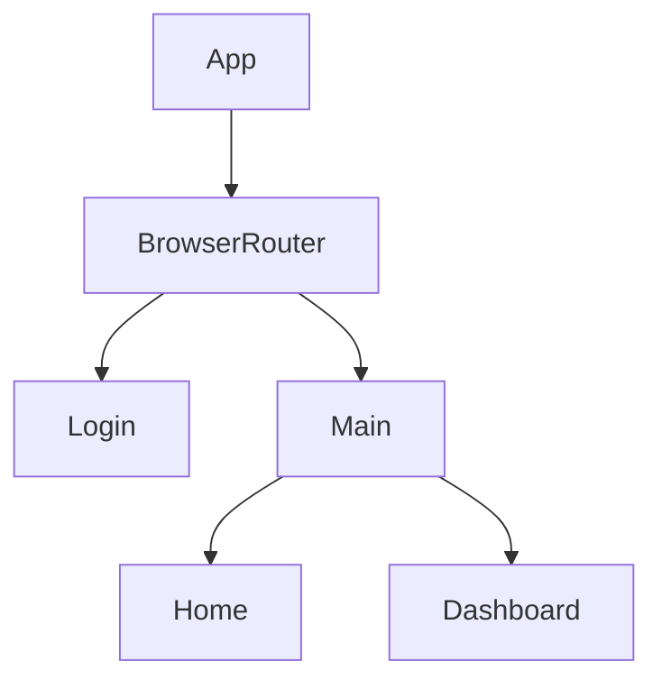

# src/App.jsx

> **Source File:** [src/App.jsx](https://github.com/test-company-prowiz/tableau-frontend/blob/main/src/App.jsx)
> **Repository:** `tableau-frontend`
> **Branch:** `main`

# src/App.jsx

### Overview
This file serves as the root component for the React application, responsible for defining the top-level structure and client-side routing using `react-router-dom`. It orchestrates the rendering of different page components based on the URL path.

### Architecture & Role
`App.jsx` resides at the highest level of the application's component hierarchy, acting as the entry point for the user interface. It belongs to the presentation layer, specifically handling the application's global layout and navigation flow.

### Key Components
*   **`App` Function Component**: The primary functional component that wraps the entire application, setting up the `BrowserRouter` and main `Routes`.
*   **`Main` Function Component**: A nested component within `App` that handles routes intended for authenticated users. It contains state for user login status, though currently hardcoded.
*   **`BrowserRouter`**: Manages the application's URL and history for client-side routing.
*   **`Routes`**: A container for `Route` components, rendering the first child `Route` that matches the current URL.
*   **`Route`**: Defines a mapping between a URL path and a component to be rendered.
*   **`API` Constant**: A string constant defining the base URL for an external AWS API Gateway endpoint.

### Execution Flow / Behavior
When the application loads, the `App` component renders the `BrowserRouter`.
1.  If the URL path is `/`, the `Login` component is rendered.
2.  For any other URL path (`/*`), the `Main` component is rendered.
3.  Inside `Main`, the `isUserLoggedIn` state is initialized to `true`. This currently bypasses any actual authentication check.
4.  If `isUserLoggedIn` is `true`, `Main` renders its own nested `Routes`:
    *   If the path is `/home`, the `Home` component is rendered.
    *   If the path is `/dashboard`, the `Dashboard` component is rendered.
The commented-out code in `Main` indicates an intended authentication flow involving `apiService.isLoggedIn()` and redirection using `useNavigate`.

### Dependencies
*   **`react-router-dom`**: Provides core routing functionalities like `BrowserRouter`, `Route`, `Routes`, and `useNavigate`.
*   **`./App.css`**: Contains global styles applied to the root `App` component.
*   **`./Pages/Login`**: The component rendered for the root path.
*   **`./Pages/Home`**: A page component rendered within the `Main` component's routes.
*   **`./Pages/Dashboard`**: Another page component rendered within the `Main` component's routes.
*   **`react`**: Specifically `useState` for managing component-level state.
*   **`./Components/Sidenav`**: Imported but currently unused in the provided code.
*   **`./Services/api_service`**: Commented out, indicating a potential or past dependency for API interactions, particularly for authentication.

### Design Notes
*   **Centralized Routing**: The application's main routing logic is consolidated in this file, making it the primary point for managing navigation paths.
*   **Authentication Placeholder**: The `Main` component includes commented-out code for an authentication check, suggesting that a user authentication flow is planned or partially implemented but currently bypassed by `isUserLoggedIn` being hardcoded to `true`. This requires further implementation for security.
*   **API Endpoint Definition**: The `API` constant is defined directly within this file. For larger applications, it might be beneficial to move such configuration into a dedicated environment or configuration file for easier management across different deployment environments.
*   **Unused Import**: The `Sidenav` component is imported but not rendered, indicating either incomplete feature implementation or a component intended for a different layout structure.

### Diagram

```mermaid
graph TD
A[App] --> B[BrowserRouter]
B --> C[Login]
B --> D[Main]
D --> E[Home]
D --> F[Dashboard]
```