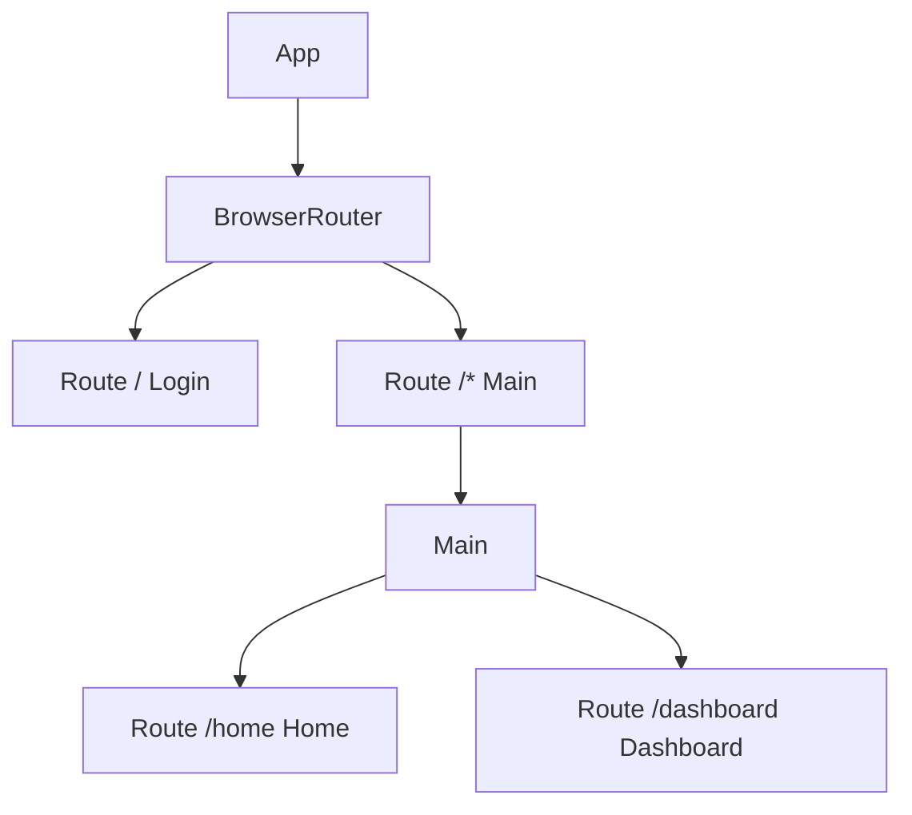

# src/App.jsx

> **Source File:** [src/App.jsx](https://github.com/test-company-prowiz/tableau-frontend/blob/main/src/App.jsx)
> **Repository:** `tableau-frontend`
> **Branch:** `main`

# src/App.jsx

### Overview
This file serves as the root component for the application, responsible for setting up client-side routing and defining the top-level application structure. It manages the initial route configuration, directing users to either a login page or the main application sections based on the path.

### Architecture & Role
Architecturally, `App.jsx` resides at the presentation layer as the primary entry point for the React application's UI. It acts as the orchestrator for different application views by configuring `react-router-dom`, effectively defining the application's navigation flow.

### Key Components
*   **`App` function component**: The default export. It initializes the `BrowserRouter` and defines the top-level `Routes`, directing traffic to the `Login` page or the `Main` component.
*   **`Main` function component**: A sub-component rendered for all paths under `/*`. It contains further nested `Routes` for authenticated sections like `/home` and `/dashboard`. It also includes a `isUserLoggedIn` state, currently hardcoded, which would typically control access to these routes.
*   **`API` constant**: An exported string defining the base URL for the backend API endpoint.

### Execution Flow / Behavior
1.  The `App` component mounts and renders the `BrowserRouter`.
2.  The `BrowserRouter` listens for URL changes and matches them against the defined `Routes`.
3.  If the path is `/`, the `Login` component is rendered.
4.  For any other path (`/*`), the `Main` component is rendered.
5.  Inside `Main`, a `isUserLoggedIn` state (currently `true`) determines if its nested `Routes` are rendered.
6.  If `isUserLoggedIn` is `true`, `Main` renders additional `Routes`:
    *   `/home` renders the `Home` component.
    *   `/dashboard` renders the `Dashboard` component.
7.  Commented-out code within `Main` indicates an intended `useEffect` hook to `checkUser` login status via `apiService` and redirect if not logged in.

### Dependencies
*   **`react-router-dom`**: Provides core routing capabilities, including `BrowserRouter`, `Route`, `Routes`, and `useNavigate`.
*   **`react`**: Used for the `useState` hook within the `Main` component.
*   **`./App.css`**: Imports global or root-level styling for the application.
*   **`./Pages/Login`**: The component rendered for the root path `/`.
*   **`./Pages/Home`**: A component rendered within the `Main` section under `/home`.
*   **`./Pages/Dashboard`**: A component rendered within the `Main` section under `/dashboard`.
*   **`./Components/Sidenav`**: Imported but not currently used in the rendered JSX, suggesting a pending integration.
*   **`./Services/api_service` (commented out)**: Indicates an intended dependency for user authentication checks against the backend API.

### Design Notes
*   The application structure uses a common pattern of separating public routes (like login) from protected routes (like home/dashboard) by nesting routes within a conditional component (`Main`).
*   The `isUserLoggedIn` state in `Main` is a placeholder, hardcoded to `true`. This indicates that the authentication logic is either incomplete, temporarily bypassed, or handled elsewhere.
*   The commented-out `useEffect` and `apiService.isLoggedIn()` calls suggest a future or past implementation for client-side authentication state management and redirection.
*   The `Sidenav` component is imported but not integrated into the UI, which might be an oversight or a planned feature for later integration.

### Diagram

```mermaid
graph TD
AppRoot[App] --> BrowserRouter[BrowserRouter]
BrowserRouter --> LoginRoute[Route / Login]
BrowserRouter --> MainRoute[Route /* Main]
MainRoute --> MainComponent[Main]
MainComponent --> HomeRoute[Route /home Home]
MainComponent --> DashboardRoute[Route /dashboard Dashboard]
```