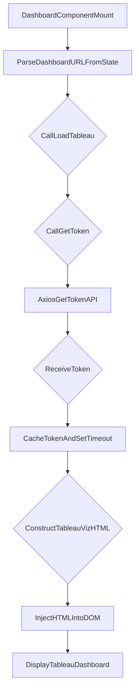

# src/Pages/Dashboard.jsx

> **Source File:** [src/Pages/Dashboard.jsx](https://github.com/test-company-prowiz/tableau-frontend/blob/main/src/Pages/Dashboard.jsx)
> **Repository:** `tableau-frontend`
> **Branch:** `main`

# src/Pages/Dashboard.jsx

### Overview
This file defines the `Dashboard` React component, which serves as a dedicated page for displaying embedded Tableau dashboards. Its primary function is to fetch an authentication token from the backend and dynamically inject a Tableau visualization into the DOM based on a provided dashboard URL.

### Architecture & Role
This component resides in the presentation layer of the application, specifically within the `Pages` directory, indicating it represents a top-level view. It acts as a client-side orchestrator for embedding external analytics content (Tableau) by interacting with the application's backend API for authentication and directly manipulating the DOM to render the Tableau visualization.

### Key Components
*   **`Dashboard` Function Component**: The main React component responsible for rendering the dashboard page, managing state for Tableau embedding, and handling user navigation actions (back, logout).
*   **`getToken()` Async Function**: An internal utility function that fetches a Tableau authentication token from the application's backend (`/tableau/token`). It implements a simple in-memory caching mechanism for the token with a 10-minute expiry.
*   **`loadTableau(dash)` Async Function**: Responsible for constructing the `<tableau-viz>` web component string using the fetched token and dashboard URL, then injecting it into a designated `div` element in the DOM.
*   **`useEffect` Hook**: Used to trigger the `loadTableau` function once the component mounts, ensuring the Tableau dashboard loads on page initialization.

### Execution Flow / Behavior
1.  When the `Dashboard` component mounts, the `useEffect` hook is triggered.
2.  The `useEffect` hook extracts the dashboard URL (`data`) from `location.state`, processes it, and then calls `loadTableau` with the parsed URL.
3.  `loadTableau` first invokes `getToken` to retrieve an authentication token.
4.  `getToken` performs an `axios.get` request to the backend endpoint `${API}/tableau/token`.
5.  Upon successful token retrieval, `getToken` caches the token for 10 minutes and returns it.
6.  If a token is available, `loadTableau` constructs an HTML string containing a `<tableau-viz>` custom element. This element's `src` attribute is set using hardcoded Tableau host/content URL and the provided dashboard path, and its `token` attribute is set to the fetched token.
7.  The constructed `<tableau-viz>` HTML string is then inserted into the `innerHTML` of the `div` element with `id="tableau"`, causing the Tableau dashboard to render.
8.  The component provides UI elements for navigation:
    *   Clicking the back arrow or "Qadence by TQG" navigates the user to `/home`.
    *   Clicking "Logout" clears the session cookie and redirects the user to `/`.

### Dependencies
*   **`react`**: Core library for UI development and component lifecycle management (`useEffect`).
*   **`react-router-dom`**: Provides `useLocation` to access state passed during navigation (dashboard URL) and `useNavigate` for programmatic navigation.
*   **`axios`**: HTTP client used for making API requests to the backend to retrieve the Tableau authentication token.
*   **`../App`**: Imports the `API` constant, which presumably defines the base URL for backend API endpoints.
*   **`react-icons/io5`**: Used for the `IoArrowBackSharp` icon, providing visual navigation cues.
*   **Tableau JavaScript API (implicit)**: The `<tableau-viz>` web component relies on the Tableau JavaScript API being available globally or through a prior script import, although this file itself doesn't explicitly import it.

### Design Notes
*   The component uses direct DOM manipulation (`document.getElementById().innerHTML = ...`) to embed the Tableau visualization, which is a common pattern for integrating external web components or widgets that expect to control a specific DOM element.
*   Tableau host and content URL are hardcoded constants within the component. Consider externalizing these into environment variables or a configuration service for better flexibility.
*   Token caching logic is simple and in-memory, tied to the component's lifecycle (implicitly, as `token` is a `let` variable outside of state management). This design prevents excessive token requests but may require reconsideration in a multi-component scenario or for more robust error handling.
*   The dashboard URL is passed via `location.state`, which is suitable for temporary, client-side data transfer during navigation.
*   The component relies on CSS classes (e.g., `w-[100vw]`, `h-[100vh]`, `bg-[#03111B]`) for styling, suggesting the use of a utility-first CSS framework like Tailwind CSS.

### Diagram
