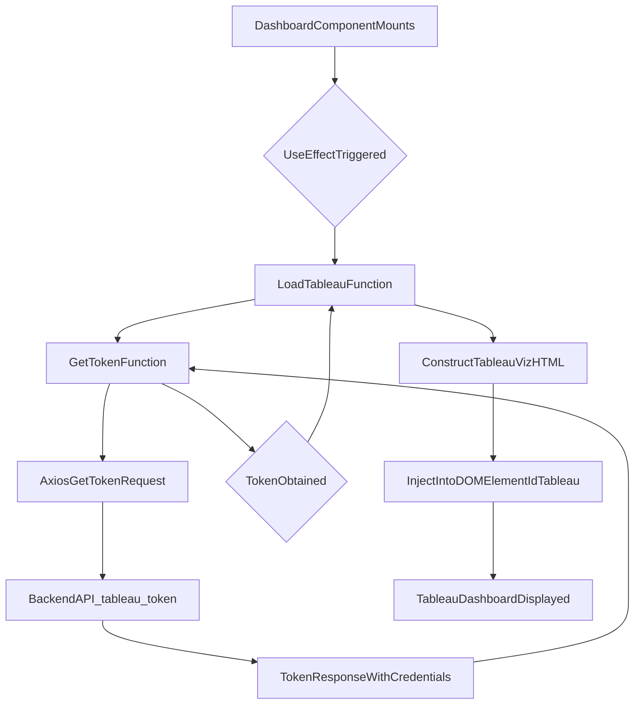

# src/Pages/Dashboard.jsx

> **Source File:** [src/Pages/Dashboard.jsx](https://github.com/test-company-prowiz/tableau-frontend/blob/main/src/Pages/Dashboard.jsx)
> **Repository:** `tableau-frontend`
> **Branch:** `main`

# src/Pages/Dashboard.jsx

### Overview
This file defines the `Dashboard` React functional component, which is responsible for rendering an embedded Tableau visualization. It handles fetching a secure token from the backend, constructing the Tableau embed URL, and dynamically injecting the Tableau web component into the DOM.

### Architecture & Role
This component operates within the presentation layer of the application. It functions as a top-level page component, orchestrated by React Router, to display specific Tableau dashboards based on navigation state. It interacts with the backend API to secure authentication tokens for Tableau.

### Key Components
*   **`Dashboard` Function Component**: The primary React component that orchestrates the embedding of Tableau dashboards.
*   **`useLocation` Hook**: Retrieves state data passed during navigation, specifically the Tableau dashboard URL.
*   **`useNavigate` Hook**: Provides functionality for programmatic navigation within the application, used for "Home" and "Logout" actions.
*   **`useEffect` Hook**: Manages side effects, specifically triggering the initial loading and embedding of the Tableau dashboard when the component mounts.
*   **`getToken` Async Function**: Handles asynchronous requests to the backend (`/tableau/token`) to acquire a short-lived Tableau authentication token. It implements client-side caching for the token.
*   **`loadTableau` Async Function**: Embeds the Tableau visualization by first obtaining an authentication token, then dynamically generating and injecting a `<tableau-viz>` web component into a designated DOM element.

### Execution Flow / Behavior
1.  Upon mounting, the `Dashboard` component retrieves the target Tableau dashboard URL from `location.state.data`.
2.  The `useEffect` hook triggers the `loadTableau` function, passing the processed dashboard URL.
3.  `loadTableau` calls `getToken` to retrieve an authentication token.
4.  `getToken` sends an `axios.get` request to the backend at `${API}/tableau/token` with credentials to fetch a token. If successful, the token is cached for 10 minutes (600,000 milliseconds).
5.  Once a token is available, `loadTableau` constructs an HTML string containing a `<tableau-viz>` web component, including the `TABLEAU_HOST`, `TABLEAU_CONTENT_URL`, the dashboard path, and the fetched `token`.
6.  This HTML string is then injected into the `div` element with `id="tableau"`, causing the Tableau dashboard to render.
7.  Users can navigate back to the home page via the `IoArrowBackSharp` icon or log out, which clears the `session` cookie and redirects to the root path.

### Dependencies
*   **`react`**: Core library for building user interfaces.
*   **`react-router-dom`**: For client-side routing, specifically `useLocation` to access navigation state and `useNavigate` for programmatic navigation.
*   **`axios`**: A promise-based HTTP client for making API requests to the backend (`/tableau/token`).
*   **`../App` (API)**: Provides the base URL for the application's backend API.
*   **`react-icons/io5`**: Supplies the `IoArrowBackSharp` icon for UI navigation.
*   **Tableau JavaScript API / Web Component**: Implied external dependency, as `<tableau-viz>` is a web component expected to be available globally in the browser environment (e.g., via a script tag in `index.html`).

### Design Notes
*   **Token Management**: The component implements a client-side token caching mechanism to reduce redundant backend calls for Tableau authentication tokens within a 10-minute window. This improves perceived performance.
*   **Direct DOM Manipulation**: The use of `document.getElementById("tableau").innerHTML = ...` indicates direct DOM manipulation to embed the Tableau web component. This is often necessary when integrating third-party libraries that provide web components or require specific HTML structures not easily managed declaratively within React's virtual DOM.
*   **URL Parsing**: The `data` URL from `location.state` is processed by removing its second segment. This suggests a specific URL format is expected from the upstream navigation, indicating a convention between navigation source and this component.
*   **Styling**: Tailwind CSS classes are extensively used for component layout and styling, ensuring responsiveness and consistent UI.

### Diagram
