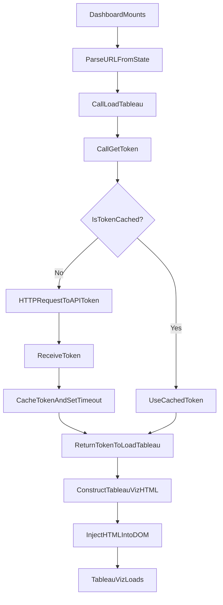

# src/Pages/Dashboard.jsx

> **Source File:** [src/Pages/Dashboard.jsx](https://github.com/test-company-prowiz/tableau-frontend/blob/main/src/Pages/Dashboard.jsx)
> **Repository:** `tableau-frontend`
> **Branch:** `main`

# src/Pages/Dashboard.jsx

### Overview
This file defines the `Dashboard` React component, which is responsible for rendering an embedded Tableau dashboard. It handles fetching an authentication token from a backend API, dynamically injecting the Tableau visualization, and providing navigation and logout functionalities within the page header.

### Architecture & Role
This file resides in the frontend application's `Pages` directory, making it a top-level UI component. It functions as a view layer component responsible for displaying specific data visualizations. It interacts with `react-router-dom` for navigation and state management, and makes HTTP requests to a backend API for authentication, placing it in the presentation layer with direct API interaction.

### Key Components
*   **`Dashboard` function component**: The primary React component that renders the Tableau dashboard and its surrounding UI elements.
*   **`useEffect` hook**: Initiates the Tableau dashboard loading process upon component mount.
*   **`getToken` function**: An asynchronous function responsible for fetching an authentication token for Tableau from the backend API. It includes a simple client-side caching mechanism for the token.
*   **`loadTableau` function**: An asynchronous function that takes a dashboard path, obtains a token, and dynamically injects a `<tableau-viz>` custom HTML element into the DOM to display the Tableau visualization.
*   **`useLocation` hook**: Used to retrieve dashboard-specific data passed via router state.
*   **`useNavigate` hook**: Used for programmatic navigation to other routes, such as `/home` or `/`.
*   **`IoArrowBackSharp` icon**: A UI element that triggers navigation back to the home page.

### Execution Flow / Behavior
1.  Upon mounting, the `Dashboard` component's `useEffect` hook is triggered.
2.  The `useEffect` hook extracts a Tableau dashboard URL path from `location.state.data`, parsing it to remove an initial segment.
3.  It then calls the `loadTableau` function with the processed URL.
4.  The `loadTableau` function first calls `getToken`.
5.  `getToken` checks if a valid token is cached. If not, it makes an authenticated GET request to the `API/tableau/token` endpoint.
6.  Upon receiving a token, `getToken` stores it and sets a `setTimeout` to nullify the token after 10 minutes (6e5 milliseconds).
7.  Once `loadTableau` receives a token, it constructs an HTML string containing a `<tableau-viz>` custom element. This element's `src` attribute is built using predefined Tableau host/content URL and the dashboard path, and its `token` attribute is set.
8.  This HTML string is then injected into the `innerHTML` of the `div` with `id="tableau"`, causing the Tableau visualization to load.
9.  The component also renders a header with a "Qadence by TQG" title and navigation elements:
    *   A back arrow icon navigates to `/home`.
    *   A "Logout" text clears the `session` cookie and navigates to the root path (`/`).

### Dependencies
*   **`react`**: Core library for building the user interface.
*   **`react-router-dom`**: Provides `useLocation` for accessing navigation state and `useNavigate` for routing.
*   **`axios`**: A promise-based HTTP client used for making API requests to the backend (`/tableau/token`).
*   **`../App`**: Exports the `API` constant, which is the base URL for backend API requests.
*   **`react-icons/io5`**: Provides the `IoArrowBackSharp` icon used for navigation.
*   **Tableau JavaScript API (implicit)**: The functionality relies on the `<tableau-viz>` custom element, implying that the Tableau JavaScript API is loaded globally or pre-imported to enable this custom element.

### Design Notes
*   The component relies on `location.state.data` for the Tableau dashboard's URL, indicating that navigation to this page is expected to pass this data.
*   The Tableau token is cached client-side for 10 minutes (`6e5` ms) to reduce redundant API calls for authentication. This is a pragmatic design choice for performance.
*   The Tableau visualization is dynamically injected using `innerHTML`, which requires careful handling of untrusted input to prevent XSS, though in this context, the `dash` URL is parsed from internal state.
*   Tableau host and content URL are hardcoded constants within the component, which might be candidates for configuration externalization in larger applications.
*   Logout functionality involves directly manipulating `document.cookie` to clear the session, which is a common but specific client-side approach.

### Diagram
