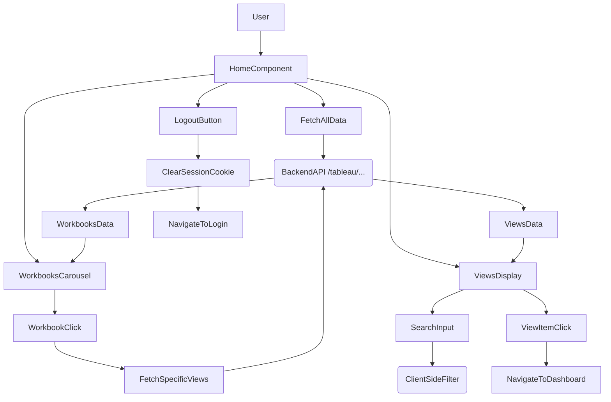

# src/Pages/Home.jsx

> **Source File:** [src/Pages/Home.jsx](https://github.com/test-company-prowiz/tableau-frontend/blob/main/src/Pages/Home.jsx)
> **Repository:** `tableau-frontend`
> **Branch:** `main`

# src/Pages/Home.jsx

### Overview
This file implements the main home page of the application, serving as a dashboard entry point. It displays a list of Tableau workbooks in a carousel and a searchable list of Tableau views. Users can interact with workbooks to filter views or navigate to individual view dashboards.

### Architecture & Role
This file represents a presentation layer component within a React frontend application. It acts as a primary user interface, orchestrating data fetching from a backend API and rendering dynamic content. It handles user interactions such as navigation, search, and data filtering, making it a critical part of the user experience for exploring Tableau content.

### Key Components
*   **`Home` function component**: The main React component that manages the state for workbooks, views, loading indicators, and search input. It contains all rendering logic and event handlers.
*   **`SamplePrevArrow` / `SampleNextArrow`**: Custom functional components used by `react-slick` to render navigation arrows for the workbook carousel.
*   **`fetchViews(id)`**: Asynchronous function to fetch views associated with a specific workbook ID from the backend.
*   **`onSearch(e)`**: Handler for the view search input, performing client-side filtering of views based on `contentUrl`.
*   **`fetchAllViews()`**: Asynchronous function to retrieve all available views from the backend.
*   **`fetchAllData()`**: Asynchronous function called on component mount (`useEffect`) to fetch both workbooks and all views initially.

### Execution Flow / Behavior
1.  Upon initial render, the `useEffect` hook triggers `fetchAllData()`.
2.  `fetchAllData()` makes `axios` requests to the backend API (`${API}/tableau/workbooks` and `${API}/tableau/views`) to fetch all workbooks and views, setting `loading` state to `true` during the process.
3.  Fetched workbooks are displayed in a `react-slick` carousel.
4.  Fetched views are displayed in a scrollable list below the workbooks.
5.  Clicking a workbook in the carousel calls `fetchViews(item.id)`, fetching and displaying only views related to that specific workbook.
6.  Typing in the search input triggers `onSearch`, which filters the currently displayed `views` based on the input text and updates `filteredViews`.
7.  Clicking the "All Views" button calls `fetchAllViews()`, resetting the view list to include all views.
8.  Clicking a specific view in the list navigates the user to the `/dashboard` route, passing the view's `contentUrl` as state.
9.  Clicking the "Logout" text clears the `session` cookie and redirects the user to the root path (`/`).
10. Skeleton loaders are displayed for workbooks and views while data is being fetched.

### Dependencies
*   **`react`**: Core library for building the user interface.
*   **`react-slick`**: A carousel component for displaying workbooks.
*   **`slick-carousel/slick/slick.css` & `slick-carousel/slick/slick-theme.css`**: Styling for the `react-slick` carousel.
*   **`react-icons/ai` & `react-icons/fa`**: Icon libraries for navigation arrows and search icon.
*   **`axios`**: HTTP client for making API requests to the backend.
*   **`react-router-dom`**: For declarative navigation (`useNavigate`, `Link`).
*   **`antd`**: UI component library providing `Input`, `Skeleton`, `Space`, and `Spin` for enhanced user experience and loading states.
*   **`../App`**: Imports the `API` constant, likely defining the base URL for backend endpoints.
*   **`@ant-design/icons`**: Imports `LoadingOutlined` for custom loading indicators.
*   **`../Mock/workbooks` & `../Mock/view`**: Imported mock data, although not directly used in the current render path, suggesting potential use during development or for fallback scenarios.

### Design Notes
*   The component uses local state (`useState` hooks) for managing UI state, data, and loading indicators.
*   Asynchronous data fetching is handled with `async/await` and `axios`, with `withCredentials: true` indicating reliance on session cookies for authentication.
*   The use of `Skeleton` and `Spin` from `antd` provides visual feedback during data loading, improving perceived performance.
*   Client-side filtering for views is implemented, which is suitable for a moderate number of views but might need server-side pagination/filtering for larger datasets.
*   The logout mechanism directly manipulates the browser cookie, which is effective for session invalidation on the client side.

### Diagram
