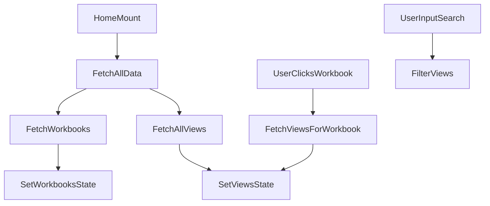

# src/Pages/Home.jsx

> **Source File:** [src/Pages/Home.jsx](https://github.com/test-company-prowiz/tableau-frontend/blob/main/src/Pages/Home.jsx)
> **Repository:** `tableau-frontend`
> **Branch:** `main`

# src/Pages/Home.jsx

### Overview
This file defines the `Home` page component, which serves as the primary landing page for users. It displays lists of Tableau workbooks and views, provides search functionality for views, and allows navigation to specific Tableau dashboards.

### Architecture & Role
This component resides in the presentation layer of the frontend application. It functions as a top-level page component responsible for orchestrating data display and user interaction, acting as a container for various UI elements and data-driven sections.

### Key Components
*   `Home` function component: The main React component rendering the homepage UI and encapsulating its logic.
*   `SamplePrevArrow`, `SampleNextArrow`: Custom functional components used by `react-slick` to render navigation arrows for the workbook carousel.
*   `inputSearch` (state): Stores the current value of the view search input.
*   `loading` (state): Boolean flag indicating if initial workbook and view data is being fetched.
*   `viewsLoading` (state): Boolean flag indicating if views are being fetched (e.g., after a workbook selection or "All Views" click).
*   `views` (state): Stores the array of all available views fetched from the backend.
*   `filteredViews` (state): Stores the array of views after applying search filters.
*   `workbooks` (state): Stores the array of all available workbooks fetched from the backend.
*   `fetchViews(id)`: Asynchronously fetches views associated with a specific workbook ID.
*   `onSearch(e)`: Filters the `views` state based on the user's search input.
*   `fetchAllViews()`: Asynchronously fetches all available views from the backend.
*   `fetchAllData()`: Asynchronously fetches both all workbooks and all views. This function is called on component mount.

### Execution Flow / Behavior
1.  Upon mounting, the `useEffect` hook triggers `fetchAllData()`.
2.  `fetchAllData()` sets `loading` to `true`, then makes concurrent `axios.get` requests to the backend API (`/tableau/workbooks` and `/tableau/views`) to retrieve all available workbooks and views.
3.  Once data is received, `workbooks` and `views` states are updated, and `loading` is set to `false`.
4.  Workbooks are rendered within a `react-slick` carousel. Clicking a workbook triggers `fetchViews(item.id)`, fetching views specific to that workbook.
5.  Views are displayed in a scrollable list. If `filteredViews` is populated (due to a search), those are displayed; otherwise, all `views` (or views specific to a workbook) are displayed.
6.  The search input, managed by `onSearch()`, filters the `views` data client-side based on `contentUrl`.
7.  Clicking the "All Views" button calls `fetchAllViews()`, resetting the displayed views to the complete list.
8.  Clicking a specific view navigates the user to the `/dashboard` route, passing the view's `contentUrl` as state.
9.  A "Logout" link clears the session cookie and redirects the user to the root path (`/`).
10. Loading indicators (`Skeleton`, `Spin`) from Ant Design are displayed during data fetching operations.

### Dependencies
*   **React**: `React`, `useEffect`, `useRef`, `useState` for core component functionality, lifecycle management, and state.
*   **`react-slick`**: `Slider` for displaying workbooks in a carousel, along with its CSS imports (`slick-carousel/slick/slick.css`, `slick-carousel/slick/slick-theme.css`).
*   **`react-icons`**: `AiOutlineArrowLeft`, `AiOutlineArrowRight`, `FaSearch` for UI icons.
*   **`axios`**: HTTP client for making API requests to the backend.
*   **`react-router-dom`**: `Link`, `useNavigate` for declarative and programmatic navigation.
*   **`antd`**: `Input`, `Skeleton`, `Space`, `Spin` for UI components, search input, and loading states.
*   **`@ant-design/icons`**: `LoadingOutlined` for the loading spinner.
*   **`../App`**: Imports the `API` constant, likely the base URL for backend API calls.
*   **`../Mock/workbooks`**, **`../Mock/view`**: Imports mock data, although these are not directly used in the current operational logic.

### Design Notes
*   The component manages multiple loading states (`loading` for initial data, `viewsLoading` for view-specific fetches) to provide granular feedback to the user.
*   Client-side filtering for views is implemented, which might not scale efficiently for very large datasets without server-side search capabilities.
*   Navigation to dashboards passes state via `useNavigate`, which is suitable for simple data transfer but should be validated against URL-based state or global state for persistence and refreshability.
*   The `API` constant is centralized in `../App`, promoting maintainability for backend endpoint configuration.
*   Styling is managed using a combination of inline Tailwind CSS classes and potentially external CSS files.

### Diagram 
