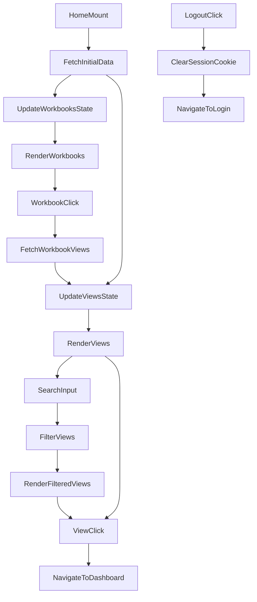

# src/Pages/Home.jsx

> **Source File:** [src/Pages/Home.jsx](https://github.com/test-company-prowiz/tableau-frontend/blob/main/src/Pages/Home.jsx)
> **Repository:** `tableau-frontend`
> **Branch:** `main`

# src/Pages/Home.jsx

### Overview
This file implements the primary landing page component of the application. It displays lists of Tableau workbooks and views, allows users to search for specific views, navigate to view dashboards, and provides a logout mechanism.

### Architecture & Role
This file functions as a top-level presentation layer component within a React frontend application. It is responsible for orchestrating UI state, fetching data from a backend API, and rendering dynamic content. It interacts directly with the user and serves as an entry point for navigating to detailed dashboard views.

### Key Components
-   **`Home` Function Component**: The main React component that manages application state for workbooks, views, loading indicators, and search input. It orchestrates data fetching and renders the entire page.
-   **`SamplePrevArrow`, `SampleNextArrow`**: Custom functional components used by `react-slick` to render navigation arrows for the workbook carousel.
-   **`fetchViews(id)`**: Asynchronous function to fetch views associated with a specific workbook ID from the backend API.
-   **`onSearch(e)`**: Handler function for the view search input, filtering the currently displayed views based on the input value.
-   **`fetchAllViews()`**: Asynchronous function to retrieve all available views from the backend API, typically used to reset the view list after filtering.
-   **`fetchAllData()`**: Asynchronous function called on component mount to fetch both all workbooks and all views concurrently.
-   **`sliderSettings`**: Configuration object for the `react-slick` carousel displaying workbooks.
-   **State Management**: Utilizes `useState` for `inputSearch`, `loading`, `viewsLoading`, `views`, `filteredViews`, and `workbooks`.

### Execution Flow / Behavior
1.  **Initialization**: When the `Home` component mounts, the `useEffect` hook triggers `fetchAllData()`.
2.  **Initial Data Fetch**: `fetchAllData()` makes parallel asynchronous calls to the backend API (`/tableau/views` and `/tableau/workbooks`) to retrieve all views and workbooks. During this process, the `loading` state is true, displaying `Skeleton` components.
3.  **Content Display**: Once data is fetched, `workbooks` are rendered in a `react-slick` carousel, and `views` are listed below.
4.  **Workbook Interaction**: Clicking on a workbook in the carousel invokes `fetchViews(id)`, which fetches views specific to that workbook, updating the `views` state and `viewsLoading` status.
5.  **View Search**: Users can type into the "Search For Views Here" input, triggering `onSearch`. This filters the current `views` state to populate `filteredViews`, which is then rendered.
6.  **"All Views" Button**: Clicking this button executes `fetchAllViews()`, resetting the view list to display all available views.
7.  **View Navigation**: Clicking on a specific view's title navigates the user to the `/dashboard` route, passing the view's `contentUrl` as state.
8.  **Logout**: The "Logout" button clears the `session` cookie by setting its expiration date to the past and then navigates the user to the root path (`/`).

### Dependencies
-   **`react`**: Core library for building UI components.
-   **`react-router-dom`**: For declarative navigation (`useNavigate`, `Link`).
-   **`axios`**: Promise-based HTTP client for making API requests to the backend.
-   **`react-slick` & `slick-carousel`**: Library for rendering responsive carousels.
-   **`react-icons`**: Provides UI icons (`AiOutlineArrowLeft`, `AiOutlineArrowRight`, `FaSearch`).
-   **`antd`**: Ant Design UI library for components like `Input`, `Skeleton`, `Space`, and `Spin` with `LoadingOutlined`.
-   **`../App`**: Imports the `API` constant, likely the base URL for backend service endpoints.
-   **`../Mock/workbooks`, `../Mock/view`**: Imports mock data files, although they are not actively used in the provided logic, suggesting they might be remnants from development or fallback options.

### Design Notes
-   The component combines a carousel for workbooks and a scrollable list for views, providing two main ways to browse content.
-   Loading states are handled with Ant Design `Skeleton` and `Spin` components, enhancing user experience during data fetching.
-   The search functionality is client-side, filtering views already loaded into the component's state. This implies that for a very large number of views, a server-side search might be more efficient.
-   Direct manipulation of `document.cookie` for logout is a simple way to clear the session, but it couples the UI component directly to cookie management logic.

### Diagram
