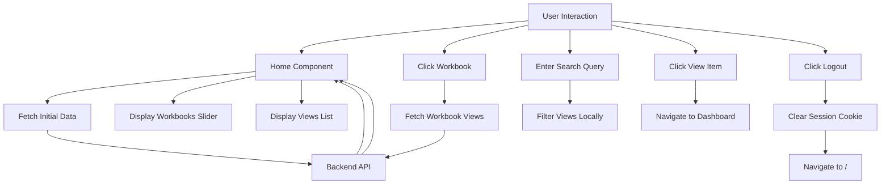

# src/Pages/Home.jsx

> **Source File:** [src/Pages/Home.jsx](https://github.com/test-company-prowiz/tableau-frontend/blob/main/src/Pages/Home.jsx)
> **Repository:** `tableau-frontend`
> **Branch:** `main`

# src/Pages/Home.jsx

### Overview
This file implements the primary landing page (`/home`) for the application. It displays a list of Tableau workbooks in a carousel and a list of Tableau views, allowing users to search and navigate to specific dashboards.

### Architecture & Role
This component operates at the presentation layer of the frontend. It is a React page component responsible for fetching data from the backend API, managing local state for UI elements (loading, search input, data sets), and orchestrating user interactions such as navigation, filtering, and logout.

### Key Components
*   **`Home` Function Component**: The main React component rendering the home page content. It manages all state, data fetching, and rendering logic.
*   **`SamplePrevArrow` / `SampleNextArrow`**: Functional components used as custom navigation arrows for the `react-slick` carousel.
*   **`inputSearch` (state)**: Stores the current value of the view search input.
*   **`loading` (state)**: Boolean flag indicating if initial workbook and view data is being fetched.
*   **`viewsLoading` (state)**: Boolean flag indicating if views are being fetched (e.g., after clicking a workbook or "All Views").
*   **`views` (state)**: Stores the list of all fetched Tableau views.
*   **`filteredViews` (state)**: Stores the list of views after applying search filters.
*   **`workbooks` (state)**: Stores the list of all fetched Tableau workbooks.
*   **`sliderSettings`**: Configuration object for the `react-slick` carousel, defining its behavior and appearance.
*   **`fetchViews(id)`**: Asynchronous function to fetch views associated with a specific workbook ID.
*   **`onSearch(e)`**: Handles changes in the search input, filtering `views` based on `contentUrl`.
*   **`fetchAllViews()`**: Asynchronous function to refetch all available views.
*   **`fetchAllData()`**: Asynchronous function executed on component mount to fetch both workbooks and all views initially.

### Execution Flow / Behavior
1.  **Initialization**: Upon mounting, the `useEffect` hook calls `fetchAllData()`.
2.  **Initial Data Fetch**: `fetchAllData()` makes concurrent `axios.get` requests to the `API/tableau/workbooks` and `API/tableau/views` endpoints. While fetching, the `loading` state is true, displaying skeleton loaders.
3.  **Workbook Display**: Once `workbooks` data is received, it populates a `react-slick` carousel. Each workbook item, when clicked, triggers `fetchViews(item.id)`.
4.  **View Display**: The `views` data is displayed below the workbooks.
5.  **Workbook-specific Views**: `fetchViews(id)` fetches views pertinent to the selected workbook ID. The `viewsLoading` state is true during this operation, showing a spinner.
6.  **Searching Views**: Users can type into the "Search For Views Here" input. The `onSearch` handler updates `inputSearch` and `filteredViews` by filtering the `views` state based on `contentUrl`.
7.  **"All Views" Functionality**: Clicking the "All Views" button triggers `fetchAllViews()`, which fetches all views again, clearing any previous workbook-specific view context.
8.  **Dashboard Navigation**: Clicking on a specific view name navigates the user to the `/dashboard` route, passing the `item.contentUrl` as state.
9.  **Logout**: The "Logout" button clears the `session` cookie by setting its expiration date to the past and then navigates the user back to the root (`/`).

### Dependencies
*   **`react`**: Core library for building UI components.
*   **`react-slick`**: A carousel component for displaying workbooks in a slider.
*   **`slick-carousel/slick/slick.css`, `slick-carousel/slick/slick-theme.css`**: Styling for the `react-slick` carousel.
*   **`react-icons/ai`**: Provides arrow icons (`AiOutlineArrowLeft`, `AiOutlineArrowRight`) for slider navigation.
*   **`react-icons/fa`**: Provides the search icon (`FaSearch`) for the input field.
*   **`axios`**: HTTP client for making API requests to the backend, especially for Tableau data.
*   **`react-router-dom`**: For declarative navigation (`useNavigate`, `Link`).
*   **`antd`**: Ant Design UI library, providing components like `Input`, `Skeleton`, `Space`, and `Spin` for loading indicators.
*   **`@ant-design/icons`**: Provides `LoadingOutlined` for the spinning indicator.
*   **`../App`**: Imports the `API` constant, which is the base URL for backend API calls.
*   **`../Mock/workbooks`, `../Mock/view`**: These files are imported but not actively used within the provided component logic.

### Design Notes
*   The component effectively manages multiple loading states (`loading` for initial data, `viewsLoading` for view-specific fetches) to provide a responsive user experience with skeleton loaders and spinners.
*   Client-side filtering is implemented for views, which is suitable for smaller datasets but might become inefficient with very large numbers of views.
*   The `fetchAllViews` and `fetchAllData` functions both fetch all views. There's a slight redundancy where `fetchAllData` already gets all views on initial load, and `fetchAllViews` can be called later. This could potentially be refactored for clarity or to avoid duplicate fetches if `views` state could be directly reused.
*   Logout is handled by directly manipulating `document.cookie`, which is a valid but less abstracted approach than using a dedicated authentication context or service.

### Diagram

```mermaid
graph TD
User[User Interaction] --> HomePage[Home Component]
HomePage --> FetchInitialData[Fetch Initial Data]
FetchInitialData --> BackendAPI[Backend API]
BackendAPI --> HomePage
HomePage --> DisplayWorkbooks[Display Workbooks Slider]
HomePage --> DisplayViews[Display Views List]
User --> ClickWorkbook[Click Workbook]
ClickWorkbook --> FetchWorkbookViews[Fetch Workbook Views]
FetchWorkbookViews --> BackendAPI
BackendAPI --> HomePage
User --> SearchInput[Enter Search Query]
SearchInput --> FilterViewsLocally[Filter Views Locally]
User --> ClickView[Click View Item]
ClickView --> NavigateDashboard[Navigate to Dashboard]
User --> ClickLogout[Click Logout]
ClickLogout --> ClearSessionCookie[Clear Session Cookie]
ClearSessionCookie --> NavigateRoot[Navigate to /]
```