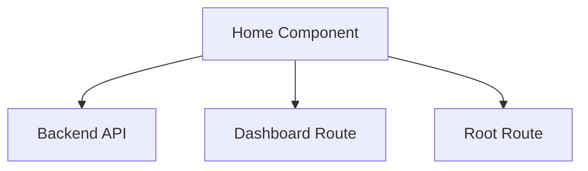

# src/Pages/Home.jsx

> **Source File:** [src/Pages/Home.jsx](https://github.com/test-company-prowiz/tableau-frontend/blob/main/src/Pages/Home.jsx)
> **Repository:** `tableau-frontend`
> **Branch:** `main`

# src/Pages/Home.jsx

### Overview
This file implements the `Home` React component, which serves as the main landing page for users. It displays a list of Tableau workbooks in a carousel and a list of Tableau views. Users can browse workbooks, filter views by search, and navigate to a detailed dashboard for a selected view. It also provides a logout mechanism.

### Architecture & Role
The `Home` component operates within the client-side presentation layer of the application. It is a top-level page component responsible for orchestrating UI display, user interaction, and data fetching from the backend API. It acts as a client-side orchestrator, consuming data from the `/tableau` API endpoints and rendering it using various UI components.

### Key Components
*   **`Home` Function Component**: The primary React functional component managing the page's state, data fetching logic, and rendering of workbooks and views.
*   **`SamplePrevArrow` / `SampleNextArrow`**: Custom functional components used by `react-slick` to render navigation arrows for the workbook carousel.
*   **`useState` Hooks**: Manage component state for search input (`inputSearch`), loading indicators (`loading`, `viewsLoading`), fetched views (`views`, `filteredViews`), and workbooks (`workbooks`).
*   **`useEffect` Hook**: Triggers initial data fetching (`fetchAllData`) upon component mount.
*   **`useNavigate` Hook**: Provides programmatic navigation to other routes, such as the dashboard or the root path.
*   **`fetchViews(id)`**: Asynchronously fetches views associated with a specific workbook ID from the backend.
*   **`onSearch(e)`**: Filters the currently displayed views based on user input in the search bar.
*   **`fetchAllViews()`**: Asynchronously fetches all available views from the backend, typically used to reset the view list after filtering by workbook.
*   **`fetchAllData()`**: Fetches both all workbooks and all views concurrently during initial page load.
*   **`sliderSettings`**: Configuration object for the `react-slick` carousel, defining behavior like number of slides shown, autoplay, and custom arrows.
*   **External UI Libraries**: `react-slick` for the carousel, `antd` (Input, Skeleton, Space, Spin) for form elements, loading states, and layout, and `react-icons` for graphical icons.

### Execution Flow / Behavior
1.  **Initial Load**: When the `Home` component mounts, the `useEffect` hook triggers `fetchAllData()`.
2.  **Data Fetching**: `fetchAllData()` makes concurrent `axios` GET requests to `/tableau/views` and `/tableau/workbooks` endpoints on the backend API. During this process, a `loading` state is active, displaying skeleton loaders for both workbooks and views.
3.  **Workbook Display**: Once workbooks are fetched, they are rendered within a `react-slick` carousel. Each workbook item is clickable.
4.  **View Display**: After views are fetched, they are listed below the workbooks. Initially, all views are shown.
5.  **Workbook Interaction**: Clicking a workbook item triggers `fetchViews(item.id)`, fetching only the views associated with that specific workbook. The `viewsLoading` state activates, showing a spinner.
6.  **View Filtering**: Users can type into the search input. The `onSearch` handler filters the `views` array by matching `contentUrl` against the input, updating `filteredViews`.
7.  **Reset Views**: Clicking the "All Views" button calls `fetchAllViews()`, refetching all views from the backend and resetting any previous workbook-specific or search filters.
8.  **Navigation to Dashboard**: Clicking on a listed view navigates the user to the `/dashboard` route, passing the view's `contentUrl` as state to the new route.
9.  **Logout**: Clicking the "Logout" text clears the session cookie and navigates the user to the root path (`/`).

### Dependencies
*   **`react`**: Core library for building the user interface.
*   **`react-slick`**: For implementing the responsive carousel display of workbooks.
*   **`slick-carousel/slick/slick.css` & `slick-carousel/slick/slick-theme.css`**: Styling for the `react-slick` carousel.
*   **`react-icons/ai`**: Provides `AiOutlineArrowLeft` and `AiOutlineArrowRight` for carousel navigation.
*   **`axios`**: HTTP client for making API requests to the backend server.
*   **`react-router-dom`**: Provides `Link` and `useNavigate` for client-side routing.
*   **`antd`**: Ant Design UI library for components like `Input`, `Skeleton`, `Space`, `Spin`, and `LoadingOutlined`.
*   **`../App`**: Imports the `API` constant, which defines the base URL for backend API calls.
*   **`../Mock/workbooks` & `../Mock/view`**: Imports mock data, although these are not actively used in the current `axios`-based data fetching logic. They may represent previous development stages or fallback data.
*   **`react-icons/fa`**: Provides `FaSearch` icon for the search input.

### Design Notes
*   The component uses a combination of `useState` and `useEffect` for effective state management and side effects, following React functional component best practices.
*   Loading states (`loading`, `viewsLoading`) are explicitly handled with Ant Design `Skeleton` and `Spin` components, providing a better user experience during data fetching.
*   The use of `axios` with `withCredentials: true` indicates that the application relies on cookie-based authentication or session management with the backend.
*   Client-side filtering for views (`onSearch`) is efficient for already loaded data but might not scale for very large datasets without server-side search capabilities.
*   The `API` constant is imported from `../App`, centralizing the backend endpoint configuration.
*   The presence of `../Mock/workbooks` and `../Mock/view` imports, despite not being used in the current data fetching logic, suggests that the component might have previously used mock data or these imports are remnants. This could be cleaned up or leveraged for development/testing environments.
*   Logout functionality directly manipulates `document.cookie`, which is a common but direct method for clearing client-side session data.

### Diagram

```mermaid
graph TD
HomeComponent[Home Component] --> BackendAPI[Backend API]
HomeComponent --> DashboardRoute[Dashboard Route]
HomeComponent --> RootRoute[Root Route]
```