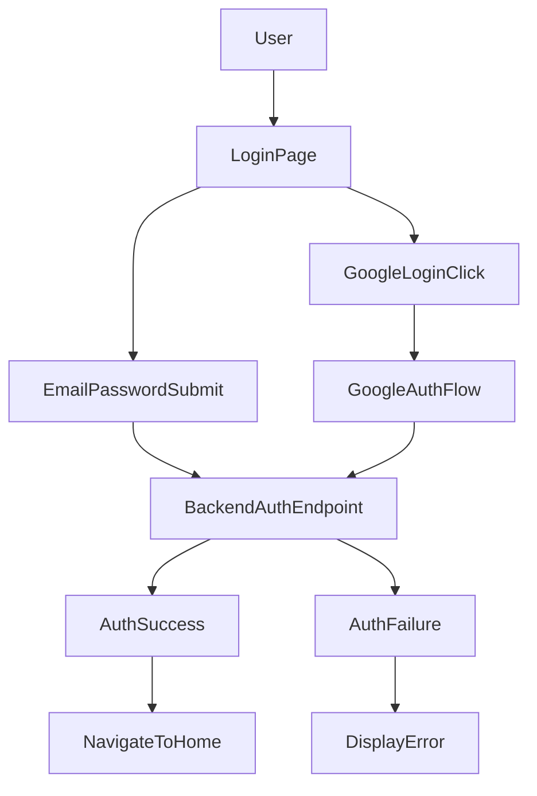

# src/Pages/Login.jsx

> **Source File:** [src/Pages/Login.jsx](https://github.com/test-company-prowiz/tableau-frontend/blob/main/src/Pages/Login.jsx)
> **Repository:** `tableau-frontend`
> **Branch:** `main`

# src/Pages/Login.jsx

### Overview
This file defines the `Login` React functional component, which serves as the primary user authentication interface. It supports both traditional email/password login and Google OAuth-based authentication.

### Architecture & Role
This file represents a UI layer component within a frontend application. It resides in the `Pages` directory, indicating its role as a top-level view or page. Its responsibility is to capture user credentials, orchestrate authentication requests to a backend service, and manage the UI state related to login processes, including navigation and feedback.

### Key Components
*   **`Login` (function component)**: The main React component that renders the login form and handles authentication logic.
*   **`useState` hooks**: Manage component-specific state, including `token` (for Google access token), `creds` (declared but unused), `loading` (for UI spinner), and `isPassVisible` (for password input type toggling).
*   **`useForm` (from `react-hook-form`)**: Provides functionality for form registration, submission handling, and client-side validation for the email and password fields.
*   **`useNavigate` (from `react-router-dom`)**: Enables programmatic navigation after successful authentication.
*   **`googleLogin` (from `@react-oauth/google`)**: Initiates the Google OAuth consent flow.
*   **`registerGoogleSignin`**: An asynchronous function invoked on successful Google OAuth authorization to send the Google access token to the backend for verification.
*   **`onSubmit`**: An asynchronous function that handles the submission of the traditional email and password form, sending credentials to the backend.
*   **`ToastContainer`, `toast` (from `react-toastify`)**: Used for displaying user feedback (success/error notifications).
*   **`Spin`, `LoadingOutlined` (from `antd`)**: UI components to show a loading indicator during asynchronous operations.

### Execution Flow / Behavior
1.  **Component Rendering**: When the `Login` component mounts, it displays a form with email and password input fields, a "Login with Tableau ID" button (for traditional login), and a "Login with Google ID" button.
2.  **Traditional Email/Password Login**:
    *   A user inputs their email and password into the form fields.
    *   Upon clicking "Login with Tableau ID," the `handleSubmit` function (from `react-hook-form`) validates the input.
    *   If validation passes, the `onSubmit` function executes:
        *   The `loading` state is set to `true`, displaying a spinner.
        *   An `axios.post` request is sent to `${API}/auth/` with `data.email` and `data.password` in the request body.
        *   The request includes `withCredentials: true`, indicating a reliance on cookie-based session management.
        *   If the backend responds with HTTP status 200, the user is navigated to `/home`, and a success toast notification appears.
        *   If the request fails (e.g., due to invalid credentials), an error toast notification displays the error message from the backend.
        *   The `loading` state is reset to `false`.
3.  **Google OAuth Login**:
    *   A user clicks the "Login with Google ID" button, triggering the `googleLogin` function.
    *   This initiates the external Google OAuth flow.
    *   Upon successful authorization by Google, the `onSuccess` callback executes `registerGoogleSignin`.
    *   Inside `registerGoogleSignin`:
        *   The `loading` state is set to `true`.
        *   The Google `access_token` is extracted from the payload.
        *   An `axios.post` request is sent to `${API}/auth/` with an `Authorization` header containing `Bearer ${payload.access_token}`. The request body contains empty `user` and `pwd` fields.
        *   This request also includes `withCredentials: true`.
        *   If the backend responds with HTTP status 200, the user is navigated to `/home`, and a success toast notification appears.
        *   The `loading` state is reset to `false`.
    *   If the Google login fails, the `onError` callback logs the error to the console.

### Dependencies
*   **`axios`**: For making HTTP requests to the backend API.
*   **`react`, `useState`**: Core React library for building UI components and managing component state.
*   **`react-hook-form` (`useForm`)**: For declarative form management and validation.
*   **`react-router-dom` (`useNavigate`)**: For client-side routing and navigation.
*   **`react-toastify` (`ToastContainer`, `toast`)**: For displaying transient user notifications.
*   **`antd` (`Spin`), `@ant-design/icons` (`LoadingOutlined`)**: UI library components for displaying loading indicators.
*   **`@react-oauth/google` (`useGoogleLogin`)**: For integrating Google OAuth 2.0.
*   **`../App` (`API`)**: An internal constant providing the base URL for API endpoints.
*   **`../Services/apiService`**: An internal service import, though `apiService` is not explicitly used within this component's logic.

### Design Notes
*   The component supports two distinct authentication mechanisms: traditional email/password and external Google OAuth.
*   Client-side form validation is handled robustly using `react-hook-form`, providing immediate feedback to the user regarding required fields.
*   User experience is enhanced with visual feedback through a loading spinner (`Spin`) during API calls and toast notifications (`react-toastify`) for login outcomes.
*   The `creds` state is declared but not utilized in the current implementation.
*   The `header` object generated within the `onSubmit` function for traditional login is not passed to the `axios.post` request, meaning traditional logins do not send a bearer token, relying solely on `user` and `pwd` in the body and potentially cookies from `withCredentials: true`.
*   The `apiService` import is present but the `apiService` object is not invoked, suggesting it might be vestigial or intended for future use.

### Diagram 
