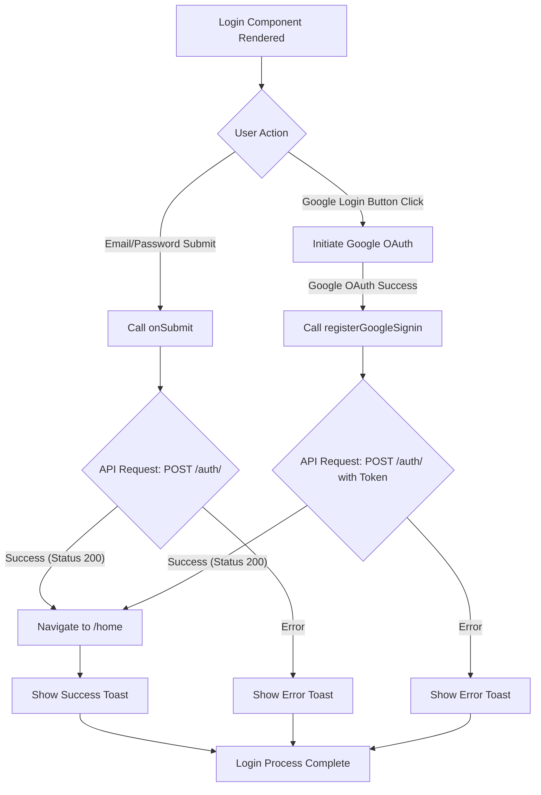

# src/Pages/Login.jsx

> **Source File:** [src/Pages/Login.jsx](https://github.com/test-company-prowiz/tableau-frontend/blob/main/src/Pages/Login.jsx)  
> **Repository:** `tableau-frontend`  
> **Branch:** `main`

# src/Pages/Login.jsx

### Overview
This file defines the `Login` React component, which provides the user interface and functionality for user authentication. It supports both traditional email/password login and Google OAuth-based login, handling form submission, API requests, and user feedback.

### Architecture & Role
Architecturally, this file represents a frontend page-level component within the application's UI layer. It acts as a controller for the login process, managing local state, interacting with user input, and orchestrating calls to the authentication backend. Its primary role is to facilitate user access to the application by authenticating credentials.

### Key Components
*   **`Login` function**: The main React functional component responsible for rendering the login page.
*   **`useState` hooks**:
    *   `token`: Stores the access token obtained from Google OAuth.
    *   `creds`: Declared but not utilized in the current component logic.
    *   `loading`: Boolean state to control the visibility of a loading spinner during API requests.
    *   `isPassVisible`: Boolean state to control password input visibility.
*   **`useForm` (from `react-hook-form`)**: Manages form state, validation, and submission for the email/password login form.
*   **`useNavigate` (from `react-router-dom`)**: Provides programmatic navigation functionality after successful login.
*   **`useGoogleLogin` (from `@react-oauth/google`)**: Hook to initiate and handle the Google OAuth login flow.
*   **`onSubmit` function**: Handles the submission of the email/password login form, sending credentials to the backend.
*   **`registerGoogleSignin` function**: Callback function executed upon successful Google OAuth, sending the obtained access token to the backend.
*   **`notify`, `successNotify`**: Utility functions for displaying error and success toast notifications using `react-toastify`.

### Execution Flow / Behavior
1.  When the `Login` component mounts, it displays a login form for email/password and a button for Google login.
2.  **Email/Password Login**:
    *   A user enters an email and password into the form fields.
    *   Upon form submission, `handleSubmit` triggers the `onSubmit` function.
    *   `onSubmit` sets `loading` to `true`, makes an `axios.post` request to `${API}/auth/` with the provided credentials.
    *   If the request is successful (status 200), the user is navigated to the `/home` route, `successNotify` is called, and `loading` is set to `false`.
    *   If an error occurs, `notify` is called with the error message, and `loading` is set to `false`.
3.  **Google Login**:
    *   A user clicks the "Login with Google ID" button, which invokes the `googleLogin` function.
    *   This initiates the Google OAuth flow, typically redirecting the user to Google for authentication.
    *   Upon successful authentication, Google redirects back, and the `onSuccess` callback of `useGoogleLogin` is triggered, calling `registerGoogleSignin` with the `codeResponse` payload.
    *   `registerGoogleSignin` extracts the `access_token` from the payload, sets the `token` state, and makes an `axios.post` request to `${API}/auth/`. This request includes the Google access token in the `Authorization` header.
    *   If the request is successful (status 200), the user is navigated to the `/home` route, `successNotify` is called, and `loading` is set to `false`.
    *   If an error occurs during Google login, the `onError` callback logs the error to the console.
4.  A loading spinner (`Spin` from `antd`) is displayed when the `loading` state is `true`.
5.  Toast notifications (success/error) are shown using `react-toastify`.

### Dependencies
*   **`axios`**: An HTTP client used for making API requests to the backend authentication endpoint.
*   **`react`**: The core JavaScript library for building user interfaces.
*   **`react-hook-form`**: A library for managing form state, validation, and submission, used for the email/password form.
*   **`react-router-dom`**: Provides routing capabilities, specifically `useNavigate` for redirecting users post-login.
*   **`react-toastify`**: A library for displaying non-blocking notifications (toasts) to the user.
*   **`@ant-design/icons`**: Provides Ant Design icons, specifically `LoadingOutlined` for the loading spinner.
*   **`antd`**: Ant Design UI library, providing the `Spin` component for loading indicators.
*   **`@react-oauth/google`**: A React hook for integrating Google's OAuth 2.0 authentication.
*   **`../Services/apiService`**: Imported but not directly used within this file's provided logic.
*   **`../App`**: Provides the `API` constant, which serves as the base URL for backend API requests.

### Design Notes
*   The component integrates two distinct authentication mechanisms: a traditional email/password form and a third-party Google OAuth flow. Both flows ultimately make a POST request to the same `/auth/` backend endpoint.
*   Form validation for the email/password input fields is handled by `react-hook-form`, ensuring required fields are populated before submission.
*   User feedback is provided through a loading spinner during API calls and toast notifications for success or error messages.
*   The `token` state variable is updated after a successful Google OAuth flow but is not explicitly utilized by the email/password submission logic to include authentication headers. The `onSubmit` function for email/password login does not send any `Authorization` header.
*   The `creds` state variable is declared but appears to be unused within the component's current logic.
*   API calls are made directly within the component using `axios`, rather than abstracting them through the imported `apiService`, which suggests an area for potential refactoring to centralize API interactions.