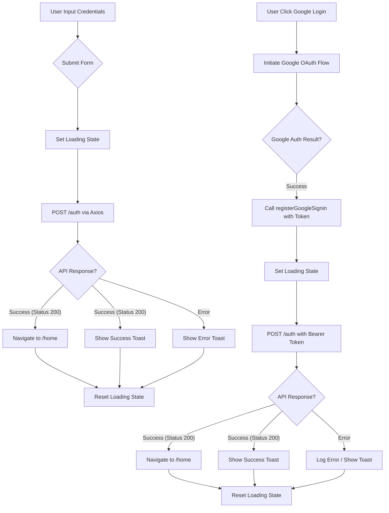

# src/Pages/Login.jsx

> **Source File:** [src/Pages/Login.jsx](https://github.com/test-company-prowiz/tableau-frontend/blob/main/src/Pages/Login.jsx)  
> **Repository:** `tableau-frontend`  
> **Branch:** `main`

# src/Pages/Login.jsx

### Overview
This file implements the Login page component, providing user authentication functionality through both email/password credentials and Google OAuth. It handles form submission, API interaction, state management for loading and errors, and navigation upon successful login.

### Architecture & Role
This file represents a presentation layer component within the client-side frontend architecture. It acts as a primary user interface for authentication, directly interacting with backend authentication APIs. It is responsible for collecting user input, displaying authentication status, and initiating navigation within the single-page application after successful login.

### Key Components
*   **`Login` function component**: The main React functional component responsible for rendering the login form and managing its state and behavior.
*   **`useState` hooks**: Used for managing component-specific states such as `token`, `creds`, `loading`, `isPassVisible`.
*   **`useForm` (from `react-hook-form`)**: Provides capabilities for form validation, input registration, and submission handling.
*   **`useNavigate` (from `react-router-dom`)**: Used to programmatically redirect the user to different routes within the application.
*   **`googleLogin`**: An instance of `useGoogleLogin` hook, configured to initiate the Google OAuth flow and call `registerGoogleSignin` on success.
*   **`registerGoogleSignin(payload)`**: An asynchronous function that processes the Google OAuth response, extracts the access token, and sends it to the backend for authentication.
*   **`onSubmit(data)`**: An asynchronous function invoked upon manual form submission (email/password). It sends user credentials to the backend for authentication.
*   **`notify` and `successNotify`**: Helper functions using `react-toastify` to display error and success messages to the user.
*   **`Spin` and `LoadingOutlined` (from `antd`)**: Components used to display a loading indicator during API requests.
*   **`ToastContainer` (from `react-toastify`)**: The container for displaying toast notifications.

### Execution Flow / Behavior
1.  **Initial Render**: The `Login` component renders a UI with an email input, password input, a "Login with Tableau ID" button (for email/password), and a "Login with Google ID" button.
2.  **Email/Password Login Flow**:
    *   User enters email and password into the respective fields.
    *   Upon clicking "Login with Tableau ID", `handleSubmit(onSubmit)` is triggered.
    *   `onSubmit` sets `loading` state to `true`, then sends a POST request to `${API}/auth/` with `user` (email) and `pwd` (password).
    *   If the request is successful (status 200), `navigate("/home")` is called, a success toast is displayed, and `loading` is set to `false`.
    *   If an error occurs, an error toast is displayed using the error message from the API response, and `loading` is set to `false`.
3.  **Google Login Flow**:
    *   User clicks "Login with Google ID", triggering the `googleLogin` function.
    *   The `useGoogleLogin` hook initiates the Google OAuth authentication process in a popup.
    *   Upon successful authentication with Google, the `onSuccess` callback executes `registerGoogleSignin` with the Google response payload.
    *   `registerGoogleSignin` extracts the `access_token` from the payload, constructs an `Authorization` header, and sends a POST request to `${API}/auth/` with an empty `user` and `pwd`, but including the Google token in headers.
    *   If this request is successful (status 200), `navigate("/home")` is called, a success toast is displayed, and `loading` is set to `false`.
    *   If the Google login fails or `registerGoogleSignin` encounters an error, an error is logged to the console, and `loading` (if set) would be reset (though the explicit `setLoading(false)` is only within success path in `registerGoogleSignin`).
4.  **Loading Indicator**: A spinning indicator is displayed across the screen when `loading` state is `true`.
5.  **Notifications**: Success and error messages are displayed as toast notifications.
6.  **Form Validation**: `react-hook-form` performs client-side validation, marking email and password fields as required.

### Dependencies
*   **`axios`**: Used for making HTTP requests to the backend API for both email/password and Google token authentication.
*   **`react`**: The core library for building the user interface.
*   **`react-hook-form`**: A library for efficient form management and validation.
*   **`react-router-dom`**: Provides routing capabilities, specifically `useNavigate` for programmatic navigation.
*   **`react-toastify`**: A library for displaying non-blocking notifications (toasts).
*   **`@ant-design/icons` (`LoadingOutlined`) and `antd` (`Spin`)**: UI components for displaying loading states.
*   **`@react-oauth/google` (`useGoogleLogin`)**: A React hook for integrating Google OAuth 2.0.
*   **`../Services/apiService`**: Imported but not directly utilized within the `Login` component's current implementation; `axios` is used directly.
*   **`../App` (`API`)**: Imports the base API URL, centralizing the backend endpoint configuration.

### Design Notes
*   The component supports two distinct login mechanisms: traditional email/password and Google OAuth, offering flexibility to users.
*   Client-side form validation is implemented using `react-hook-form` to provide immediate feedback to the user and prevent unnecessary API calls for incomplete forms.
*   State variables like `loading` are used to manage UI feedback, showing a spinner during API calls to improve user experience.
*   `react-toastify` provides a consistent way to display user notifications for both success and error scenarios.
*   The `API` constant is imported from `../App`, suggesting a centralized configuration for API endpoints.
*   There's an inconsistency in handling `setLoading(false)` in `registerGoogleSignin` where it's only in the success path, potentially leaving the spinner on if the API call within `registerGoogleSignin` fails. This could be an area for improvement.
*   The `apiService` dependency is imported but not actively used in this file, which might indicate a planned refactor or an unused import.
*   The `token` state is maintained but appears to be used only in a conditional check within `onSubmit` to potentially add an `Authorization` header, although the primary `onSubmit` path for email/password credentials does not typically use a token. This suggests a potential leftover from an alternative authentication flow or a future enhancement.

### Diagram (Optional)
