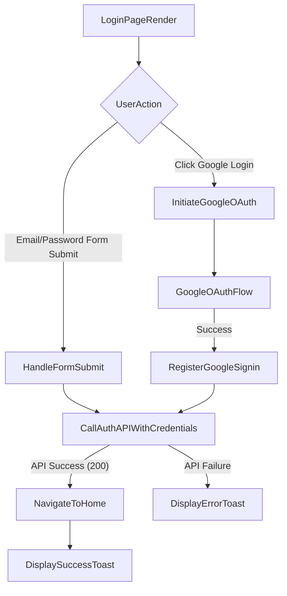

# src/Pages/Login.jsx

> **Source File:** [src/Pages/Login.jsx](https://github.com/test-company-prowiz/tableau-frontend/blob/main/src/Pages/Login.jsx)
> **Repository:** `tableau-frontend`
> **Branch:** `main`

# src/Pages/Login.jsx

### Overview
This file implements the user login interface, allowing users to authenticate using either traditional email and password credentials or via Google OAuth. It handles form submission, API interaction for authentication, and subsequent navigation.

### Architecture & Role
This file represents a presentation layer component within the application's client-side architecture. It is a React functional component acting as a top-level page (`/login` route). Its primary role is to render the login UI, manage user input, and orchestrate authentication requests to the backend API.

### Key Components
- **`Login` Function**: The main React functional component that renders the login page.
- **`useState` Hooks**: Manage component-specific state such as loading status (`loading`), password visibility (`isPassVisible`), and Google access token (`token`).
- **`useForm` (react-hook-form)**: Manages form state, validation rules, and submission for the email/password login form.
- **`useNavigate` (react-router-dom)**: Enables programmatic navigation to other routes (e.g., `/home`) upon successful authentication.
- **`useGoogleLogin` (@react-oauth/google)**: Facilitates the Google OAuth flow, handling the initiation and success/error callbacks.
- **`registerGoogleSignin(payload)`**: An asynchronous function triggered on successful Google OAuth, responsible for sending the Google access token to the backend for authentication.
- **`onSubmit(data)`**: An asynchronous function handling the submission of the email and password form, sending credentials to the backend.
- **`ToastContainer`, `toast` (react-toastify)**: Components and functions for displaying user notifications (success/error messages).
- **`Spin`, `LoadingOutlined` (antd)**: UI components used to display a loading spinner during API requests.
- **`API`**: An imported constant from `../App` representing the base URL for backend API requests.

### Execution Flow / Behavior
1.  Upon rendering, the `Login` component displays a form for email/password login and a button for Google login.
2.  **Email/Password Login Flow**:
    *   A user enters credentials into the form fields.
    *   On form submission, `handleSubmit(onSubmit)` is invoked.
    *   The `onSubmit` function sets the `loading` state to `true`, displays a spinner, and sends a `POST` request to `${API}/auth/` with the provided email and password.
    *   If the request is successful (HTTP 200), the user is navigated to `/home`, a success toast is displayed, and `loading` is set to `false`.
    *   If the request fails, an error toast is displayed, and `loading` is set to `false`.
3.  **Google Login Flow**:
    *   A user clicks the "Login with Google ID" button, which triggers the `googleLogin` function from `useGoogleLogin`.
    *   The Google OAuth consent flow is initiated in a popup or redirect.
    *   Upon successful completion of the Google OAuth flow, the `onSuccess` callback (`registerGoogleSignin`) is executed.
    *   `registerGoogleSignin` sets the Google access token in the component's state (`token`), sets `loading` to `true`, and sends a `POST` request to `${API}/auth/` with the Google access token in the `Authorization` header.
    *   If the request is successful (HTTP 200), the user is navigated to `/home`, a success toast is displayed, and `loading` is set to `false`.
    *   If the request fails, an error toast is displayed, and `loading` is set to `false`.
4.  A loading spinner is conditionally rendered based on the `loading` state.

### Dependencies
-   **External Libraries**:
    *   `axios`: For making HTTP requests to the backend.
    *   `react`: Core library for building UI components.
    *   `react-hook-form`: Manages form state and validation.
    *   `react-router-dom`: Enables client-side routing and navigation.
    *   `react-toastify`: Provides toast notifications for user feedback.
    *   `@ant-design/icons`, `antd`: Ant Design components for UI elements like the loading spinner.
    *   `@react-oauth/google`: Integrates Google authentication.
-   **Internal Modules**:
    *   `../App`: Provides the `API` base URL constant.
    *   `../Services/apiService`: Imported, but not utilized within this file's logic.

### Design Notes
-   The component directly handles API calls for authentication, which could be abstracted into a dedicated service layer for better separation of concerns (though `apiService` is imported, it's not used).
-   The `token` state, set by Google login, is also conditionally included in the headers for the email/password login `onSubmit` function. This implies a potential interaction where a Google token might be sent with a subsequent traditional login request, which may be unintended behavior or require clarification.
-   Error handling provides user feedback via toast notifications and console logging.
-   Uses `withCredentials: true` in `axios` requests, indicating reliance on cookies or similar mechanisms for session management.
-   Form validation is handled client-side using `react-hook-form`.

### Diagram

```mermaid
graph TD
A[LoginPageRender] --> B{UserAction};
B -- "Email/Password Form Submit" --> C[HandleFormSubmit];
B -- "Click Google Login" --> D[InitiateGoogleOAuth];

C --> E[CallAuthAPIWithCredentials];
D --> F[GoogleOAuthFlow];
F -- "Success" --> G[RegisterGoogleSignin];
G --> E;

E -- "API Success (200)" --> H[NavigateToHome];
E -- "API Failure" --> I[DisplayErrorToast];

H --> J[DisplaySuccessToast];
```