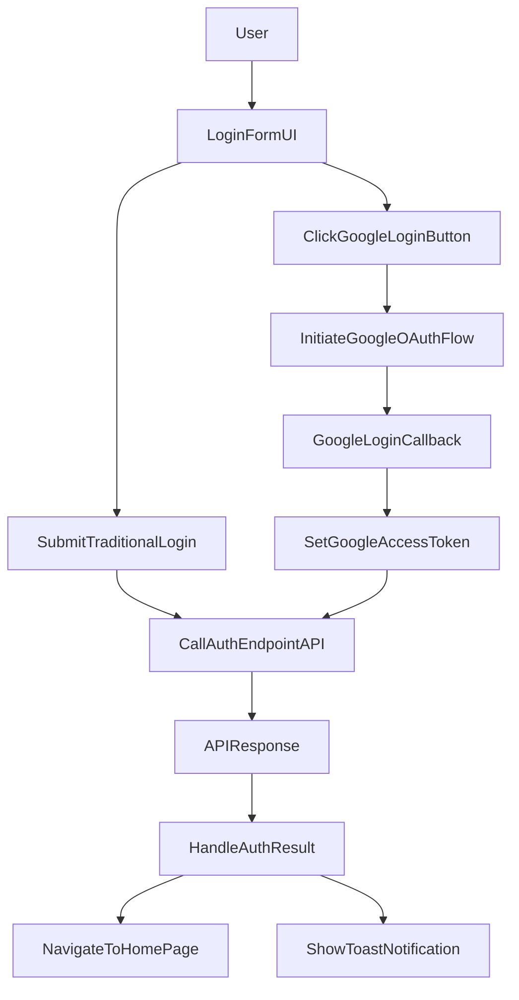

# src/Pages/Login.jsx

> **Source File:** [src/Pages/Login.jsx](https://github.com/test-company-prowiz/tableau-frontend/blob/main/src/Pages/Login.jsx)
> **Repository:** `tableau-frontend`
> **Branch:** `main`

# src/Pages/Login.jsx

### Overview
This file defines the `Login` React component, which serves as the user interface for authenticating users within the application. It supports both traditional email/password login and Google OAuth-based login.

### Architecture & Role
The `Login` component operates at the presentation layer of the frontend application. It functions as a page-level component, handling user input, managing local UI state (loading, password visibility, form errors), and orchestrating API calls to the authentication endpoint. It relies on client-side routing for navigation after successful authentication.

### Key Components
*   **`Login` function component**: The main React component responsible for rendering the login UI and managing authentication logic.
*   **`useState` hooks**:
    *   `token`: Stores the access token obtained from Google OAuth.
    *   `creds`: An unused state variable intended for user credentials.
    *   `loading`: Manages the display of a loading spinner during API requests.
    *   `isPassVisible`: Controls the visibility of the password input field.
*   **`useForm` hook (from `react-hook-form`)**: Provides utilities for form management, including registration of input fields, validation, and submission handling.
*   **`useNavigate` hook (from `react-router-dom`)**: Used for programmatic navigation to different routes within the application.
*   **`useGoogleLogin` hook (from `@react-oauth/google`)**: Initiates the Google OAuth flow and provides callbacks for success or failure.
*   **`onSubmit` function**: Handles the submission of the traditional email/password login form, performing client-side validation and dispatching an authentication request to the backend.
*   **`registerGoogleSignin` function**: Called upon successful Google OAuth authentication. It extracts the access token and sends it to the backend for verification and login.
*   **`notify`, `successNotify` functions**: Utility functions for displaying toast notifications using `react-toastify`.

### Execution Flow / Behavior
1.  Upon rendering, the `Login` component displays a form for email and password input, along with buttons for "Login with Tableau ID" (traditional) and "Login with Google ID".
2.  **Traditional Login Flow**:
    *   A user enters their email and password and clicks "Login with Tableau ID".
    *   `handleSubmit(onSubmit)` is invoked, triggering form validation via `react-hook-form`.
    *   If validation passes, `onSubmit` sets `loading` to `true`, then sends a `POST` request to `${API}/auth/` with the provided `user` (email) and `pwd` (password) using `axios`.
    *   If the request is successful (status 200), the user is navigated to `/home`, a success notification is shown, and `loading` is set to `false`.
    *   If the request fails, an error notification is displayed, and `loading` is set to `false`.
3.  **Google Login Flow**:
    *   A user clicks "Login with Google ID".
    *   The `googleLogin` function (from `useGoogleLogin`) initiates the Google OAuth authorization process in a popup.
    *   On successful authorization, the `onSuccess` callback executes `registerGoogleSignin` with the Google `codeResponse`.
    *   `registerGoogleSignin` extracts the `access_token` from the `codeResponse`, sets it to the `token` state, and sends a `POST` request to `${API}/auth/` with an `Authorization` header containing the bearer token. The request body contains empty `user` and `pwd` fields.
    *   Similar to traditional login, a successful response navigates to `/home`, shows a success notification, and sets `loading` to `false`.
    *   Errors during the Google OAuth process or the subsequent API call are logged to the console or displayed via notifications.
4.  A loading spinner (`antd` Spin component) is conditionally rendered when the `loading` state is `true`.
5.  Toast notifications (`react-toastify`) provide user feedback for both success and error scenarios.

### Dependencies
*   **`axios`**: (External) Used for making HTTP requests to the backend API for authentication.
*   **`react`, `useState`**: (External) Core React library and hook for managing component state.
*   **`react-hook-form`**: (External) Manages form state, validation, and submission.
*   **`react-router-dom`**: (External) Provides client-side routing capabilities, specifically `useNavigate`.
*   **`react-toastify`**: (External) Used for displaying non-blocking notifications to the user.
*   **`@ant-design/icons` (`LoadingOutlined`)**: (External) Provides the loading spinner icon.
*   **`antd` (`Spin`)**: (External) A UI component library; `Spin` is used for showing loading indicators.
*   **`@react-oauth/google` (`useGoogleLogin`)**: (External) Facilitates integration with Google's OAuth 2.0 for user authentication.
*   **`../Services/apiService`**: (Internal) Imported but not directly used within this file.
*   **`../App` (`API`)**: (Internal) Provides the base URL for API endpoints.

### Design Notes
*   The component supports two distinct authentication methods: a traditional email/password flow and a Google OAuth flow. This dual approach provides flexibility for users.
*   Client-side form validation is handled by `react-hook-form`, which improves user experience by providing immediate feedback.
*   The use of `useState` for `loading` and `isPassVisible` effectively manages UI interactivity during asynchronous operations and user input.
*   The `token` state variable is set only by the Google OAuth flow. If an email/password login attempt occurs *after* a Google login has set a token, the `onSubmit` function will check for `token.length > 0` and potentially include an `Authorization` header. This implies a potential architecture where the backend might handle bearer tokens even for traditional logins if a token is present, although the primary use shown is for Google login.
*   The `creds` state is declared but not utilized, suggesting it might be a remnant from an earlier design or an incomplete feature.
*   The `apiService` import is currently unused, indicating either a planned refactor, a forgotten dependency removal, or an alternative API interaction strategy that wasn't fully adopted here.

### Diagram

```mermaid
graph TD
User[User] --> LoginForm[LoginFormUI];
LoginForm --> SubmitTraditional[SubmitTraditionalLogin];
SubmitTraditional --> CallAuthAPI[CallAuthEndpointAPI];
LoginForm --> ClickGoogleLogin[ClickGoogleLoginButton];
ClickGoogleLogin --> InitiateGoogleOAuth[InitiateGoogleOAuthFlow];
InitiateGoogleOAuth --> GoogleCallback[GoogleLoginCallback];
GoogleCallback --> SetGoogleToken[SetGoogleAccessToken];
SetGoogleToken --> CallAuthAPI;
CallAuthAPI --> APIResponse[APIResponse];
APIResponse --> HandleAuthResult[HandleAuthResult];
HandleAuthResult --> NavigateHome[NavigateToHomePage];
HandleAuthResult --> ShowToast[ShowToastNotification];
```