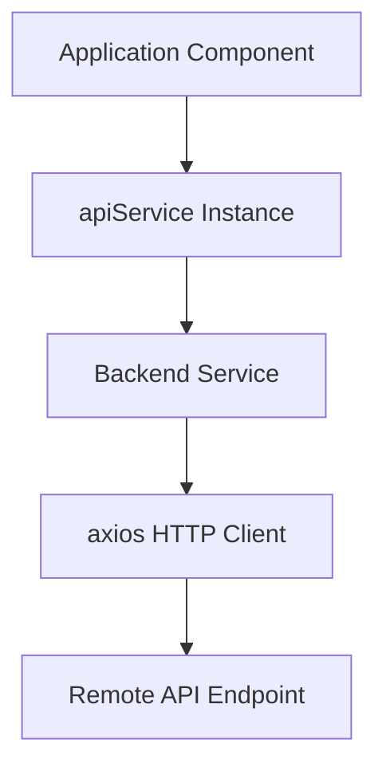

# src/Services/apiService.js

> **Source File:** [src/Services/apiService.js](https://github.com/tableau-frontend/blob/main/src/Services/apiService.js)  
> **Repository:** `tableau-frontend`  
> **Branch:** `main`

### Overview
This file defines an API service abstraction that provides methods for interacting with either a remote backend or local mock data. It centralizes API endpoint definitions and implements concrete services for different operational environments.

### Architecture & Role
This file functions as the data access layer, specifically handling outbound network requests or serving simulated data. It resides at the service layer, abstracting the specifics of data fetching from the application's components. It facilitates communication with external APIs or provides a local testing harness.

### Key Components
*   `Endpoint` (object): A constant object defining known API paths for various operations like login, fetching camera data, or updating camera status.
*   `ApiService` (abstract class): Serves as the base contract for API interaction. It defines `login`, `get`, and `modifyInput` methods. Its constructor prevents direct instantiation, ensuring only concrete subclasses can be created.
*   `Backend` (class): A concrete implementation of `ApiService` responsible for making actual HTTP requests to a remote backend. It uses `axios` and includes `login`, `logout`, and `get` methods with `withCredentials` enabled for cookie handling.
*   `Mock` (class): A concrete implementation of `ApiService` designed for local development and testing. It simulates API responses using local data (`allViews`, `allWorkBooks`) and introduces artificial delays via `setTimeout` instead of making actual network calls.
*   `apiService` (exported instance): An instance of the `Backend` class, configured as the primary API interaction point for the application.

### Execution Flow / Behavior
1.  **Initialization**: When the module is loaded, an instance of the `Backend` class is created and assigned to the `apiService` export. This instance is configured with the remote API host URL.
2.  **Backend Interaction**:
    *   Calling `apiService.login(user, pwd, headers)` sends an HTTP POST request to the `/auth/login/` endpoint on the configured host, including user credentials and setting `withCredentials`. It returns the `axios` response or an error object.
    *   Calling `apiService.logout()` clears the `session` cookie in the browser by setting its expiry to a past date.
    *   Calling `apiService.get(endpoint)` sends an HTTP GET request to the specified endpoint on the configured host, also with `withCredentials`.
3.  **Mock Interaction (if used)**: If an instance of the `Mock` class were utilized, `login` calls would simulate a delay and return a success status, while `get` calls would simulate a delay and return predefined mock data based on regular expression matching against the requested `endpoint` (e.g., for `/tableau/views/` or `/tableau/workbooks/`).

### Dependencies
*   `axios`: An external library used by the `Backend` class for making asynchronous HTTP requests to the remote API.
*   `../Mock/view`: An internal module providing static mock data for "all views," used by the `Mock` service.
*   `../Mock/workbooks`: An internal module providing static mock data for "all workbooks," used by the `Mock` service.

### Design Notes
*   **Strategy Pattern Implementation**: The file implements a variant of the Strategy pattern, allowing the application to switch between a real `Backend` service and a `Mock` service. This enhances testability and enables frontend development decoupled from backend readiness.
*   **Abstract Base Class for API**: The `ApiService` abstract class establishes a common interface for all API service implementations, enforcing method signatures and preventing direct instantiation of the generic service.
*   **Centralized Endpoint Definitions**: Grouping API endpoint paths in the `Endpoint` object promotes consistency and simplifies maintenance when backend routes change.
*   **Cookie-based Session Management**: The explicit manipulation of `document.cookie` in the `Backend.logout` method indicates a client-side approach to managing session cookies.

### Diagram (Optional)
