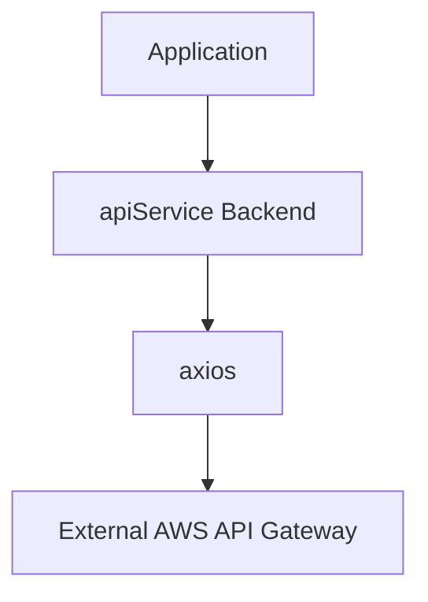

# src/Services/apiService.js

> **Source File:** [src/Services/apiService.js](https://github.com/test-company-prowiz/tableau-frontend/blob/main/src/Services/apiService.js)
> **Repository:** `tableau-frontend`
> **Branch:** `main`

# src/Services/apiService.js

### Overview
This file provides a service layer for interacting with backend APIs. It defines an abstract `ApiService` class with concrete implementations for both a real backend (`Backend`) and a mock data source (`Mock`), allowing the application to switch between environments.

### Architecture & Role
This file resides in the `Services` layer, acting as a facade for all API interactions. It abstracts the underlying HTTP request mechanism (`axios`) and data sources (real backend or mock data) from the rest of the application. Its primary role is to provide a consistent interface for data fetching and submission.

### Key Components
*   **`Endpoint`**: A constant object defining various API path suffixes.
*   **`ApiService`**: An abstract base class that defines the common API methods (`login`, `get`, `modifyInput`, `logout`). It prevents direct instantiation.
*   **`Backend`**: A concrete implementation of `ApiService` that uses `axios` to make HTTP requests to a configured external API host. It handles authentication via session cookies.
*   **`Mock`**: A concrete implementation of `ApiService` that simulates API responses using local mock data (`allViews`, `allWorkBooks`) and `setTimeout` to mimic network latency.
*   **`apiService`**: The default exported instance, initialized as a `Backend` object, making it the primary interface for API calls in the application.

### Execution Flow / Behavior
The application interacts with the `apiService` instance. Since `apiService` is instantiated as `new Backend()`, all method calls (e.g., `apiService.login()`, `apiService.get()`) are routed to the `Backend` class's implementations.

*   **`login(user, pwd, headers)`**: Sends a POST request to the `/auth/login/` endpoint with user credentials. It includes `withCredentials:true` for session management and handles potential errors by returning a structured response.
*   **`logout()`**: Clears the `session` cookie by setting its expiry date to the past, effectively logging the user out from the client side.
*   **`get(endpoint)`**: Sends a GET request to the specified endpoint, appending it to the base host. It also includes `withCredentials:true`.
*   The `Mock` class methods are not actively used by the exported `apiService` instance but provide an alternative execution path if `apiService` were instantiated as `new Mock()`. The `Mock.get` method includes logic to return specific mock data based on regex matching for Tableau-related endpoints.

### Dependencies
*   **`axios` (external)**: A promise-based HTTP client used by the `Backend` class to make API requests.
*   **`../Mock/view` (internal)**: Provides mock data for views, used by the `Mock` implementation.
*   **`../Mock/workbooks` (internal)**: Provides mock data for workbooks, used by the `Mock` implementation.

### Design Notes
*   The use of an abstract `ApiService` class and concrete `Backend`/`Mock` implementations follows the Strategy or Factory pattern, enabling easy switching between different API environments (e.g., development with mock data vs. production with real backend).
*   The `Backend` class explicitly handles `withCredentials:true` for `axios` calls, indicating reliance on HTTP cookies for session management and authentication.
*   Error handling in `Backend.login` is explicit, returning a status and error detail. Other `get` methods in `Backend` only log errors to the console without returning a structured error object.
*   The `modifyInput` method is declared in `ApiService` but not implemented in `Backend` or `Mock`, suggesting it might be a placeholder for future functionality or an incomplete feature.
*   The `Mock` implementation for `logout` is commented out, indicating that mock mode does not simulate cookie clearing.
*   The specific endpoint patterns `/tableau/views/` and `/tableau/workbooks/` in the `Mock.get` method imply an integration with or simulation of a Tableau-related API.

### Diagram

```mermaid
graph TD
Application --> ApiServiceInstance[apiService Backend]
ApiServiceInstance --> AxiosClient[axios]
AxiosClient --> ExternalAPI[External AWS API Gateway]
```